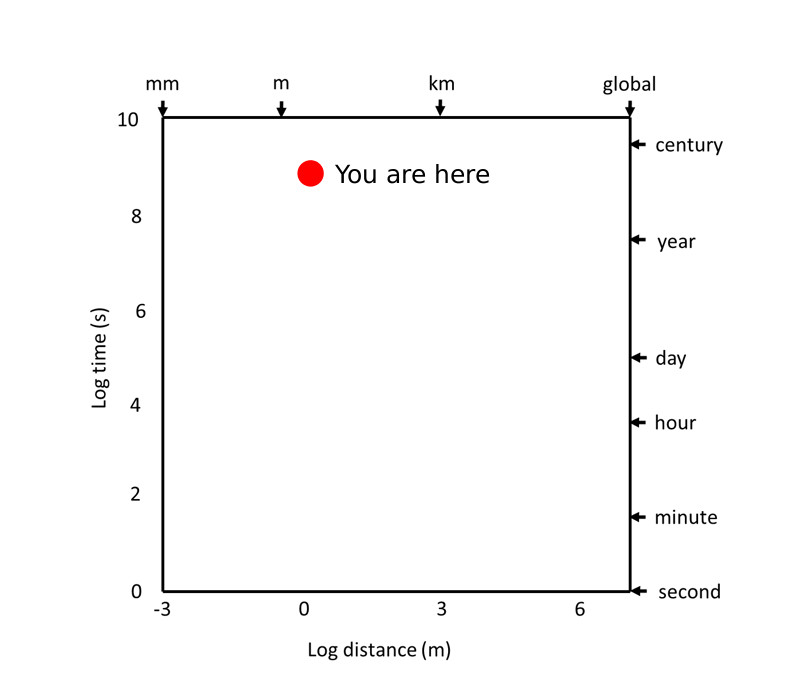
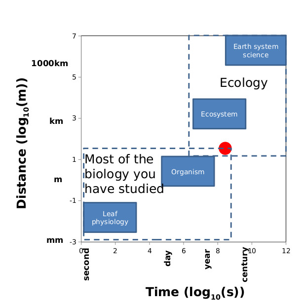
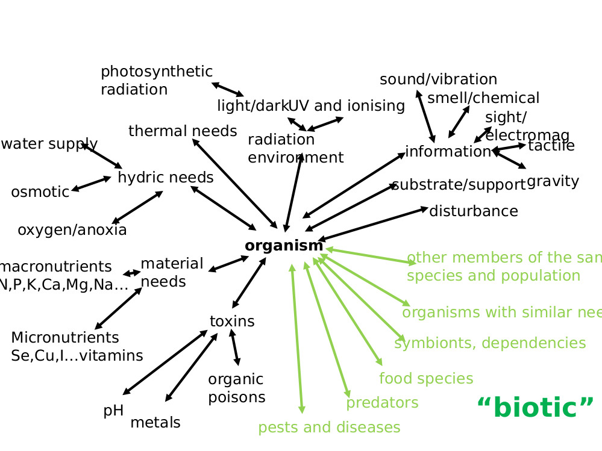
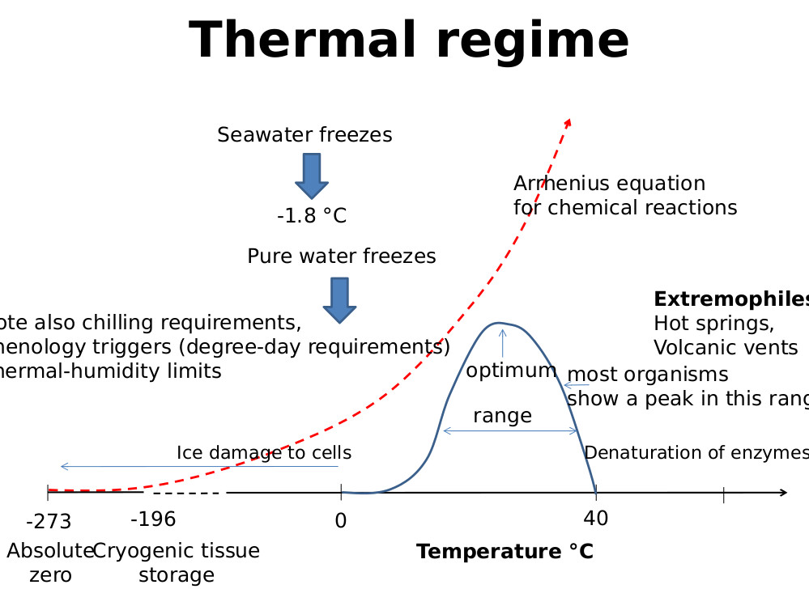

# Background

## A sense of scale

### Stommel diagrams
Plot a log of time(s) against a log of space(m).

### Reductionism
Describing or analysing complex phenomenon in terms of phenomena held to represent a simpler or more fundamental level, which if fully understood can provide a complete explanation/prediction for the complex phenomenon

### Holism
The theory/position that the hole can be more than simply the some of the parts due to the interactions between the parts which lead to emergent properties. (emergent properties can only be observed at the right scale)

### Scales in ecology

#### Ecosystem ecology
Biosphere
Biome
High level ecosystems
Ecosystem

#### Community ecology
Community
Population

#### Organismal ecology
Organism
tissue
Cell

### Mathusianism
Organisms don't grow independently they are constrained by energy and material requirements which leads to regulatory  feedback associated with thomas malthusian.

### Classical economics
There are not limits to growth because human ingenuity will always outpace human expansion.
Associated with Ester boserup

MEMORY DEVICE: talk between sex

### Applications
Determining carrying capacity
How much can be harvested from stock without upsetting cultivation environment
Existential crisis, limits to growth.

## Systems

### Not systems
Single object with inputs and outputs
Multiple objects which interact linear with each other, (ie no circular causality)
The interactions of one object with another could just be thought of as a input to the object in question and it could be analysed in isolation.

### (chaotic) systems
2 or more objects which interact with each other, this implies circular causality and non linear models must be used, and bifurcations often result

#### Complex systems
Complex system are not necessarily complicated in the conventional sense of the word, but they are very hard to predict.
Characteristics

##### Multiple stable states
It is very hard to predict how to shift between stable states, or what parameters variables must remain within to sustain a given stable state.(threshold/sepratrics)

##### Multiple factor causes

##### Circular causality

##### Emergent properties

## Definitions

### Emergent properties
Properties which can only be observed at the correct scale as the result from interactions between parts which are not apparent when viewing those parts in isolation
For example climate is a emergent property of weather, Clouds are an emergent property of water vapour particles in the atmosphere

### Bifurcations
Small random changes in a system which can lead to large changes in the direction or ultimate stable state which the system settles at.

## Argument forms

### Dialectic argument
Thesis + antithesis (becomes) synthesis
## Exams

### Questions list
Draw sommel diagram place an ecosystem.
Define ecosystem and emergent properties.

### Exams
In exams questions will be very broad requiring one to pick a stance and make a convincing case for it.

### Test
Tests will have shorter more direct questions

### Organisms and their environment.

###### definition: autecology
the view of an organism looking outwards on an environment.

#### requirements of an organism

##### response to a given factor.
In general the response on and organism to increasing amounts/concnetrations
of any given factor shows  humped shape growth curve. this growth curve can be
split into several sections.

###### sub critical
bellow the minimum level of the factor which the organism needs to survive.

###### sub optimal
the organism can survive but is not yet operating optimally due to a shortage
of the factor.

###### optimal
the organism has exactly the most beneficial amount of the factor and all other
things being equal, is growing at the highest possible rate.

###### supra optimal
 the organism is growing at below optimal rate because it has a detrimental
 excess of the factor.

##### nutrient requirements

###### plants

###### animals
NOTE: animals can gain water from metabolism.

##### water needs

###### plants
Essential:

    Non-mineral O, C, H
    Macro N, S, Ca, P, K, Mg
    Micro Cl, Fe, Zn, Cu, Mn

Beneficial:

    Si, Na, Co, Se

###### Animals

Essential:

      Bulk O,C,H,N,S
      Macro Ca, P, K, Cl, Na, Mg
      Trace Fe, Zn, Cu, I, Mo, Co, Se

Beneficial

    Sn, Ni, Va, F

NOTE: Animals like salt so much, because plants (which don't really need it) don't store in it in large quantities, therefore animals must find mineral sources of salt to augment their plant diets.

###### water availability
97% of water is salt water
of the remaining 3%, 70% is frozen, 29% is underground and 1% remains in rivers
and lakes.

Plants (from saturated to dry)
1. Aquatic
2. Emergent macrophytes
3. Mesophytes
4. Xerophytes

Animals
1. Aquatic
2. Amphibious
3. Land-dwelling Water-dependent.
4. water independent.

#### LieBigs law of the minimum
growth is controlled not by the total amount of resources but by the amount
of the scarcest resource necessary for growth.

##### example: redfield ration
biological entities/system show a very precise and constant element ratio or C:N:P:

    126:16:1 in marine plankton
    100:10:1 in Soil
    100:5:1 in Leaves
    19:3:1 Vertebrates

An increase in any element above that ratio will lead to no additional growth.

#### temperature requirements

##### plants
25 for C3 plants
28-30 for C4, tropical plants.
 ##### Earth as an environment.
 Earth lies in the goldilocks zone with regard to temperature, (and a number of)
 other conditions, not because of its location but more because it has an
 atmosphere which is capable of maintaining it at a stable temperature suitable
 suitable for life.
 the peculiar conditions found on earth result in part from the way the
 biosphere has acted to shape the climate, mineral distribution etc.

### organisms interactions with each other
(copy slide)

# Questions
exam
requirements of organisms from their biotic and abiotic environment, including
sub minimum optimal and supra optimal conditions.

test Liebig's law of minimums
give and example of oversupply of an essential growth factor
nitrogen, oxygen, water, temperature.

#Different Ecological Approaches

the extreme of this approach might be to see the earth as a (conscious, self preserving) entity in and of itself)

##Entities Higher than the organism

### Basic Questions
* Can conscious entities greater than the organism exist.
* Can natural selection take place at entities above the organism level.

## Friedric Clements (Clementian school)

### Background
dominant in (continental) Europe.

### Examples
the current felt management policy in South Africa is Clementian

## Henry Gleason (Gleasonian School)

###Background
Dominant in America
