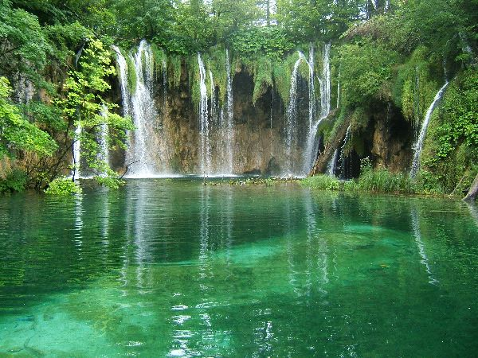
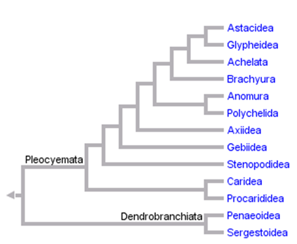
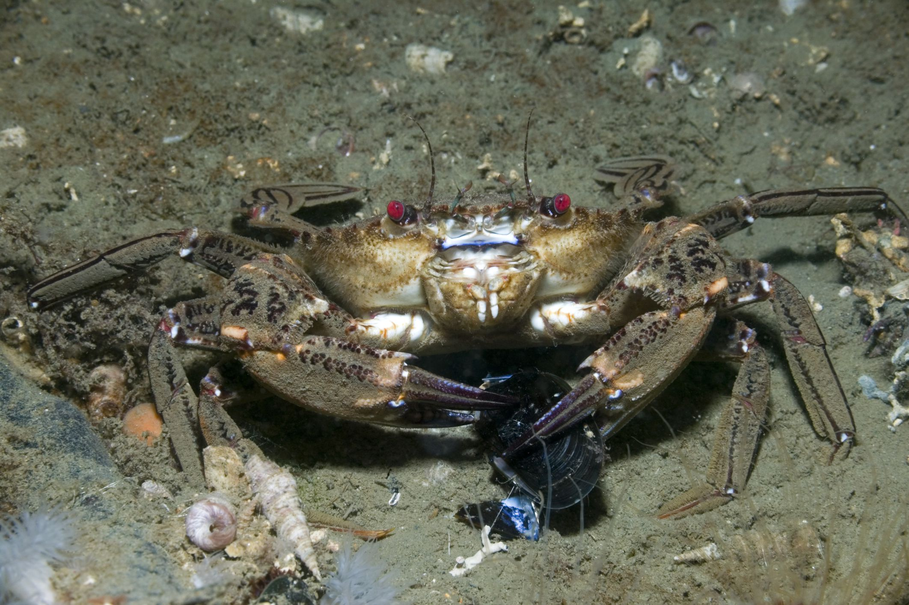
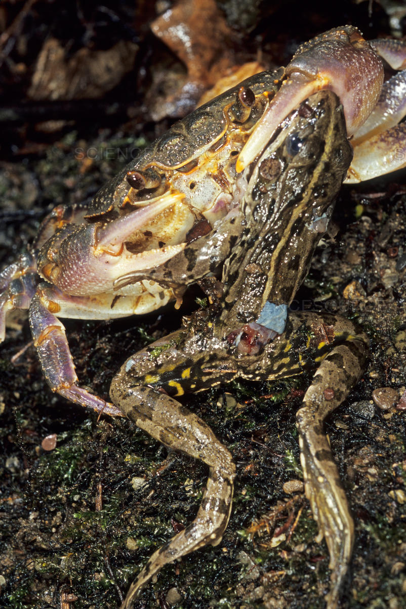
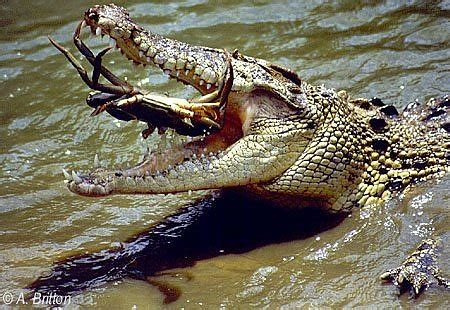
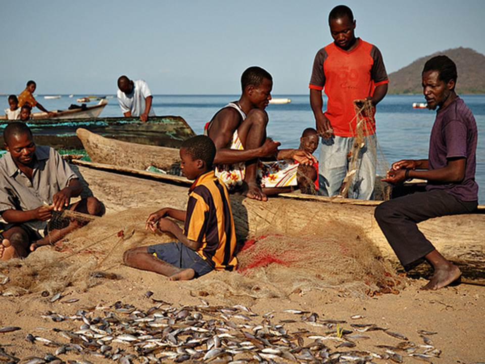
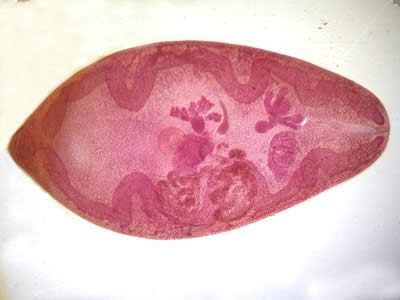
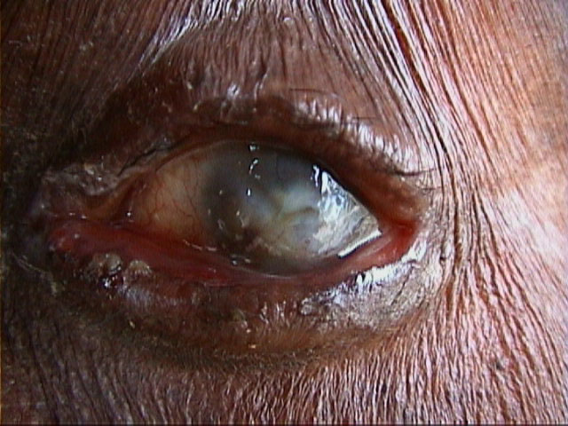

# Presentation

## Slide 1

 #. Globally, $>1 000 000$ spp rely on tropical freshwater ecosystems for survival. 
 
  
  
  
_Large, black text overlaid in a white box over the center of the image_
  
---

## Slide 2
### The threat
 #.  Large scale degradation of aquatic systems and deterioriation of water quality due to: 
    #. Pollution, global warming, and Deforestation.
 #. Deteriating water quality impact serious of the biology of aquatic systems. 
    #. A third to a half of fish and amphibian spp in some areas are already extinct or endangered.
 
 .jpg){width=40%}
 
 
.jpg){width=40%}

_Text on left side of slide images on right side of slide, First image appears with first statment, second image appear below first, at the same time as second statment appears below first_

---

---

## Slide 4 
 #. Effect on Freshwater invertebrates (specifically crabs) been affected? 
 #. Why is it so important to know? 
    #. What are freshwater crabs? 
    #. Where are they found? 
    #. what ecological roles do they fill?
    #. What economic impact do they have?
 
_text in Red bold font on white or blue background, Last three questions appear after first two and in smaller font_
 
---

---
 
## Slide 5
### What are Freeshwater crabs?
 #. Crabs of decapods of the infraorder Branchyra, (the largest of all decapod groups)
 #.  $\frac{1}{5}$ of all crabs are freshwater crabs including the superfamilies:
     #. Gecarinucodiea, Potamoidea, Psuedothelphusodiea, and Trichodactyloidea. 
      
{width=40%}
    
---
  
---

## Slide 6 
### Where are They found? 
 #. Rivers, Streams waterfalls, karsts, and caves.
 #. Almost all clean water bodies from moist lowland forests to rugged mountains
 #. Many are also semi-terrestrial. 
 #. Require prestine water conditions to survive

.jpg){width=20%}

.jpg){width=20%}

.jpg){width=20%}

_Images in one row along the bottom under the text_

---

---
 
## Slide 7 
### Ecological Role of Freshwater crabs. 
#### Feeding
 #. Predators
    #. control populations of aquatic insects and gastropods. 
 #. Herbivors.
    #. fallen leaves, algae and beachnuts. 
 #. Detritovors
    #. Dead frogs and snakes. 
    
{width=40%}

{width=30%}

{width=30%}
 
## Slide 8   
### Nutrient Cycling  
  #. Ditrotivor feeding habits (Shredding guild)
  #. 88-94\% of overall biomass in the streams and debris dams in the eastern Usambara Mountains of Tanzania. 
  #. Very important to dynamics of nutrient cycling. 

## Slide 9
### Prey species
  #. Food for a wide range of predators. 
      #. Otters, mongooses, civets, kites, ergets, herons, and kingfishers, eels bullfrogs, toads, monitor lizards and crocodiles, turtles, capuchin monkeys, wild boar. and stream snakes.

{width=50%}

---

---

## Slide 10
### Prey species 
 #. Invasive north american crayfish, replaced native crabs in western Kenya
 #. Upward trophic casdace, decrease in clawless otter populations. 

.jpg){width=50%}

---

---

## Slide 11
### Crabs as a source of genetic diversity. 
 #. Alleopathic speciation
    #. Low fercundity 
    #. Low vagility
    #. Fragmented nature of aquatic water bodies
 #. Sympatric speciation
    #. Niche specialisation
    #. Up to 5 different species in one site

---

---

## Slide 12 
### Economic importance of fresh water crabs

#### Crabs as a food Source. 
 #. The dirrect consumption of Crabs as a food source is wide spread
 #. Crab fisheries in Lakes Malawe and Tanganyika fuel the local economy. 
 
 .jpg){width=50%}
 
 {width=50%}

---

---

## Slide 13
## Medicinal importance
 #. Crabs act as a host species for several important human parasites
     #. Paragonimiasis: (a food borne zoonosis)
        #.diarrhea, abdominal pain, fever, cough, pulmonary abnormalities
        #. 20 million people infected world wide.
     #. Biting blackfly. _Simulium spp_,
        #. Vector of infection for parasite _Onchocerca volvultus_, which causes onchocerciassis (river blindness). 

{width=50%}

{width=50\%}

---

---

## Slide 14 
### Anthropic effects on Freshwater Crabs. 
 #. Lack of research detailing current ecological status
 #. Existing research suggests many freshwater crab species seriously endanger
 #.  2008 IUCN Red list incread number of threatened of endanger species from 93 to 1280 globally. 
 
---

---

### Slide 15
### Purpose of the research
  #. Assess anthropic effects and ecological status of fresh water crabs. 
  #. Comprehensive study including
      #. 1280 freshwater crabs
      #. Tropical regions of Americas, Africa, Asia and Australasia. 
      #. All five major families (as above) 
