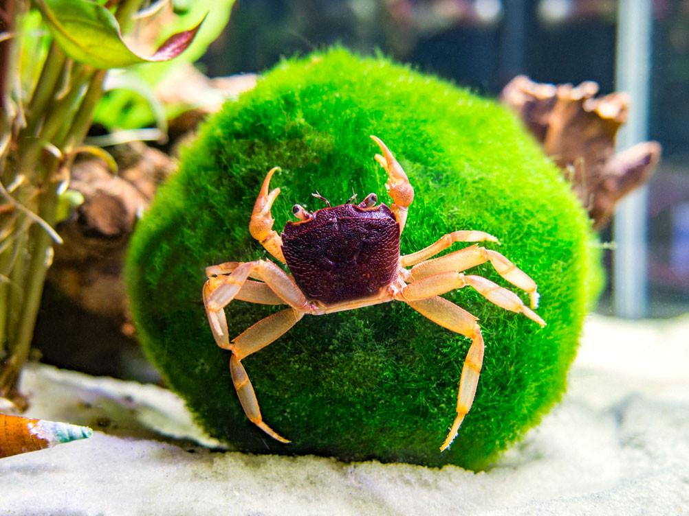

# Presentation

## Slide 1

 #. Globally, $>1 000 000$ spp rely on tropical freshwater ecosystems for survival. 
 
  
  
  
_Large, black text overlaid in a white box over the center of the image_
  
---

## Slide 2
 #. Pollution and global warming have led to large scale degradation of aquatic systems and deterioriation of water quality. 
 #. Deteriating water quality impact serious of the biology of aquatic systems. 
    #. A third to a half of fish and amphibian spp in some areas are already extinct or endangered.
 
 .jpg){width=40%}
 
 
.jpg){width=40%}

_Text on left side of slide images on right side of slide, First image appears with first statment, second image appear below first, at the same time as second statment appears below first_

---

---

## Slide 4 
 #. Effect on Freshwater invertebrates (specifically crabs) been affected? 
 #. Why is it so important to know? 
    #. What are freshwater crabs? 
    #. Where are they found? 
    #. what ecological roles do they fill
 
_text in Red bold font on white or blue background, Last three questions appear after first two and in smaller font_
 
---

---
 
## Slide 5
### What are Freeshwater crabs?
 #. Crabs of decapods of the infraorder Branchyra, (the largest of all decapod groups)
 #.  $\frac{1}{5}$ of all crabs are freshwater crabs including the superfamilies:
     #. Gecarinucodiea, Potamoidea, Psuedothelphusodiea, and Trichodactyloidea. 
  
  
      
{width=40%}
    
---
  
---

## Slide 6 
### Where are They found? 
 #. Rivers, Streams waterfalls, karsts, and caves.
 #. Almost all clean water bodies from moist lowland forests to rugged mountains
 #. Many are also semi-terrestrial. 
 #. Require prestine water conditions to survive

.jpg){width=20%}

.jpg){width=20%}

.jpg){width=20%}

_Images in one row along the bottom under the text_

---

---
 
## Slide 7 
### Ecological Role of Freshwater crabs. 
#### Feeding
 #. Predators
    #. control populations of aquatic insects and gastropods. 
 #. Herbivors.
    #. fallen leaves, algae and beachnuts. 
 #. Detritovors
    #. Dead frogs and snakes. 
    
{width=40%}

{width=30%}

{with=40%}
 
## Slide 8   
### Nutrient Cycling  
  #. Ditrotivor feeding habits
Shredding guild
  #. 88-94\% of overall biomass in the streams and debris dams in the eastern Usambara Mountains of Tanzania. 
  #. Very important to dynamics of nutrient cycling. 
  #. food for a wide range of predators,
      #. Otters, mongooses, civets, kites, ergets, herons, and kingfishers, eels bullfrogs, toads, monitor lizards and crocodiles. 
        #. Pseudothelphusids preyed upon by turtles and capuchin monkeys, and in Asia fresh preyed upon by wild boar. and stream snakes. (_Opisthrotropis kikuzatoi_)
        #. Case study
          #. Invasive north american crayfish, out competed replaced native crabs, decrease in clawless otter populations. 
          #. Fragmented freshwater habitats 
 #. Low fercundity, direct development and low vagility, frequent isolation and allopatric speciation, high levels of endemism. 
 #. Niche specialisation sympatric speciation leadinging to increased diversity. One site five species occupying different habitats. 
 #. Studies in malasia suggest that freshwater crabs may face the same fate. 
 #. 2008 IUCN Red list threatened species (within all five major families), increase from 93 is Asia and Africa to 1280 globally. 

Wide spread destruction of tropical environments etc.           

#. What was done? 
    #. 1280 freshwater crabs from the troppical regions of Americas Africa, Asia and Australasia. 
        #. Families, Pseudothelphusidae, Trichodactylidae, Potamonautidae, Potamidae and Gecarcinucidae. 

 #. medical importance as paragonimiasis hosts in Asiea Africa and Neotropics, (food borne zoonosis)
    #. 20 million people infected world wide. 
    #. Biting blackfly. _Simulium spp_, 
      #. Vector of infection for parasite _Onchocerca volvultus_, river blindness (onchocerciassis in Africa.). 
      

  #. basis of small scale fisheries (Lakes malawi and Tanganyika in East africa). 
  
  
  
