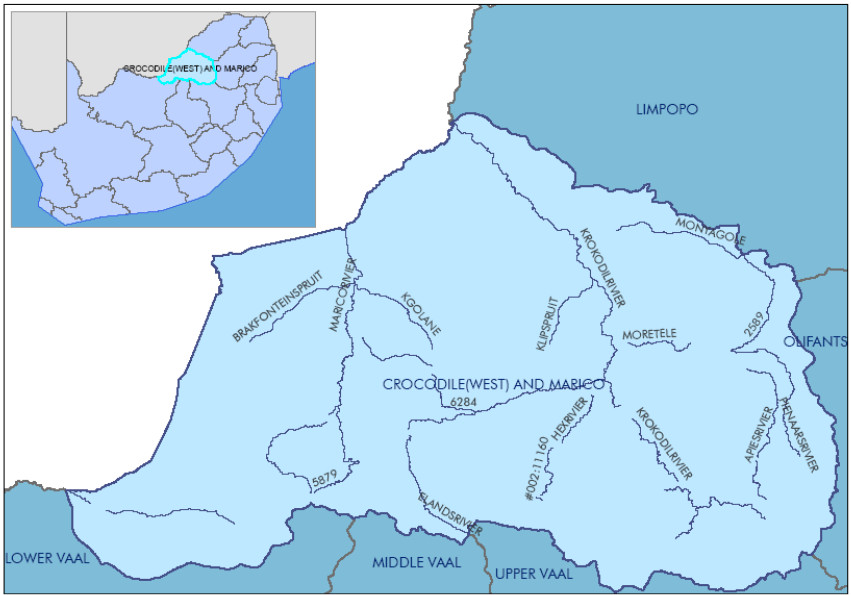
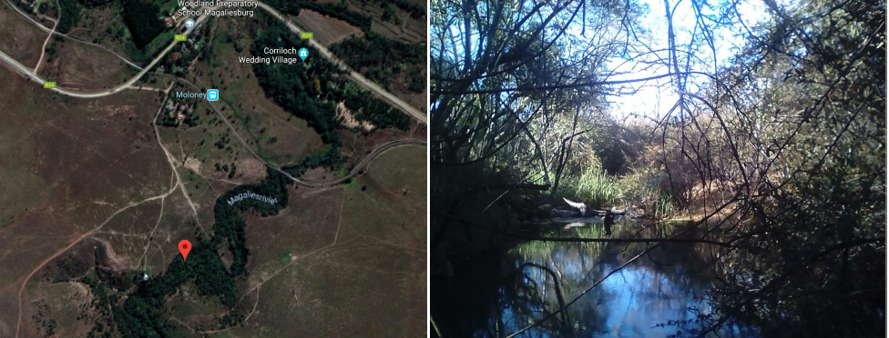
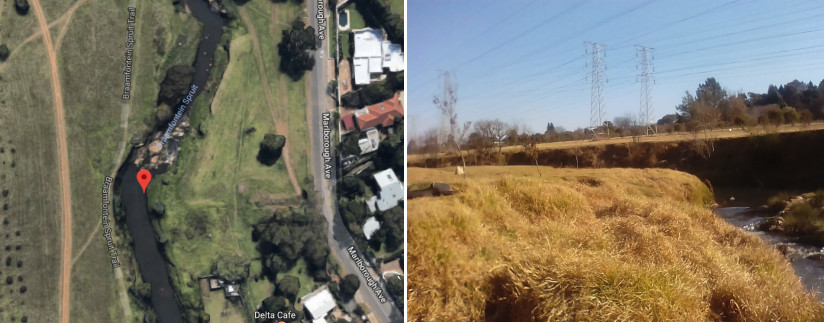
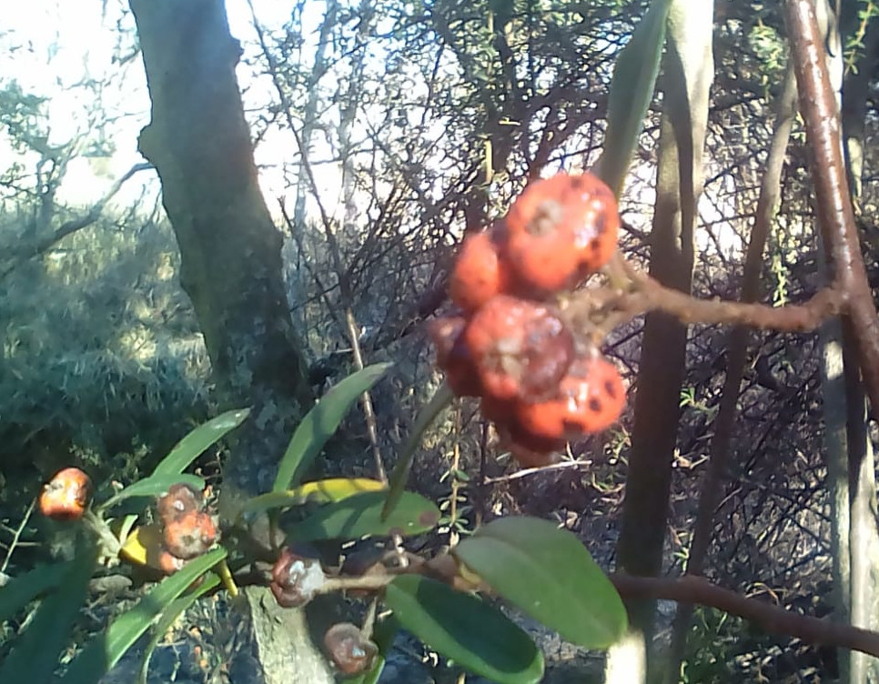

\fontsize{11}{22}
\fontseries{n}
\selectfont

$\quad$\newline
$\quad$\newline
$\quad$\newline
$\quad$\newline
$\quad$\newline
$\quad$\newline
$\quad$\newline

{width=75%}

$\quad$\newline
$\quad$\newline
$\quad$\newline
$\quad$\newline

.$\quad$$\quad$$\quad$$\quad$$\quad$$\quad$$\quad$$\quad$$\quad$$\quad$$\quad$$\quad$$\quad$$\quad$$\quad$$\quad$$\quad$ 27th October, 2018

\newpage


```{r, echo=FALSE}
# Discharge calculations
H1<-c(23,29,35.5,38,42.5,39)
H2<-c(19,27,34,37,42,38)


# Magalies
mdis<-c(round(0.035868*60), digits=2)


bdis<-round(c(0.472612430000003*60), digits=2)
#dD<-c(0.5*)

```

# \textbf{ABSTRACT}
This study aimed to assess the impact of urbanisation and anthropic disturbance on the Braamfontein Spruit freshwater aquatic ecosystem. The assessment was performed by tracking differences observed in selected, physiochemical characteristics, biological indicators of diversity and water quality, and indicators of catchment condition, between the inner-city Braamfontein Spruit sample site, and the Magalies River pristine rural reference site. The South African Scoring System (Version 5), was used for quantification of biological indicators, and the Index of Habitat Integrity was used for quantification of catchment condition. Significant differences were found in all biological and habitat indicators, as well as most physiochemical conditions. The differences observed may be linked to heat pollution, and erosion due to flooding from storm drains, in addition to high turbidity, and risks of eutrophication linked to increased run off and potential sewerage leaks. Overall urbanisation and anthropic disturbance can be linked to a marked decreased in biodiversity and water quality significantly degrading the ecological state of the system. 


# \textbf{KEYWORDS}
Freshwater Ecosystems; Habitat Integrity; South African Scoring System; Urbanisation, Braamfontein Spruit

# \textbf{INTRODUCTION}

Globally, urban freshwater ecosystems play a variety of very important social, economic and ecological roles. These systems function as: recreational areas (Swanwick _et al._, 2003); animal and plant habitats, an important source of fish stocks (Berkes, 1979), flood control systems (Levy _et al._, 2007), domestic or industrial water treatment and disposal systems; and even directly as a source of bathing or drinking water in some communities. However, urban, freshwater systems come under considerable stress due to human disturbance, predominately in the form of pollution, often so much so that their natural function may become entirely compromised. A detailed, and localised understanding of the nature and consequences of anthropic disturbance, may prove critical for effective protection and remediation of these vital systems.
$\quad$\newline

Much research has already been done into the deleterious effects of pollution on aquatic ecosystems. Nitrate pollution, deriving from domestic sewerage, has been linked, at a global level, to eutrophication, and to resulting losses in biodiversity and system function, (Julio and Alvaro, 2006). Other nutrient based pollution, such as phosphate pollution from agricultural fertilisers, or washing powders has also been shown to decreased species diversity, nutrient uptake, and productivity within aquatic systems, (Walsh _et al._, 2005). Finally, industrial pollution, such as acid mine drainage, can lead to increased heavy metal toxicity (Ata and Soner, 2006), which is particularly difficult to remove from waste water (Fu and Wang, 2011), and can build up to highly toxic levels with aquatic organisms through the process of bioaccumulation and biomagnification, (Spehar _et al._, 1978). Human communities also suffer from heavy metal pollution due to increased toxicity in drinking water (Duruibe _et al._, 2007).
$\quad$\newline

Significant physical sources of disturbance have also been identified, such as the effects of storm water run off, where a connection was established  between water run off schemes and river ecological condition. (Walsh _et al._, 2012). Erosion from ground disturbance in buildings can also wash down into urban aquatic systems increasing the turbidity, and potentially even blocking the water channel completely. (Collins _et al._, 2011). 
$\quad$\newline


Finally, biological source of disturbance, such as the introduction of invasive alien species may also be anthropically introduced, and can have a serious negative impact on the water quality and biodiversity of a system. For example, large predatory fish species, introduced to add to local fish stocks, such as _salmoides_ species, can serious reduce the diversity of macroinvertebrate communities by vociferous predation (Weyl _et al._, 2010). This increased predation pressure can initiate a trophic cascade, as reduced numbers of primary consumers promote increases in algal biomass further disrupting underlying nutrient cycling and ecological processes. (Simon _et al._, 2003). Biological impact can also originate from the lowest trophic levels as with the invasive diatom species _Didymosphenia geminata_ in Australian systems which forms thick sludge layers covering the channel substrate and impacting on hydrology, and food web structure. This invader impacts negatively on fisheries, hydrological power stations and tourism, degrading the local water systems and decreasing their water quality. (Spaulding and Elwell, 2007). 
$\quad$\newline

 Overall, many pertinent anthropic causes of pollution have been identified and categorised, and their effects investigated at a global level; however, the degree of disturbance, and well as the leading causes of anthropic disturbance still remain relatively unknown within many smaller localised systems. Investigations into the condition of such systems can provide important insight for local administrators, or other interested and affected parties such as recreational uses, and communities dependant for water and fishing resources. Additionally, the information obtained from such investigations can be of great assistance in community based or governmental remediation attempts.
$\quad$\newline

The aim of this study was to assess the effects of urbanisation and anthropic disturbance on the ecological state of the Braamfontein Spruit freshwater ecosystem. This aim was split into several objectives. Firstly, to assess the extent, and nature of physiochemical changes within the urban system, specifically, dissolved oxygen, pH, temperature and turbidity. Secondly, to assess the differences in biological diversity, and by extension water quality in the urban versus the rural system, using the South African Scoring System (SASS), Version 5, methodology. SASS scores were also used to calculate the Present Ecological Status (PES) of each site. Thirdly, to assess any differences in the ecological integrity of the surrounding catchment between the urban and the rural system using the Index of Habitat Integrity (IHI) scoring methodology. The SASS methodology uses the diversity of macroinvertebrate species observed as an indicator of water quality, as many rarer macroinvertebrate species are dependant on high water quality for survival (Phipps _et al._, 1995). The IHI scoring methodology relies on visual clues of anthropic presence within the catchment to assess the overall level of anthropic disturbance.
  
\newpage

# \textbf{METHODS AND MATERIALS}

## \textbf{Study area}
Two separate sites were assessed in this study, a lowlands section of the Braamfontein Spruit (the main study site) lying within a highly developed urban area, and a pristine upland section of the Magalies River, used as a reference site. 
$\quad$\newline

### \textbf{Braamfontein Spruit study site}
The Braamfontein Spruit study site, GPS coordinates, $26^\circ07'35.3"S 28^\circ00'59.1"E$ (Fig. 2), lies within Delta Park, a public park located along Craighall Road within Victory Park, Johannesburg, a major city within the Provence of Central Gauteng. The Braamfontein Spruit falls within the upper Crocodile sub-region of the Crocodile (west) and Marico water management area water management area seen in Figure 1 below (Statistics South Africa, 2010), which falls under the jurisdiction of the department of Water and Sanitation. The area under study is within the highveld ecoregion, a level 1 ecoregion (Kleyhans _et al._, 2005), under the jurisdiction of the Johannesburg Metropolitan Municipality. 
$\quad$\newline

The Spruit itself is fed by the Montgomery and Westdene Spruits and originates just above the Westdene dam, flowing through several kilometers of highly developed city areas before the sample site is reached (Masetle, 2014). The park lies within a highly populated urban district with many recreational users frequenting the park every day (Visser, 2008), as well as homeless individuals who inhabit the park, and may use the river waters for bathing or cooking ( Bosaka, 2015). Furthermore the park was historically a sewerage treatment site (Maud, 2008) any although it has been re-purposed, it is still a hub of the Johannesburg sewerage transport network (Taylor, 2008), with the possibility of multiple leaks of raw sewerage directly into the river (Jonker, 2017), or by overflowing of nearby sewers (Fig 4). Many storm water drains also empty directly into the river as seen in Figure 4. The site is prone to frequent serious erosion due to flooding from storm water drains. (Masawi, 2018).
$\quad$\newline

### \textbf{Magalies River reference site}
The Magalies River study site, GPS coordinates $26^\circ 0' 59.7"S, 27^\circ 33' 51.5"E$ (Fig. 3), lies within the Magaliesburg mountains just outside the city of Johannesburg, to the west. The Magalies river also falls within the upper Crocodile sub-region of the Crocodile (west) and Marico water management area, but the site itself is within the western Bankenveld ecoregion (a level 1 ecoregion (Kleyhans _et al._, 2005), and falls under the jurisdiction of the Westrand district municipality. 
$\quad$\newline

The sampling site is within less than a kilometers of the river source, with only very limited housing developments, including the wedding venue and school seen in Figure 3 upstream, and only one major road, the R24, near by (Fig. 3). The riparian zone is highly forested, predominately with alien invasives such as the _Pyracantha angustifolia_ ( Fig. 5). This tree cover extends significantly over the stream itself, blocking out light and depositing leafy debris. Aside from the presence of these alien invasives, however, the site displays very little sign of human impact and can be generally regarded as pristine. 


\newpage
## \textbf{Experimental design and protocol}

### \textbf{Physiochemical parameters}
For each study site, measures of physiochemical parameters and biological/habitat indicators were assessed at four sample sites displaced $\approx$ 30m from each other along the river channel. For each sample site an identical sampling procedure was employed. 
$\quad$\newline

Before any other sampling took place, a turbidity sample was taken by gently submerging a sampling bottle in the center of the channel, and allowing it to fill. The sampling bottle was then sealed tightly, for storage and taken back to the laboratory where absorbance was measured (in Nephelometric Turbidity Units) using a Hanna turbidity meter (model HI98703-02). 
$\quad$\newline

pH, temperature, dissolved oxygen, and conductivity were all assessed using a handheld YSI Professional Plus multi-parameter meter. Measurements were taken by placing the probe in the center of the water channel, and taking the measurement only once the reading stabilised. Only one reading was taken at each sample site.
$\quad$\newline

A Transparent Velocity Head Rod (TVHR) (sourced from the company GroundTruth, operating in Pietermaritzburg, South Africa), along with a 50m tape measure were used to make the measurements required to calculated discharge\footnote{Due to anomalies which occurred in data collection and storage only one measurement of discharge was taken for each study sites}. The tape measure was used to measure the in channel width of a slow flowing section of the channel with a smooth, homogeneous benthos, i.e an area with no sudden variations in depth or large stones on the river bed, or macrophytes blocking the river flow.  The TVHR was then used to, measure the depth of the channel at 0.5m intervals along the horizontal line which was used in measuring channel width. The height difference due to water build up behind the TVHR was also measured, and used to calculate an estimate of water velocity. The overall discharge was estimated using the equations set out in (Benson and Dalrympl, 1967).
$\quad$\newline

### \textbf{Biological indices}
The standard SASS Version 5 methodology as described in Dickens and Graham, 2002, was used for the sampling of Aquatic invertebrates with some minor adaptions. In place of the standard SASS sampling nets, butterfly catching nets were used, and the sampling period was extended to 5 minutes, in cases where it appeared few macroinvertebrates had been collected in the designated time. The macroinvertebrate samples, once collected where placed in $\approx$ 85\% ethanol solution, and stored for several weeks, before identification. 
$\quad$\newline

 The overall SASS score as well as the ASPT where used to calculate the Present ecological status using the boundary levels given in Dallas, 2007. A relatively pristine section of the Magalies river was also sampled as a control/stand for comparison.

### \textbf{Habitat integrity}
Signs of human impact were observed and categorised in nature and extent using the IHI scoring system as detailed in Amis, 2007.


## \textbf{Data Analysis}
The overall average of each physiochemical characteristic measured, as well as the habitat integrity score, and biological indicator scores were calculated from the data collected at each sample site. This averaging was used to reduce no-determinate errors, and local variations associated individual measures. The standard error for each parameter was also calculated to given an indication of the natural variation present, and the precision of the measurements obtained. 
$\quad$\newline

Two sample, equal variance, two tailed, Student t tests were performed to test for significant differences in each parameter between the two study sites (the Braamfontein Spruit and the Magalies River), at a 5\% significance level. Equal variance of the two study site was assumed with no explicit statistical test. Two tailed tests were used as the null hypothesis behind the assessment was simply that no significant difference existed between the sample site and the reference site. 

# \textbf{RESULTS} 

## \textbf{Physiochemical data}

Measures of Conductivity, Dissolved oxygen, and Turbidity were all a good deal higher, on average at the Braamfontein Spruit sampling sight (Table 1), at which there was a higher current, more riffles/shallow rocky sections, and more macrophytes growing within the water channel itself. The discharge measured at that Braamfontein site was also a good deal higher than that of the Magalies reference site (Table 1), however, due to the lack of repetitions the significance of this difference could not be assessed. Manholes for sanitary sewers were also located near to the banks of the stream at this site. Furthermore, the differences observed in Turbidity, dissolved oxygen concentration were all both highly significant (Table 2) well below the conventional 5\% significance level set for the purpose of this study. Conversely, however, the difference observed in average conductivity had only a low associated significance level (Table 2) (Predominately due to the very large variance in the conductivity measures taken), and so was not considered significant for the purposes of this study. Furthermore measures of pH and Temperature, were higher at the Magalies sampling site (Table 1), although only the difference in temperature actually proved to be significant (Table 2).
$\quad$\newline

## \textbf{Habitat assessment}
The Index of Habitat Integrity (IHI) score was far higher at the Braamfontein Spruit site (Table 1), which as afore mentioned, lies in a densely populated urban area, and exhibited visible signs of human disturbance such as plastic waste floating within the channel itself, as well as large storm drain pipes draining directly into the channel and bridges and a large pedestrian bridge placed over the channel (Fig. 4). This significant difference is further demonstrated by (Fig. 6), in which it can be seen that not only is the mean IHI score at the Braamfontein Spruit sampling site more than double that of IHI score for the Magalies River reference site, there is is no overlap in the error bars for the two means, Theses error bars, which show the standard error in the means, support the observation of significant difference given in Table 2, showing that the difference in means is highly unlikely to have arisen simply from random variation.
$\quad$\newline

## \textbf{Biological indicators}
All of the indicators of biological diversity measured i.e, overall South Africa Scoring System, version 5 (SASS) score, taxa score, and Average Score per Taxon (ASPT), were higher at the Magalies sampling site at which different biome types were more distinctly segregated, and evenly distributed along the river channel, as seen in Table 1. The differences observed in these parameters between the two sampling sites were without exception significant, as seen in Table 2. The significance of this difference is further reinforced by the PES categorisation, given by the SASS scores obtained, which identified the disturbance seen at the Braamfontein site at a distinctly higher level/category than that seen at the Magalies reference site. The present ecological status calculated from the SASS scores obtained also showed a marked difference between the sample and reference sites (Fig. 7). 

\newpage

# \textbf{DISCUSSION} 

The disruptive effects of urbanisation are clearly present across all aspects of the Braamfontein Spruit system, from the physiochemistry to the biology, to the integrity of the surrounding habitat. Theses changes are closely connected. Arguably the processed underlying the degradation observed may originate with changes in the physiochemical character, and catchment conditions related to urbanisation and anthropic disturbance, which subsequently impacted upon the biology of the system. This amalgamation of changes then lead to a marked decrease in water quality, linking to the degradation of the system as a whole. 
$\quad$\newline

This first major sign of disturbance is evident in the significant difference in temperatures measured between the two sites. The nature of this difference was unexpected as mountainous headwater are conventionally much cooler than larger lowland streams, due to their higher altitude, lower exposure to sunlight, and proximity to the cold river source (Allanson and Gieskes, 1961). The lower temperature in the Braamfontein Spruit may related to the increased turbidity, as even at very shallow depth below the water surface the penetration of sunlight, and the resultant heating may be seriously decreased (Paaijmans _et al._, 2008 ). However, given the vigorous current, the exposure to wind action (due to low tree cover) and the frequent riffles present in the Braamfontein Spruit, physical/mechanical water mixing might be expected bring the sunlight heated surface waters into thermal equilibrium with the water just below minimizing the effects of this difference. Perhaps a more likely explanation is that an influx of cold storm water in flooding (Masawi, 2018), brings in water which enters the river directly from the underground storm sewers system (Hence not exposed to sunlight), resulting in thermal pollution lowering temperature of the Braamfontein Spruit site. Thermal pollution can be an issue for the local biota affecting the energy budget of aquatic animals which must expend additional energy in heating/ cooling, or triggering unseasonal spawning events, critically endangering an animals reproductive cycles. (Olden and Naiman, 2010). 
$\quad$\newline

The significant difference in oxygen concentration observed may be direct related to this abnormal temperature difference, as oxygen solubility in water increases with decreased temperature. (Truesdale, and Downing, 1954). Additionally, the increase in oxygen levels may also come as a result of the afore mentioned mechanical mixing. Despite the anomaly of the relatively high oxygen concentration, its biological effect is likely to be relatively insignificant as higher oxygen concentrations are not directly associated with any form of toxicity. The increased oxygen concentration, in conjunction with the lower temperatures may favour a change in the macroinvertebrate, as well as fish and macrophyte populations within the system increasing the competitive advantage of highly oxygen dependant species. However, given that high oxygen dependant species, which are typically headwater species are usually highly sensitive to chemical pollution (Woodcock and Huryn, 2007), and are maladapted to high turbidity environments (Vuori and Joensuu, 1996), they are still unlikely to persist in a polluted urban system. Hence, little overall biological effect, aside perhaps from a slight increase in productivity could be expected. Conversely a significant increase in turbidity could have a more serious biological effect.
$\quad$\newline

Increased turbidity may be linked to erosion caused by flooding from the afore mentioned storm drains, in addition to direct run off from the surrounding catchment. The increase in impervious surfaces within the surrounding surfaces which contributed in part to the high IHI score obtained, implies that water will not infiltrate as well within the catchment, leading to increased run off as a pose to subsurface flow. This run off is more likely to pick up loose surface sediments which will be washed down into the river itself. The disruption of the nearby land surface in human developments, such as mud or clay from road work excavations, or fine sand deposited for use in construction, will also be picked up by run off, adding to the sediment load. Increased turbidity can have a serious negative impact on the local biology such as diminishing the number of visual predators such as fish or even crabs (Utne-Palm, 2002), diminishing biomass of phytoplankton due to decreased light penetration, and hence lower overall productivity, and finally diminishing numbers of benthic macroinvertebrates sensitive to mud accumulation within their integument or gills, or loss of interstitial habitats. (Kasangaki _et al._, 2008). The decrease in benthic macroinvertebrates may be one of the major drives behind the lower SASS, and ecological status scores obtained. 
$\quad$\newline

The increased turbidity may be due in part to an increase in dissolved and suspended biological material. Dog and horse feces (resulting from recreational uses of the park), brought down in runoff, in addition to potential sewerage overflows, could increase the concentration of dissolved biological molecules, especially nitrates and phosphates, within the river. Increased nutrient concentration runs the serious risk of inducing eutrophication, and the related decrease in biodiversity and water quality (Nyenje _et al._, 2010). In this case it appears that the system has not yet transformed into a eutrophic state due to the high dissolved oxygen content, in addition to the neutral/ slightly basic pH which is fairly atypical of a eutrophic system. None the less such pollution still places the system in significant danger of eutrophication especially as the decreased biodiversity and modified physiochemistry are already likely to have reduced resilience and resistance within the system. 
$\quad$\newline

The higher level of discharge seen in the Braamfontein site may also link directly to this increased run of and injection from storm drains. This comparison is unreliable both because of the lack of repetition in the discharge measurements taken and because the Braamfontein site which is further down stream would by default be expected to have a higher discharge (Vannote, 1980). However, an increase discharge related to flooding events could help to explain the lack of biological diversity captured in the SASS scores, leading to high levels of disturbance which are typically linked with decreased biodiversity (Townsend, 1997). Over time the system may be expected to shift to to contain only coloniser species adapted to common disturbance, or species specifically adapted to high flow such as larval caddisflies (_Anabolia_) (Statzner and  Holm, 1989).
$\quad$\newline

In Conclusion, The significant difference seen in biological indicators of water quality and ecological status, can be linked to both physiochemical changes within the river as well as degradation of the surrounding catchment resulting from urbanisation. Erosion and run off from increased flooding due to nearby roads and other impervious surface, and loose sand deposits for construction, increase the turbidity of the water and hence negatively impacting on fish macroinvertebrates and phytoplankton within the stream. Aside from the physical effects of turbidity there is also the related increase in nutrient concentration, exacerbated by potential sewerage leaks/ overflows which risk push the system towards a eutrophied state. Finally potential temperature pollution from storm drains, in combination with the increased flooding disturbance causes by these drain may also decrease the biological diversity. Overall, within the Braamfontein Spruit, habit degradation and physiochemical disturbance related to urbanisation of the surrounding catchment, have had a discernible negative impact upon the river's biology, and water quality, implying serious ecological degradation of the entire system. 

# \textbf{ACKNOWLEDGEMENTS}
Thanks are owed to the University of the Witwatersrand for providing all sampling materials, in addition to reference books used in macroinvertebrate identification for SASS scoring, as well as all Witwatersrand Aquatic Ecology Students who aided in all sampling and data collection. 


# \textbf{REFERENCES} 

Allanson, B. R., Gieskes, J. M. T. M.,1961.  Part I The physical, chemical anf biological conditions in tihe Jukskei-Crocodile River System. _Hydrobiologia_, 18(1-2), 2-76.

Amis, M. A., Rouget, M., Balmford, A., Thuiller, W., Kleynhans, C. J., Day, J.,Nel, J., 2007. Predicting freshwater habitat integrity using land-use surrogates. _Water South Africa_, 33(2).

Ata A., Soner K., 2006. Acid Mine Drainage (AMD): causes, treatment and case studies, _Journal of Cleaner Production_,14,12–13: 1139-1145,

Benson, M. A., Dalrymple, T. ,1967. General field and office procedures for indirect discharge measurements (No. 03-A1). _United States Goverment_ , Print. Official. 

Berkes, F., 1979. An Investigation of Cree Indian Domestic Fisheries in Northern Quebec. _Arctic_, 32(1), 46-70.

Bosaka, P. ,2015. Changing Practices of the State: Johannesburg City Parks and Zoo Officials’ Views on Opportunities and Challenges of Community Engagement.

Christopher J. Walsh, Allison H. Roy, Jack W. Feminella, Peter D. Cottingham, Peter M. Groffman, and Raymond P. Morgan, 2005. "The urban stream syndrome: current knowledge and the search for a cure," _Journal of the North American Benthological Society_ 24,3: 706-723.

Collins, A. L., Naden, P. S., Sear, D. A., Jones, J. I., Foster, I. D., Morrow, K., 2011. Sediment targets for informing river catchment management: international experience and prospects. _Hydrological Processes_, 25(13), 2112-2129.

Dallas, H.F., 2007. River health programme: South African scoring system (SASS) data interpretation guidelines. _Report produced for the Department of Water Affairs and Forestry (Resource Quality Services) and the Institute of Natural Resources_.

Dickens C.W.S., Graham P.M., 2002. The South African Scoring System (SASS) Version 5 Rapid bioassesment method for rivers,Umgeni Water, _African Journal of Aquatic Science_ ,27:1-10

Duruibe, J. O., Ogwuegbu, M. O. C., Egwurugwu, J. N. ,2007. Heavy metal pollution and human biotoxic effects. _International Journal of physical sciences_, 2(5), 112-118.

Fu, F., Wang, Q., 2011. Removal of heavy metal ions from wastewaters: a review. _Journal of environmental management_, 92(3), 407-418.

Jonker, L.,2017. Aquatic ecological assessment as part of the enviromental assessment and authorisation process for the proposed mamagement and control of the Braamfontein Spruit in Johannesburg within the Gauteng province.Report Reference No. SAS 216040, prepared for SRK consulting.  

Taylor, L. 2008. Johannesburg City Council, 1930 to 1963, Annual Report of the City Engineers.

Redcliffe, B.J.P.R.M., 1938. City government: the Johannesburg experiment. The Clarendon press.

Julio A. C., Álvaro A., 2006. Ecological and toxicological effects of inorganic nitrogen pollution in aquatic ecosystems: A global assessment, _Environment International_, 32,6,2006: 831-849,

Kasangaki, A., Chapman, L. J., Balirwa, J., 2008. Land use and the ecology of benthic macroinvertebrate assemblages of high‐altitude rainforest streams in Uganda. _Freshwater biology_, 53(4), 681-697.

Kleyhans, C.J., Thirion, C., Moolman. J. , 2005. A Level I River Ecoregion Classificatino System or South Africa, Lesotho ans Swaziland, Reprot No: N/0000/00/REQ0104, Resource Quality Services, Department of Water Affairs and Forestry, Pretoria, South Africa

Levy, J. K., Hartmann, J. , Li, K. W., An, Y. and Asgary, A., 2007. Multi‐Criteria Decision Support Systems for Flood Hazard Mitigation and Emergency Response in Urban Watersheds. _ Journal of the American Water Resources Association_, 43: 346-358. 

Masetle, L., 2014. Ecological integrity of Westdene and Emmarentia dams in Johannesburg, Doctoral dissertation, University of Johannesburg.

Ndompupei M,,2018. Environmental management programme (EMPr) for conducting maintenance work on the Braamfontein Spruit: Phase 2, Report No: 490343, prepared for Johannesburg Roads Agency (JRA), SRK consulting, 2018, Johannesburg, South Africa. 

Nyenje, P. M., Foppen, J. W., Uhlenbrook, S., Kulabako, R., Muwanga, A., 2010. Eutrophication and nutrient release in urban areas of sub-Saharan Africa—a review. _Science of the Total Environment_, 408(3), 447-455.

Olden, J. D., Naiman, R. J., 2010. Incorporating thermal regimes into environmental flows assessments: modifying dam operations to restore freshwater ecosystem integrity. _Freshwater Biology_, 55(1), 86-107.

Paaijmans, K. P., Takken, W., Githeko, A. K., Jacobs, A. F. G., 2008. The effect of water turbidity on the near-surface water temperature of larval habitats of the malaria mosquito Anopheles gambiae. _International journal of biometeorology_, 52(8), 747-753.

Phipps, G. L., Mattson, V. R., & Ankley, G. T., 1995. Relative sensitivity of three freshwater benthic macroinvertebrates to ten contaminants. _Archives of Environmental Contamination and Toxicology_, 28(3), 281-286.

Sabo, J. L., Sponseller, R. , Dixon, M. , Gade, K. , Harms, T. , Heffernan, J. , Jani, A. , Katz, G. , Soykan, C. , Watts, J. and Welter, J., 2005. Riparian zones increase regional species richness by haboring different, not more, species. _Ecology_, 86: 56-62.

Simon, K. S., Townsend, C. R., 2003. Impacts of freshwater invaders at different levels of ecological organisation, with emphasis on salmonids and ecosystem consequences. _Freshwater biology_, 48(6), 982-994.

Spaulding, S., Elwell, L., 2007. Increase in nuisance blooms and geographic expansion of the freshwater diatom Didymosphenia geminata: recommendations for response. White Paper. USEPA Region, 8.

Spehar, R. L., Anderson, R. L., Fiandt, J. T, 1978. Toxicity and bioaccumulation of cadmium and lead in aquatic invertebrates. _Environmental Pollution_, 15(3), 195-208.

Statistics South Africa, 2010. Environmental and economic accounts: Water managment areas in south africa. Discussion Document Reference No. L DO405.8, Statistics South Africa, Pretoria. South Afirca. 

Statzner, B., Holm, T. F., 1989. Morphological adaptation of shape to flow: microcurrents around lotic macroinvertebrates with known Reynolds numbers at quasi-natural flow conditions. _Oecologia_, 78(2), 145-157.

Swanwick, C., Dunnett, N., Woolley, H., 2003. Nature, Role and Value of Green Space in Towns and Cities: An Overview. Built Environment (1978-), 29(2), 94-106.

Townsend, C. R., Scarsbrook, M. R., Dolédec, S., 1997. The intermediate disturbance hypothesis, refugia, and biodiversity in streams. _Limnology and oceanography_, 42(5), 938-949.

Truesdale, G. A., Downing, A. L., 1954. Solubility of oxygen in water. _Nature_, 173(4417), 1236.

Vannote, R. L., Minshall, G. W., Cummins, K. W., Sedell, J. R., & Cushing, C. E., 1980. The river continuum concept. Canadian journal of fisheries and aquatic sciences, 37(1), 130-137.

Visser E., 2008. City of Johannesburg-Finding green heaven in Johannesburg, accessed October 2018, <http://www.joburg.org.za>

Vuori, K. M., Joensuu, I., 1996. Impact of forest drainage on the macroinvertebrates of a small boreal headwater stream: do buffer zones protect lotic biodiversity?. _Biological conservation_, 77(1), 87-95.

Walsh CJ, Fletcher TD, Burns MJ, 2012, Urban Stormwater Runoff: A New Class of Environmental Flow Problem. _PLOS ONE_ 7(9)

Weyl, P. S., De Moor, F. C., Hill, M. P., Weyl, O. L., 2010. The effect of largemouth bass Micropterus salmoides on aquatic macro-invertebrate communities in the Wit River, Eastern Cape, South Africa. African _Journal of Aquatic Science_, 35(3), 273-281.

Woodcock, T. S., & Huryn, A. D., 2007. The response of macroinvertebrate production to a pollution gradient in a headwater stream. _Freshwater biology_, 52(1), 177-196.
 


\newpage


{width=60%} 

{width=75%} 

{width=75%}


{width=70%}


..\newpage

```{r, echo=FALSE, warning=FALSE}
# Data Input
se <- function(x) sqrt(var(x)/length(x))


## Braamfontein Spruit
bpH<-c(8.1,8.26,8.12,7.94,8.34,8.39,8.31)
bC<-c(366.3,367.1,150.9,151.5,343.9,356,148.7)
bTe<-c(15,15,13.9,13.8,13.9,15.3,13.9)
bDO<-c(8.22,"NA",8.82,"NA",10.63,8.46,9.33)
bDOe<-c(8.22,8.82,10.63,8.46,9.33)
bTu<-c(13.1,6.23,12.1,20.5,18.3,13.7,11)
bAv1<-c(mean(bpH), mean(bC), mean(bTe), mean(bDOe), mean(bTu))
bse1<-c(se(bpH), se(bC),se(bTe), se(bDOe), se(bTu))


bIHI<-c(66,122,123,70," ",175,163,167)
bIHIe<-c(66,122,123,70,175,163,167)
bSASS<-c(55,53,38,30,47,32,48,51)
bt<-c(12,11,8,8,9,7,11,9)
bASPT<-c(4.58,4.82,4.75,3.75,5.2,4.57,4.36,5.7)
bAv2<-c(mean(bIHIe), mean(bSASS), mean(bt), mean(bASPT))
bse2<-c(se(bIHIe),se(bSASS), se(bt), se(bASPT))
bsd<-sd(bIHIe)


Bp<-data.frame( "pH"=bpH, "Conductivity"=bC, "Temperature"=bTe, "Dissolved Oxygen"=bDO,"Turbidity"=bTu)

Bb<-data.frame("IHI"=bIHI, "SASS"=bSASS, "taxa"=bt, "ASPT"=bASPT)

bAv<-c(bAv1,bAv2)
bse<-c(bse1,bse2)

## Magalies

mpH<-c(8.36,	8.31,	8.23,	8.31,	8.42,	8.34,	8.25)
mC<-c(224.8,	220.8,	226.7,	224.8	,226.1,	222.7,	225.6)
mTe<-c(19,	18.4,	19,	18.9,	19.2,	18.6,	19)
mDO<-c(5.76,	6.52,	6.54,	6.54,	6.55,	6.09,	5.5)
mTu<-c(1.33,	0.83,	1.24,	2.04,	0.98,	2.13,	2.65)
mAv1<-c(mean(mpH), mean(mC), mean(mTe), mean(mDO), mean(mTu))
mse1<-c(se(mpH),se(mC),se(mTe),se(mDO),se(mTu))


mIHI<-c(7,	42,	27,	162,41,	2,	15)
mSASS<-c(216,	193,	80,	108,	139,	78,	100,	61)
mtaxa<-c(31,	26,	13,	16,	24,	14,	17,	10)
mASPT<-c(6.97,	7.42,	6.15,	6.75,	5.79,	5.57,	5.88,	6.1)
mAv2<-c(mean(mIHI), mean(mSASS), mean(mtaxa), mean(mASPT))
mse2<-c(se(mIHI),se(mSASS), se(mtaxa), se(mASPT))
msd<-sd(mIHI)

x<-c(1:9)
mAv<-c(mAv1,mAv2)
mse<-c(mse1,mse2)
mse[x+1]<-mse[x]
mse<-round(mse,digits=2)
mse[1]<-c("-")

mAv[x+1]<-mAv[x]
mdis<-c(round(0.035868*60), digits=2)
mAv[1]<-c(mdis)

mAv<-round(mAv,digits=2)


bAv<-round(bAv,digits=2)


x<-c(1:9)
bAv[x+1]<-bAv[x]
bAv[1]<-c(bdis)
bse<-round(bse,digits=2)

bse[x+1]<-c(bse[x])
bse<-round(bse,digits=2)
bse[1]<-c("-")

```

```{r, echo=FALSE}
# Table of water quality data 

x<-c(1:9)
mse[x]<-c(paste("(",mse[x],")"))


bse[x]<-c(paste("(",bse[x],")"))


T1<-data.frame("Mean"=bAv,"Standard Error"=bse,"Mean "=mAv,"Standard Error "=mse)
library(knitr)


row.names(T1)<-c("Discharge ($m^3/min$)","pH","Conductivity ($\\mu S$)","Temperature($^\\circ C$)","Dissolved Oxygen($mg \\cdot L^{-1}$)", "Turbidity(NTUs)","IHI", "SASS", "taxa", "ASPT")

library("kableExtra")
T1d_latex<-knitr::kable(T1,"latex", digits = 3,row.names=NA, col.names = NA, align="llll", caption = "Summary measure of key physiochemical characteristics, biological indicators of water quality, and habitat integrity indicators for the Braamfontein Spruit study site, and Magalies river pristine reference site.", escape = FALSE) %>%
add_header_above(c("", "Braamfontein Spruit"=2, "Magalies River"=2))


kable_styling(T1d_latex, latex_options = c("striped","hold_position"), position= "center")


```

```{r, echo=FALSE}
### Comparison table. 

pv<-c(t.test(bpH,mpH,alternative=c("two.sided"), var.equal = TRUE)$p.value,
     t.test(bC,mC,alternative=c("two.sided"), var.equal = TRUE)$p.value,
     t.test(bTe,mTe,alternative=c("two.sided"), var.equal = TRUE)$p.value,
     t.test(bDOe,mDO,alternative=c("two.sided"), var.equal = TRUE)$p.value,
     t.test(bTu,mTu,alternative=c("two.sided"), var.equal = TRUE)$p.value,
     t.test(bIHIe,mIHI,alternative=c("two.sided"), var.equal = TRUE)$p.value,
     t.test(bSASS,mSASS,alternative=c("two.sided"), var.equal = TRUE)$p.value,
     t.test(bt,mtaxa,alternative=c("two.sided"), var.equal = TRUE)$p.value,
     t.test(bASPT,mASPT,alternative=c("two.sided"), var.equal = TRUE)$p.value)
     
df<-c(t.test(bpH,mpH,alternative=c("two.sided"), var.equal = TRUE)$parameter,
     t.test(bC,mC,alternative=c("two.sided"), var.equal = TRUE)$parameter,
     t.test(bTe,mTe,alternative=c("two.sided"), var.equal = TRUE)$parameter,
     t.test(bDOe,mDO,alternative=c("two.sided"), var.equal = TRUE)$parameter,
     t.test(bTu,mTu,alternative=c("two.sided"), var.equal = TRUE)$parameter,
     t.test(bIHIe,mIHI,alternative=c("two.sided"), var.equal = TRUE)$parameter,
     t.test(bSASS,mSASS,alternative=c("two.sided"), var.equal = TRUE)$parameter,
     t.test(bt,mtaxa,alternative=c("two.sided"), var.equal = TRUE)$parameter,
     t.test(bASPT,mASPT,alternative=c("two.sided"),var.equal = TRUE)$parameter)


x<-data.frame("x"=df)
df<-c(x$x)


ts<-c(t.test(bpH,mpH,alternative=c("two.sided"), var.equal = TRUE)$statistic,
     t.test(bC,mC,alternative=c("two.sided"), var.equal = TRUE)$statistic,
     t.test(bTe,mTe,alternative=c("two.sided"), var.equal = TRUE)$statistic,
     t.test(bDOe,mDO,alternative=c("two.sided"), var.equal = TRUE)$statistic,
     t.test(bTu,mTu,alternative=c("two.sided"), var.equal = TRUE)$statistic,
     t.test(bIHIe,mIHI,alternative=c("two.sided"), var.equal = TRUE)$statistic,
     t.test(bSASS,mSASS,alternative=c("two.sided"), var.equal = TRUE)$statistic,
     t.test(bt,mtaxa,alternative=c("two.sided"), var.equal = TRUE)$statistic,
     t.test(bASPT,mASPT,alternative=c("two.sided"), var.equal = TRUE)$statistic)


x<-data.frame("x"=ts)
ts<-c(x$x)
```

```{r, echo=FALSE, warning=FALSE}
## Table 2 statistical comparison. 

pv<-round(pv,digits=2)

T2<-data.frame("T statistic"=ts,"Degrees of freedom"=df, "p value"=pv )
library(knitr)


row.names(T2)<-c("pH","Conductivity ($\\mu S$)","Temperature($^\\circ C$)","Dissolved Oxygen($mg \\cdot L^{-1}$)", "Turbidity(NTUs)","IHI","SASS","taxa","ASPT")


library("kableExtra")
T2d_latex<-knitr::kable(T2,"latex", digits = 3,row.names=NA, col.names = NA, align="llll", caption = "Student t test, for significant difference in physiochemical characteristics, biological indicators of water condition, and measures of habitat integrity between the Braamfontein Spruit sample site, and the pristine Magalies river reference site.", escape = FALSE) 
kable_styling(T2d_latex, latex_options = c("striped","hold_position"), position= "center")

```

.\newpage


```{r, echo=FALSE, warning=FALSE}
library(ggplot2)
bars<-c(bAv2[1],mAv2[1])


bsse<-c(bsd[1]/((length(bIHIe))^(1/2)))
msse<-c(msd[1]/((length(mIHI))^(1/2)))


err<-c(bsse[1],msse[1])


df<-data.frame("bars"=bars,"err"=err)
row.names(df)<-c("Braamfontein Spruit","Magalies River")

ggplot(df, aes(x=row.names(df), y=bars), xlab="Sample Site") +
  geom_bar(stat="identity", fill="grey") +
  geom_errorbar(aes(ymin = bars-err, ymax = bars+err),width=0.1) +
  theme_classic()+
   xlab("Sampling Sites") +
  ylab("IHI Score") +
    ggtitle(expression(" \n \n \n Figure 6: Index of Habitat Integrity (IHI) scores (Amis, 2007) for the Braamfontein Spruit \n study site catchment, and Magalies river pristine reference site catchment.Error bars are \n equivalent to standard error")) +
     theme(plot.margin = unit(c(1,1,3,1), "cm"))+
  theme(plot.title = element_text(hjust=.6,vjust=-90, size=11))
```

$\quad$\newline$\quad$\newline
$\quad$\newline$\quad$\newline


```{r, echo=FALSE, warning=FALSE}
## Scatter plot Braam
AvA<-c(bAv2[4], mAv2[4])
sd1<-c(sd(bASPT), sd(mASPT))

AvA1<-c(bAv2[2], mAv2[2])

AvS<-c(bAv2[2], mAv2[2])
sd2<-c(sd(bSASS), sd(mSASS))


AvS2<-c(AvS,mAv2[2]-mse2[2], bAv2[2]-bse2[2])
AvS1<-c(AvS,mAv2[2]+mse2[2], bAv2[2]+bse2[2])


lAvS<-c(AvA-sd1,mAv2[4],bAv2[4])
uAvS<-c(AvA+sd1,mAv2[4], bAv2[4])

par(mar = c(10,10,2,2) )
plot(AvS,AvA, xlab="SASS",ylab="ASPT", ylim=range(c(3,8)), xlim=range(c(30,200)))
#arrows(AvS2, lAvS, AvS1, uAvS, length=0.05, angle=90, code=3)
arrows(88,0,88,4.5,length=0,col="blue")
arrows(115,0,115,5.4,length=0,col="blue")
arrows(151,0,151,5.9,length=0,col="blue")
arrows(244,0,244,6.4,length=0,col="blue")

arrows(0,4.5,88,4.5, length=0,col="blue")
arrows(0,5.4,115,5.4, length=0,col="blue")
arrows(0,5.95,151,5.95, length=0,col="blue")
arrows(0,6.4,244,6.4, length=0,col="blue")


arrows(120,0,120,5.3,length=0,col="red")
arrows(154,0,154,5.95,length=0,col="red")
arrows(190,0,190,6.3,length=0,col="red")
arrows(240,0,240,6.8,length=0,col="red")

arrows(0,5.3,120,5.3, length=0,col="red")
arrows(0,5.9,154,5.9, length=0,col="red")
arrows(0,6.3,190,6.3, length=0,col="red")
arrows(0,6.8,240,6.8, length=0,col="red")

w<-30
text(w,4,"E/F", col="blue")
text(w,4.8,"D", col="blue")
text(w,5.65,"C", col="blue")
text(w,6.15,"B", col="blue")

c<-3.2
text(100,c,"E/F", col="red")
text(142,c,"D", col="red")
text(175,c,"C", col="red")


text(55,5.6,"Braamfontein site",cex=0.7)
text(124,7.3,"Magalies site",cex=0.7)


points(AvS[1],AvA[1])
points(AvS[2],AvA[2])


arrows(AvS2, lAvS, AvS1, uAvS, length=0.05, angle=90, code=3)
title(sub=".\n .\n  Figure 7: The average score per taxon (ASPT) vs the overall Ecosystem score, calculated using the \n South African Scoring system for rapid bioassessment (SASS), Version 5 (Dallas, 2007), using data \n collected from the Braamfontein Spruit study site, and Magalies River reference site. The zones \n donated by letters E to B indicate categories of Present ecological Status varying from A,Pristine\n to E: Highly disturbed. The zones marked in red refer to areas within the highveld ecoregion which\n  includes the  Braamfontein Spruit study site, and the zone boundaries marked in blue apply to the \n western Bankenveld ecoregion which contains the Magalies reference site.                                       ",cex.sub=0.7, line=8.2 )
```

\newpage


