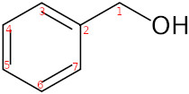
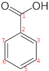
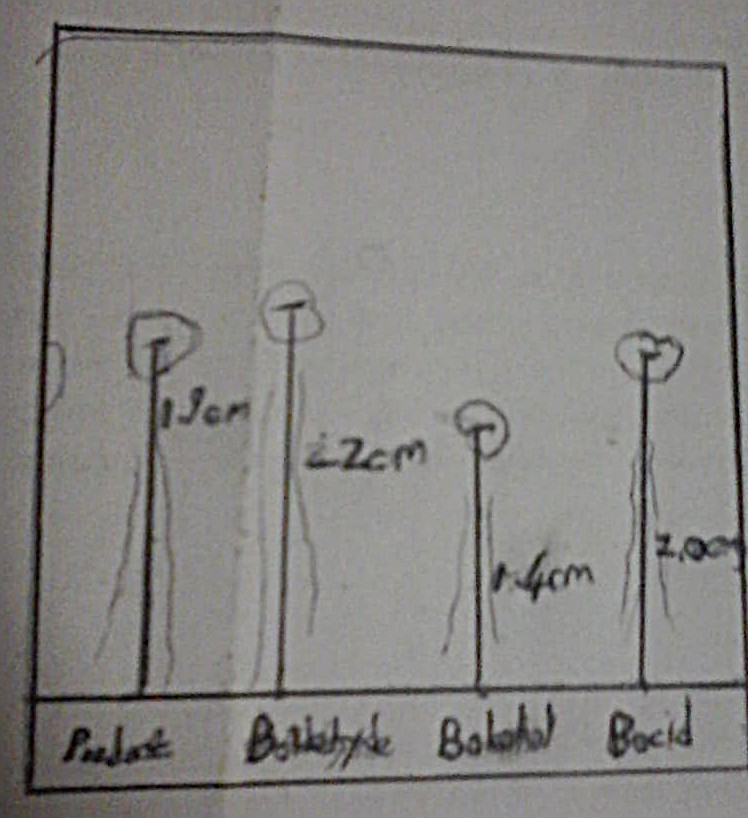

# Submission Information

Name: _Keelan Krinksy_ \newline 
Student number: _1634953_ \newline
Locker number: _365_
Group: _7_ \newline
Experiment Number: _O3(b)_ \newline
Demonstrator: \newline
Date of Experiment: _02/08/2018_ \newline
Title: _Synthesis and purification, of carboxylic acid, by purification._ \newline

```{r, echo=FALSE}
R<-c("Benzyl Alcohol","Potassium Permanganate","Sodium Carbonate","HCl")
M<-c("$1.044 g \\cdot ml^{-1} \\cdot 0.51ml=0.53$","$6.04 g/100ml \\cdot 25.0ml=1.51$","$0.5009$","Excess")
N<-c("$\\left(\\frac{0.53g}{108.14g \\cdot mol^{-1}}\\right)=4.8 \\cdot 10^{-3}$","$\\left(\\frac{1.51g}{158.034g \\cdot mol^{-1}}\\right)= 9.55\\cdot 10^{-3}$","$\\left(\\frac{0.5009g}{105.99g \\cdot mol^{-1}}\\right)= 4.726\\cdot 10^{-3}$","Excess")
MW<-c("$108.14$","$158.034$","$105.99$","$36.46$")  

help(exp)

T1<-data.frame("1"=R, "2"=MW, "3"=M, "4"=N)

library(knitr)
colnames(T1)<-c("\\textbf{Reactants Used}", "\\textbf{Molecular Weight($g \\cdot mol^{-1}$)}", "\\textbf{Mass($g$)}","\\textbf{Number of Moles(mol)}")

library("kableExtra")
T1d_latex<-knitr::kable(T1,"latex", digits = 2,row.names=FALSE, col.names = NA, align="llll", caption = "Limiting Reagent Calculations", escape = FALSE) 
kable_styling(T1d_latex, latex_options = c("striped","hold_position", "scale_down"), position= "left")


```

Limiting Reagent: _Benzyl Alcohol_

# Yield Calculations

Molecular Weight of Product: _$122.12g \cdot mol^{-1}$_\newline  
Mass of Product: $0.4783g$\newline 
Theoretical Yield: $4.8 \cdot 10^{-3}mol \cdot 122.12g \cdot mol^{-1}=0.59g$\newline
Percentage Yield: $\frac{0.4783g}{0.59g}\cdot 100\%=81\%$ \newline 

## Product analysis and observation

### Physical state of product 
Solid (White needle like crystals)

### Melting/Boiling Point of product


#### Expected: 
$122^\circ C$

#### Found:
$119-124\,^\circ C$


### NMR/IR spectra

#### Benzyl Alcohol 

##### Structure
.


```{r, echo=FALSE, fig.cap="2D Formula of Benzyl Alcohol", out.width='60%',fig.pos="H",fig.align='center'}
library("knitr")


```


```{r, echo=FALSE}

S1<-c(7.29,2,"triplet",2,"$Ar-C_{4,6}\\underline{H}$","$J_\\text{ortho}=8Hz$")
S2<-c(7.25,2,"doublet",1,"$Ar-C_{5}\\underline{H}$","$J_\\text{orthp}=7.8Hz$")
S3<-c(7.22,1,"triplet",2,"$Ar-C_{3,7}\\underline{H}$","$J=8.1Hz$") 
S4<-c(4.48,2,"singlet",0,"$C_6H_5-C\\underline{H}_2$"," ")  
S5<-c(2.50,1, "singlet",0,"$Ar-C_{3,7}\\underline{H}$"," ")

Tx2<-data.frame("1"=S1, "2"=S2, "3"=S3, "4"=S4, "5"=S5)

library(knitr)
colnames(Tx2)<-c("Signal 1","Signal 2", "Signal 3","Signal 4","Signal 5")

library("kableExtra")
row.names(Tx2)<-c("Chemical Shift","Ratio of signal", "Multiplicity", "No. of H on Adjacent C","Assignment", "Special features \n( e.g. Coupling costants)" )
Tx2d_latex<-knitr::kable(Tx2,"latex",,row.names=NA, col.names = NA, align="cccccc", caption ="Interpretation of $^1H$ NMR spectroscopic data", escape = FALSE)
kable_styling(Tx2d_latex, latex_options = c("striped","hold_position", "bordered", position="center", "scale_down"))

```

```{r, echo=FALSE, warning=FALSE}
S1<-c(140.91,"$C_6H_5\\underline{C}H_2OH$")
S2<-c(128.38, "$Ar-C_2$")
S3<-c(127.39, "$Ar-C_{3,7}$")
S4<-c(126.95, "$Ar-C_{4,6}$")
S5<-c(64.70, "$Ar-C_5$")

T3<-data.frame("1"=S1, "2"=S2, "3"=S3, "4"=S4, "5"=S5)

library(knitr)
colnames(T3)<-c("Signal 1","Signal 2", "Signal 3","Signal 4","Signal 5")
row.names(T3)<-c("Chemical Shift","Assignment" )

library("kableExtra")
T3d_latex<-knitr::kable(T3,"latex",,row.names=NA, col.names = NA, align="cccccc", caption ="Interpretation of $^{13}C$ NMR spectroscopic data", escape = FALSE) %>%
add_header_above(c("Benzyl Alcohol"=6))
kable_styling(T3d_latex, latex_options = c("striped","hold_position", "bordered"))

```

```{r, echo=FALSE, warning=FALSE}
S1<-c(3225, "Very strong","O-H stretch")
S2<-c(3032,"strong","C-H stretch (saturated)")
S3<-c(2874, "strong","C-H stretch(unsaturated)")
S4<-c(1602, "strong","$C=C$, Aromatic")
S5<-c(1501, "strong","$C=C$, Aromatic")
S6<-c(1454, "Very strong","$C=C$, Aromatic")

T4<-data.frame("1"=S1, "2"=S2, "3"=S3, "4"=S4, "5"=S5, "6"=S6)

library(knitr)
colnames(T4)<-c("Signal 1","Signal 2", "Signal 3","Signal 4","Signal 5","Signal 6")
row.names(T4)<-c("Position of Signal ($cm^{-1}$)","Intensity","Assignment")
library("kableExtra")
T4d_latex<-knitr::kable(T4,"latex",,row.names=NA, col.names = NA, align="cccccc", caption ="Interpretation of IR spectroscopic data", escape = FALSE) %>%
add_header_above(c("Benzyl Alcohol"=7))
kable_styling(T4d_latex, latex_options = c("striped","hold_position","scale_down", "repeat_header"))


```

\newpage

#### Benzoic Acid

##### Structure 

```{r, echo=FALSE, fig.cap="2D Formula of Benzoic Acid", out.width='50%',fig.pos="H",fig.align='center'}
library("knitr")

```

```{r, echo=FALSE}

S1<-c(12.09,1,"singlet",0,"$COO\\underline{H}$"," ")
S2<-c(8.12,2,"doublet of doublets",1,"$Ar-C_{3,7}\\underline{H}$","$J_\\text{ortho}=7.98$")
S3<-c(7.62,2,"doublet of doublets",1,"$Ar-C_{4,6}\\underline{H}$", "$J_\\text{ortho}=4.77 ,J_\\text{meta}=1.0$")
S4<-c(7.45,2,"triplet",2,"$Ar-C_5\\underline{H}$", "$J_\\text{ortho}=8.77, J_\\text{meta}=4.86$")  

T5<-data.frame("1"=S1, "2"=S2, "3"=S3, "4"=S4)

library(knitr)
colnames(T5)<-c("Signal 1","Signal 2", "Signal 3","Signal 4")

library("kableExtra")
row.names(T5)<-c("Chemical Shift","Ratio of signal", "Multiplicity", "Number of Carbon on Adjacent Hydrogen","Assignment", "Special features( e.g. Coupling costants)" )
T5d_latex<-knitr::kable(T5,"latex",,row.names=NA, col.names = NA, align="cccccc", caption ="Interpretation of $^1H$ NMR spectroscopic data", escape = FALSE)
kable_styling(T5d_latex, latex_options = c("striped","hold_position", "bordered","scale_down", position="left"))


```

```{r, echo=FALSE, warning=FALSE}
S1<-c(172.77,"$C_6H_5\\underline{C}H_2O_2H$")
S2<-c(133.83, "$Ar-C_5$")
S3<-c(130.28, "$Ar-C_{3,7}$")
S4<-c(129.44, "$Ar-C_2$")
S5<-c(128.49, "$Ar-C_{4,6}$")

T6<-data.frame("1"=S1, "2"=S2, "3"=S3, "4"=S4, "5"=S5)

library(knitr)
colnames(T6)<-c("Signal 1","Signal 2", "Signal 3","Signal 4","Signal 5")
row.names(T6)<-c("Chemical Shift","Assignment" )

library("kableExtra")
T6d_latex<-knitr::kable(T6,"latex",,row.names=NA, col.names = NA, align="cccccc", caption ="Interpretation of $^{13}C$ NMR spectroscopic data", escape = FALSE) %>%
add_header_above(c("Benzoic Acid"=6))
kable_styling(T6d_latex, latex_options = c("striped","hold_position", "bordered"))

```

```{r, echo=FALSE, warning=FALSE}
S1<-c(3073,"strong","$O-H$ stretching")
S2<-c(1690, "very strong", "$C=O$, stretching")
S3<-c(1340, "strong", "$O-H$ bending")
S4<-c(950,"moderate", "$C-C/C=C$ of aromatic ring")  

T7<-data.frame("1"=S1, "2"=S2, "3"=S3, "4"=S4)

library(knitr)
colnames(T7)<-c("Signal 1","Signal 2", "Signal 3","Signal 4")
row.names(T7)<-c("Position of Signal ($cm^{-1}$)","Intensity","Assignment")

library("kableExtra")
T7d_latex<-knitr::kable(T7,"latex",,row.names=NA, col.names = NA, align="cccccc", caption ="Interpretation of IR spectroscopic data", escape = FALSE) %>%
add_header_above(c("Benzoic Acid"=5))
kable_styling(T7d_latex, latex_options = c("striped","hold_position", "repeat_header","scale_down"))


```


### TLC

```{r, echo=FALSE, fig.cap="TLC of Product and reactants, with Ethanol solvent", out.width='60%',fig.pos="H",fig.align='center'}
library("knitr")

```

#### Calculated Rf values. 

 #. Product =$\frac{1.9cm}{6.0cm}=0.32$\newline 
 #. Benzaldehyde =$\frac{2.2cm}{6.0cm}=0.37$ \newline 
 #. Benzyl; alcohol=$\frac{1.4cm}{6.0cm}=0.23$ 
 #. Benzoic acid $\frac{2.0cm}{6.0cm}=3.3$ \newline

## Discussion and Conclusion
A relatively high percentage yield was achieved in the experiment], above 80\%. This high yield may be attributable the addition of sodium carbonate, which reacted with the benzoic acid as it was formed to form sodium salts, shifting the equilibrium associated with alcohol oxidation to the right, increasing product formation. Moreover the conditions of reflux raising the reaction rate to considerable above that normally achieved in the volatile solvents required help to ensure that the reaction ran to completion, with no unreacted alcohol remaining. From the TLC it seems more likely, that the slight difference in theoretical and actual yield resulted from some alcohol stopping its oxidation at the aldehyde stage rather then fully oxidizing to form benzoic acid, as the product RF value was very close to that of benzoic acid, and could conceivable have contained a fraction of benzaldehyde, (the separation is not sufficient to clearly distinguish between acid and aldehyde) but appears to contain little or no alcohol. The Melting point observed is consistent with this explanation, as the small fraction of aldehyde (which cannot H bond) dropped the bottom limit for the observed melting point range slightly lower than the expected melting point. In conclusion, high product yield was achieved with the observed melting point, and TLC analysis indicating that aldehyde, and not alcohol, as the main contaminant.


Date Submitted: $08/08/2018$  $\quad\quad\quad\quad\quad\quad\quad\quad\quad\quad\quad\quad\quad\quad\quad\quad\quad$  Signature:_______________


  

