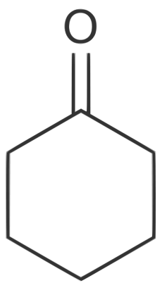
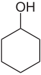

# Submission Information

Name: _Keelan Krinksy_ \newline 
Student number: _1634953_ \newline
Locker number: _365_
Group: _7_ \newline
Experiment Number: _O4_ \newline
Demonstrator: _Thabo_ \newline
Date of Experiment: _02/08/2018_ \newline
Title: _Synthesis and purification, of carboxylic acid, by purification._ \newline

# Reaction Scheme
$\quad \quad\quad \quad\quad \quad\quad \quad\quad \quad\quad \quad\quad \quad\quad \quad\quad \quad\quad \quad\quad \quad\quad \quad\quad \quad\quad \quad\quad \quad\quad \quad$\newline 

$\quad \quad\quad \quad\quad \quad\quad \quad\quad \quad\quad \quad\quad \quad\quad \quad\quad \quad\quad \quad\quad \quad\quad \quad\quad \quad\quad \quad\quad \quad\quad \quad$\newline 
$\quad \quad\quad \quad\quad \quad\quad \quad\quad \quad\quad \quad\quad \quad\quad \quad\quad \quad\quad \quad\quad \quad\quad \quad\quad \quad\quad \quad\quad \quad\quad \quad$\newline 
$\quad \quad\quad \quad\quad \quad\quad \quad\quad \quad\quad \quad\quad \quad\quad \quad\quad \quad\quad \quad\quad \quad\quad \quad\quad \quad\quad \quad\quad \quad\quad \quad$\newline 
$\quad \quad\quad \quad\quad \quad\quad \quad\quad \quad\quad \quad\quad \quad\quad \quad\quad \quad\quad \quad\quad \quad\quad \quad\quad \quad\quad \quad\quad \quad\quad \quad$\newline 
$\quad \quad\quad \quad\quad \quad\quad \quad\quad \quad\quad \quad\quad \quad\quad \quad\quad \quad\quad \quad\quad \quad\quad \quad\quad \quad\quad \quad\quad \quad\quad \quad$\newline 
$\quad \quad\quad \quad\quad \quad\quad \quad\quad \quad\quad \quad\quad \quad\quad \quad\quad \quad\quad \quad\quad \quad\quad \quad\quad \quad\quad \quad\quad \quad\quad \quad$\newline 

$\quad \quad\quad \quad\quad \quad\quad \quad\quad \quad\quad \quad\quad \quad\quad \quad\quad \quad\quad \quad\quad \quad\quad \quad\quad \quad\quad \quad\quad \quad\quad \quad$\newline 

$\quad \quad\quad \quad\quad \quad\quad \quad\quad \quad\quad \quad\quad \quad\quad \quad\quad \quad\quad \quad\quad \quad\quad \quad\quad \quad\quad \quad\quad \quad\quad \quad$\newline 


# Yield Calculations.

## Part A

```{r, echo=FALSE}
# Table of Reactant details and properties.


# Table Columns
R<-c("Cyclohexanone","$NaBH_4$")
M<-c("$0.9478g\\cdot ml^{-1} \\cdot 1.0ml=0.9478g$","0.2056")
N<-c("$\\left(\\frac{0.95g}{98.15g \\cdot mol^{-1}}\\right)= 9.7\\cdot 10^{-3}$","$\\left(\\frac{0.2056g}{37.83g \\cdot mol^{-1}}\\right)= 5.435 \\cdot 10^{-3}$")
MW<-c("$98.15$","$37.83$")  

help(exp)

T1<-data.frame("1"=R, "2"=MW, "3"=M, "4"=N)

library(knitr)
colnames(T1)<-c("\\textbf{Reactants Used}", "\\textbf{Molecular Weight($g \\cdot mol^{-1}$)}", "\\textbf{Mass($g$)}","\\textbf{Number of Moles(mol)}")

library("kableExtra")
T1d_latex<-knitr::kable(T1,"latex", digits = 2,row.names=FALSE, col.names = NA, align="llll", caption = "Limiting Reagent Calculations", escape = FALSE) 
kable_styling(T1d_latex, latex_options = c("striped","hold_position"), position= "left")


```
Limiting Reagent: _Cyclohexanone_ (as $NaBH_4$ and cyclohexanone react 2:1 and moles of $NaBH_4> 2 \text{x}$ number of moles of cyclohexanone)\newline
Molecular Weight of Product: $100.158g \cdot mol^{-1}$\newline  
Mass of Product: $8.9162g-8.3010g=0.5152g$\newline 
Theoretical Yield: $9.7 \cdot 10^{-3}mol \cdot 100.158g \cdot mol^{-1}=0.9672g$\newline
Percentage Yield: $\frac{0.5152g}{0.97g}\cdot 100\%=53\%$ \newline 


## Part B
```{r, echo=FALSE}
# Table of Reactant details and properties.


# Table Columns
R<-c("Cyclohexanol")
M<-c("$0.9624g\\cdot ml^{-1} \\cdot 2.00ml=1.93g$")
N<-c("$\\left(\\frac{1.925g}{100.158g \\cdot mol^{-1}}\\right)= 1.93\\cdot 10^{-2}$")
MW<-c("$100.158$")  


T1<-data.frame("1"=R, "2"=MW, "3"=M, "4"=N)

library(knitr)
colnames(T1)<-c("\\textbf{Reactants Used}", "\\textbf{Molecular Weight($g \\cdot mol^{-1}$)}", "\\textbf{Mass($g$)}","\\textbf{Number of Moles(mol)}")

library("kableExtra")
T1d_latex<-knitr::kable(T1,"latex", digits = 2,row.names=FALSE, col.names = NA, align="llll", caption = "Limiting Reagent Calculations", escape = FALSE) 
kable_styling(T1d_latex, latex_options = c("striped","hold_position"), position= "left")


```
Limiting Reagent: _Cyclohexanol_\newline
Molecular Weight of Product: $82.143 \cdot mol^{-1}$ \newline  
Mass of Product: $11.1998g-10.2041g=0.9957g$\newline 
Theoretical Yield: $1.93\cdot 10^{-2}mol \cdot 82.143g \cdot mol^{-1}=1.59g$\newline
Percentage Yield: $\frac{0.9957g}{1.59g}\cdot 100\%=62.6\%$ \newline 


# Product analysis and observation

## Part A

### Physical state of product 
Colorless liquid

### NMR/IR spectra

#### Cyclohexanone

##### Structure

```{r, echo=FALSE, fig.cap="Cyclohexanone", out.width='14%',fig.pos="H",fig.align='center'}
library("knitr")

```


```{r, echo=FALSE}
#HNMR Spectrum assignment table

S1<-c(2.34,2,"triplet",2,"$CH_2-C\\underline{H_2}(C(=O)-C$","$J_2=12.5Hz$")
S2<-c(1.88,2,"pentuplet",4,"$-C(=O)-CH_2-CH_2-C\\underline{H_2}-$","$J_2=3.75Hz$")
S3<-c(1.73,1,"pentuplet",4,"$-C\\underline{H}(-CH_2)(-CH)-CH$","$J_2=4Hz$") 

T3<-data.frame("1"=S1, "2"=S2, "3"=S3)
library(knitr)
colnames(T3)<-c("Signal 1","Signal 2", "Signal 3")

library("kableExtra")

#$
row.names(T3)<-c("Chemical Shift","Ratio of signal", "Multiplicity", "No. of H on Adjacent C","Assignment", "Special features \n( e.g. Coupling costants)" )


T3d_latex<-knitr::kable(T3,"latex",row.names=NA, col.names = NA, align="ccccc", caption ="Interpretation of $^1H$ NMR spectroscopic data", escape = FALSE)
kable_styling(T3d_latex, latex_options = c("striped","hold_position", "bordered", position="center", "scale_down"))

```


```{r, echo=FALSE, warning=FALSE}

# C13NMR Spectra

S1<-c(212.08,"$\\underline{C}=O$")
S2<-c(41.99, "$-CH_2-\\underline{C}H_2-C(=O)-$")
S3<-c(27.06, "$-CH_2-\\underline{C}H_2-CH_2-C(=O)-$")
S4<-c(25.03, "$-\\underline{C}H_2-CH_2-CH_2-C(=O)-$")

T6<-data.frame("1"=S1, "2"=S2, "3"=S3, "4"=S4)

library(knitr)
colnames(T6)<-c("Signal 1","Signal 2", "Signal 3","Signal 4")
row.names(T6)<-c("Chemical Shift","Assignment" )

library("kableExtra")
T6d_latex<-knitr::kable(T6,"latex",row.names=NA, col.names = NA, align="cccccc", caption ="Interpretation of $^{13}C$ NMR spectroscopic data", escape = FALSE)
kable_styling(T6d_latex, latex_options = c("striped","hold_position","scale_down", "bordered"))

```
```{r, echo=FALSE, warning=FALSE}

# IR Spectrum Analysis

S1<-c(2970, "strong","=C-H stretch")
S2<-c(2860,"strong","C-H stretch")
S3<-c(1710, "very strong","C=O stretch")


T4<-data.frame("1"=S1, "2"=S2, "3"=S3)

library(knitr)
colnames(T4)<-c("Signal 1","Signal 2", "Signal 3")
row.names(T4)<-c("Position of Signal ($cm^{-1}$)","Intensity","Assignment")
library("kableExtra")
T4d_latex<-knitr::kable(T4,"latex",row.names=NA, col.names = NA, align="cccccc", caption ="Interpretation of IR spectroscopic data", escape = FALSE) 
kable_styling(T4d_latex, latex_options = c("striped","hold_position","scale_down", "repeat_header"))


```


#### Cyclohexanol

##### Structure

```{r, echo=FALSE, fig.cap="Cyclohexanol", out.width='30%',fig.pos="H",fig.align='center'}
library("knitr")

```


```{r, echo=FALSE}
#HNMR Spectrum assignment table

S1<-c(3.56,1,"pentuplet",4,"$C-C\\underline{H}(OH)-C$","$ $")
S2<-c(2.15,1,"singlet",NA,"$-CH-O\\underline{H}$"," ")
S3<-c(1.77,4,"doublet of pentuplets",5,"$-C\\underline{H_2}-CH(OH)-C$","$J_2=-80Hz$(from CHOH)" )

S4<-c(1.49,2,"doublet",1 ,"$-C\\underline{H_2}-CH_2-CH_2-C(OH)-","$J_2=2.5Hz$")  
S5<-c(1.23,4,"multiplet",NA ,"$-C\\underline{H_2}-CH_2-C(OH)-$"," ")  

T2<-data.frame("1"=S1, "2"=S2, "3"=S3, "4"=S4)
library(knitr)
colnames(T2)<-c("Signal 1","Signal 2", "Signal 3","Signal 4")

library("kableExtra")

#$
row.names(T2)<-c("Chemical Shift","Ratio of signal", "Multiplicity", "No. of H on Adjacent C","Assignment", "Special features \n( e.g. Coupling costants)" )


T2d_latex<-knitr::kable(T2,"latex",row.names=NA, col.names = NA, align="ccccc", caption ="Interpretation of $^1H$ NMR spectroscopic data", escape = FALSE)
kable_styling(T1d_latex, latex_options = c("striped","hold_position", "bordered", position="center", "scale_down"))

```


```{r, echo=FALSE, warning=FALSE}

# C13NMR Spectra

S1<-c(70.13,"$\\underline{C}-OH$")
S2<-c(35.41, "$-CH_2-\\underline{C}H_2-C(OH)-$")
S3<-c(25.39,"$-CH_2-\\underline{C}H_2-CH_2-C(OH)-$")
S4<-c(24.08, "$-\\underline{C}H_2-CH_2-CH_2-C(OH)-$")


T6<-data.frame("1"=S1, "2"=S2, "3"=S3, "4"=S4)

library(knitr)
colnames(T6)<-c("Signal 1","Signal 2", "Signal 3","Signal 4")
row.names(T6)<-c("Chemical Shift","Assignment" )

library("kableExtra")
T6d_latex<-knitr::kable(T6,"latex",row.names=NA, col.names = NA, align="cccccc", caption ="Interpretation of $^{13}C$ NMR spectroscopic data", escape = FALSE)
kable_styling(T6d_latex, latex_options = c("striped","hold_position","scale_down", "bordered"))

```
```{r, echo=FALSE, warning=FALSE}

# IR Spectrum Analysis

S1<-c(3400, "strong","=O-H stretch")
S2<-c(2950,"strong","C-H stretch")
S3<-c(2860, "strong","C-H stretch")
S4<-c(1050, "strong","$C-O$, stretch")


T4<-data.frame("1"=S1, "2"=S2, "3"=S3, "4"=S4)

library(knitr)
colnames(T4)<-c("Signal 1","Signal 2", "Signal 3","Signal 4")
row.names(T4)<-c("Position of Signal ($cm^{-1}$)","Intensity","Assignment")
library("kableExtra")
T4d_latex<-knitr::kable(T4,"latex",row.names=NA, col.names = NA, align="cccccc", caption ="Interpretation of IR spectroscopic data", escape = FALSE) 
kable_styling(T4d_latex, latex_options = c("striped","hold_position","scale_down", "repeat_header"))


```


## Part B

### Physical state of product 
Colorless liquid

### Boiling point

#### Expected: 
$82^\circ C$ at $760mmHg$
$\rightarrow 73^\circ C$ at $740mmHg$


#### Found:
$70-75^\circ C$ at $740mmHg$

### NMR/IR spectra

#### Cyclohexene

##### Structure

```{r, echo=FALSE, fig.cap="Cyclohexene", out.width='60%',fig.pos="H",fig.align='center'}
library("knitr")

```

```{r, echo=FALSE}
#HNMR Spectrum assignment table

S1<-c(5.67,1,"singlet",0,"$-C\\underline{H}=C$"," ")
S2<-c(1.99,2,"doublet",1,"$CH_2-C\\underline{H_2}-CH=CH-$","$J_2=2Hz, J_3=1.25Hz$")
S3<-c(1.61,2,"triplet",2,"$C\\underline{H_2}-CH_2-CH=CH-$","$J_2=2.5Hz$") 


T5<-data.frame("1"=S1, "2"=S2, "3"=S3)
library(knitr)
colnames(T5)<-c("Signal 1","Signal 2", "Signal 3")

library("kableExtra")

#$
row.names(T5)<-c("Chemical Shift","Ratio of signal", "Multiplicity", "No. of H on Adjacent C","Assignment", "Special features \n( e.g. Coupling costants)" )


T5d_latex<-knitr::kable(T5,"latex",row.names=NA, col.names = NA, align="ccccc", caption ="Interpretation of $^1H$ NMR spectroscopic data", escape = FALSE)
kable_styling(T5d_latex, latex_options = c("striped","hold_position", "bordered", position="center", "scale_down"))

```


```{r, echo=FALSE}
# C13NMR Spectra

S1<-c(127.27,"$\\underline{C}H=CH-$")
S2<-c(25.18, "$\\underline{C}H_2-CH=CH$")
S3<-c(134.79,"$\\underline{C}H_2-CH_2-CH=CH$")

T6<-data.frame("1"=S1, "2"=S2, "3"=S3)

library(knitr)
colnames(T6)<-c("Signal 1","Signal 2", "Signal 3")
row.names(T6)<-c("Chemical Shift","Assignment" )

library("kableExtra")
T6d_latex<-knitr::kable(T6,"latex",row.names=NA, col.names = NA, align="cccccc", caption ="Interpretation of $^{13}C$ NMR spectroscopic data", escape = FALSE) 
kable_styling(T6d_latex, latex_options = c("striped","hold_position","scale_down", "bordered"))

```
````{r, echo=FALSE, warning=FALSE}

# IR Spectrum Analysis

S1<-c(3020, "medium","=C-H stretch")
S2<-c(2920,"strong","C-H stretch")
S3<-c(2870,"strong","C-H stretch")
S4<-c(1680, "weak","$C=C$, stretch")


T4<-data.frame("1"=S1, "2"=S2, "3"=S3, "4"=S4)

library(knitr)
colnames(T4)<-c("Signal 1","Signal 2", "Signal 3","Signal 4")
row.names(T4)<-c("Position of Signal ($cm^{-1}$)","Intensity","Assignment")
library("kableExtra")
T4d_latex<-knitr::kable(T4,"latex",row.names=NA, col.names = NA, align="cccccc", caption ="Interpretation of IR spectroscopic data", escape = FALSE) 
kable_styling(T4d_latex, latex_options = c("striped","hold_position","scale_down", "repeat_header"))


```

## Discussion and Conclusion
In both steps there was a significant loss of product, more especially the fist step in which cyclohexanone was reduced. This loss was most probably due to the loss of vapour during relfux as the relfux condensers were sealed only with aluminium foil, and not air tight seals. There may also have been a loss of vapour through the flow out pipe if the vapour was not cooled rapidly enough to condense within the holding beaker. This explanation coincides with the lower yield of the first step, as the reflux temperature was higher and hence more vapour was lost from the system. The purity of the final cyclohexene product however appeared relatively high. The observed boiling point range fell closely around the range anticipated for the given atmospheric pressure, and from the TLC it can been seen that the product ran as a single dot, closely in line with the cyclohexene sample run, and well below the cyclohexanone and cyclohexanol samples. In conclusion, low yields were achieved due to vapour loss, however the final product was of high purity, demonstration very similar physical and chemical properties to pure standard samples.


$\quad$\newline

Date Submitted: $16/08/2018$  $\quad\quad\quad\quad\quad\quad\quad\quad\quad\quad\quad\quad\quad\quad\quad\quad\quad$  Signature:_______________
