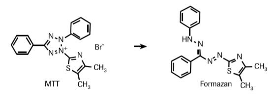

# Results
```{r, echo=FALSE}
C<-c(0.025,0.05,0.075,0.1)
A<-c(0.17, 0.42, 0.56, 0.81)


par(mar = c(10,10,2,2) )
plot(C,A, xlab= expression("MTT Concentration/ g . "~L^-1), ylab="Absorbance",  ylim=range(c(0,1)), xlim=range(c(0,0.12)))
title(sub="Figure 1: Standard Curve of absorbance plotted \n against Concentration of MTT in original sample.",cex.sub=1, line=7, )
abline(lm(A~C), col="blue")
R2<-c(cor(A,C))^2
int<-c(lm(A~C)$coefficients[1])
sl<-c(lm(A~C)$coefficients[2])
Ct<-c(0.12)
Egf<-c(0.41)

text(0.04,0.7,expression(R^2~"=0.989"))
text(0.037,0.6,expression( "y=8.24x-0.025"))
points(c((Ct-int)/sl), Ct, pch=19 )
text(c(Ct-int)/sl+0.01,Ct,"-Control")
points(c((Egf-int)/sl), Egf, pch=19 )
text(c(Egf-int)/sl+0.02, Egf,"-EGF Treated")


```

# Questions

## Question #1

### Part A
Concentration of untreated culture = $`r round(c((Ct-int)/sl), digits=3)`g\cdot L^{-1}$

As this value falls outside of the range given by the standard curve, the concentration calculated can not be quoted with any degree of confidence. 

### Part B
Concentration of EGF Treated culture = $`r round(c((Egf-int)/sl), digits=3)`g\cdot L^{-1}$

## Question 2
Succinate dehydrogenase is an oxidoreductase enzyme, catalysing a redox reaction in which the biological substrate is reduced. 

## Question 3 
Although MTT MTS XTT and WTS assays all rely on reduction by succinate dehydrogenase to form formazan chromophores, MTT is the only assay in which (water) insoluble formazan crystals are formed, in the other three assays the formazan crystallised formed are water soluble and as such the washing and solvating in isopropanol is not required.

## Question 4
A relatively pail blue/purple solution would develop, due to the action succinate dehydrogenase in the healthy mitochondria present. Only a pail color would develop however as under resting conditions these mitochondria there are less mitochondria which are less metabolically active.

## Question 5
The MTT or more accurately formazan concentration of the culture treated with epidermal growth factor was considerably higher than that of the untreated, control culture. This makes sense in terms of the biological role of epidermal growth factor which is to stimulate increased rates of cell growth and division by transduction leading to tyrosine kinase activation. The higher cellular growth rates, and division rates promoted by EGF in the culture increase the metabolic rate of the cells, most especially the metabolic activity of the mitochondria which must provide the energy for all of the catabolic synthesis required. Catabolism is an endergonic process so cellular respiration must be increased to make up the deficit in energy implied and hence the activity of succinate dehydrogenase, which is a key enzyme in the electron transport chain leading ultimately to oxidative phosphorylation, will increase dramatically. With increased succinate  dehydrogenase activity more MTT will be converted to formazan, or rather this conversion will happen at a higher rate, leading to a higher measured formazan concentration than that observed in normal cells after any given time interval. 

\newpage
## Question #6

.
{width=80\%}
.

\textbf{Figure 1:} Cell Viability and Proliferation Assay, BioFiles v6 n5, :17–21


## Question #7
Formazan refers to a group/ family of synthetic aromatic chromophores. The full IUPAC name particular formazan compound which was formed in this experiment is 3-(4,5-dimethyl-2-thiazolyl)-2, 5-diphenyl-2H-tetrazolium bromide,  (Altman, 1976). Which is in fact a formazan salt. The central formazan functionality, i.e the moiety highlighted within the full structure seen in Figure 2 below, consists only of the four central Nitrogen atoms and one associated carbon atom. The aromatic groups attached onto this central moiety, while they may not be central to the nomenclature of the compound are still central to the function of formazan as a chromophore, as it is these groups which contribute to the characteristic deep purple color of the compound and its absorbance at 570nm. It is also there large relatively non-polar (especially in the case of the benzene rings) groups which contribute to the compounds lack of solubility in an aqueous medium.

.
.jpg){width=40\%}
.

\textbf{Figure 2:} Cell Viability and Proliferation Assay, BioFiles v6 n5, :17–21

# References

Altman F. P. (1976). "Tetrazolium salts and formazans". Prog. Histochem. Cytochem. 9 (3): 1–56


