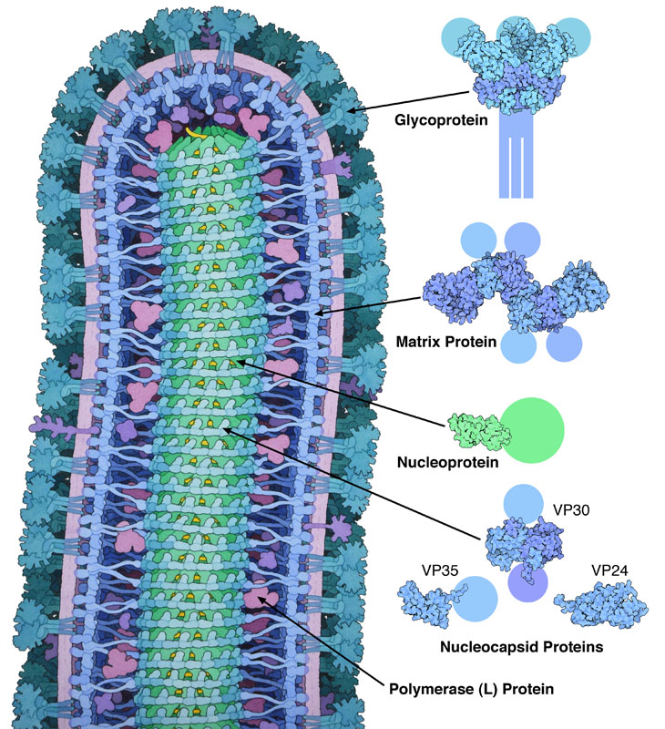
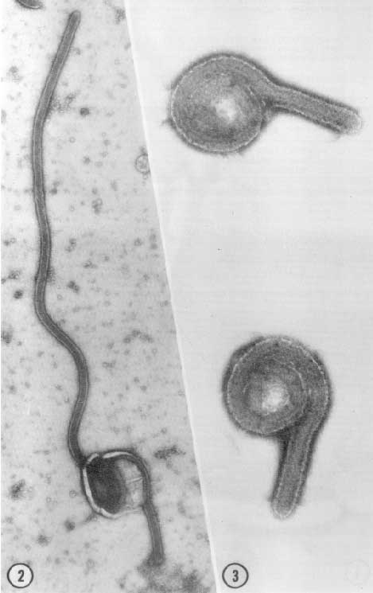

# Structure 
The Ebola virion is a rod shaped particle roughly 80nm in diameter, and 600-14000 nm in length. The virions are not particularly rigid, commonly bending into a  "U" or "6" conformation, (depending on the temperature), as shown in Figure 1 (Murphy _et al_, 1978) . Each virion particle is comprised of four general substituents, arranged as concentric layers within the rod structure. 

The outer most layer consists of the viral envelope. The viral envelope consists of a host cell derived phospholipid bilayer, and may contain other host cell membrane constituents such as glycoprotein. Furthermore the envelope contains many viral glycoproteins (GP/sGP), embedded like spikes into the phospholipid bilayer. (Kawaoka, 2005)   

The second layer consists of the viral matrix. The matrix is comprised exclusively of the viral protein VP40. This protein is composed of two domains, attached by a small flexible section. the C domain is large hydrophobic and adheres to the phospholipid membrane, where as the internal domain contains highly basic regions which facilitate clustering of VP40 proteins to form a strong but flexible mesh which adheres the viral envelope to the capsid. (Dessen _et al_, 2000)

The third layer of the virus consists of the 
Within the matrix a further five viral proteins, NP VP30, VP35 and L, are closely associated with the viral RNA.(Klenk and Freedman, 2004) NP and VP35 are bound directly to the viral RNA, and from the main nucleocapsid which contains and protects the viral genome. VP30, VP24 and VP30 associate with the capsid,but have less important structural purposes, as there main activities relate to viral replication. (Zhanga _et al_, 2014). 

The forth and final layer consists of the viral genome itself. The genome consists of a single molecule of single strand, negative sense RNA about 20000bp in length.The strand is coiled into an single helix, maintained in position by binding to NP,each 6 RNA bases are bond to one NP molecule. (Bharat _et al_ ,2005) The strand contains the genes related to the 7 viral proteins discussed above (with a short untranslated region on either end) ordered as follows: 
3'NP – VP35 – VP40 – GP/sGP – VP30 – VP24 – L-5' (Gen-Bank: KJ660346)

..{width=28%}

__Figure1:__ 3D projected structure of Ebola Virion (David Goodsell, 2014)\newline 
__Figure2:__ Electronmicrogarph of unfixedEbola Virion particles at 90 000X magnification (Murphy _et al_, 1978)

# References 

 #. Adrianna P. P. Zhanga, Zachary A. Bornholdta, Dafna M. Abelsona and Erica Ollmann Saphirea., 2014,Crystal Structure of Marburg Virus VP24,California  USA W. I. Sundquist, Department of Immunology and Microbial Science, The Scripps Research Institute, USA The Skaggs Institute for Chemical Biology, The Scripps Research Institute,88,10, pp 5859-5863

 #. Bharat, Tanmay A. M. and Noda, Takeshi and Riches, James D. and Kraehling, Verena and Kolesnikova, Larissa and Becker, Stephan and Kawaoka, Yoshihiro and Briggs, John A. G.,2012, Structural dissection of Ebola virus and its assembly determinants using cryo-electron tomography,_National Academy of Sciences_,109,11,pp 4275-4280,

 #. David Goodsell, http://pdb101.rcsb.org/motm/178, Research Collaboratory for Structural Bioinformatics,2014, 15/08/2018

 #. Dessen, Andrea and Volchkov, Viktor and Dolnik, Olga and Klenk, Hans-Dieter and Weissenhorn, Winfried,2000, Crystal structure of the matrix protein VP40 from Ebola virus,EMBO Press,_The EMBO Journal_,19,16, 

 #. FREDERICK A. MURPHY, GUIDO VAN DER GROEN, SYLVIA G. WHITFIELD, JAMES V. LANGE (1),1978, EBOLA AND MARBURG VIRUS MORPHOLOGY AND TAXONOMY, Antwerp, Belgium, Center for Disease Control, Atlanta, Georgia 30333, USA. Prince Leopold Institute of Tropical Medicine, pp 73

 #. FREDERICK A. MURPHY, GUIDO VAN DER GROEN, SYLVIA G. WHITFIELD, JAMES V. LANGE (1),1978, EBOLA AND MARBURG VIRUS MORPHOLOGY AND TAXONOMY:Unfixed diagnostic specimen from first Vero cell passage, showing elongated particle shape, but no internal tail. Sodium phosphotungstate; X 90,000,  Antwerp, Belgium, Center for Disease Control, Atlanta, Georgia 30333, USA. Prince Leopold Institute of Tropical Medicine, pp 73
 
 #. Kawaoka, Yoshihiro,2005,How Ebola Virus Infects Cells,_New England Journal of Medicine_,352, 25, pp 2645-2646
 
 #. KLENK, H.-D., FELDMANN, H., 2004. Ebola and Marburg viruses: molecular and cellular biology. Wymondham, U.K., _Horizon Bioscience_.
 

 