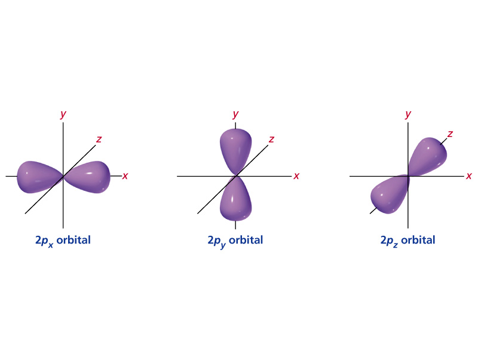
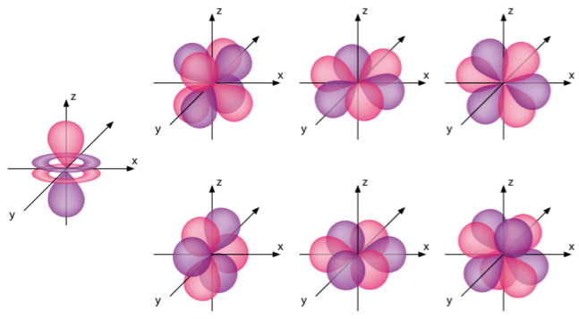

# tutorial question and additional work

## chapter 1
section 1.1-1.3

self test 1.1

self test1.2

read 1.3d-1.3g

(see section 1.3 for explanation)

# section one general review

## Quantum numbers

### Introduction
Orbitals are a spacial distribution of electron density.All energy states of electrons within atoms are negative by convention, (as the are considered to be the minimum energy necessary to free that electron from its parent atom)

### principle quantum number
n

#### range
$n \in \mathbb{Z}^+| n \geq 1$

NOTE: although n is theoretically unbounded values greater than five have not yet been observed in reality.

#### details
Identifies a specific energy state
Orbitals of the same quantum number form an part of the same electron shell

### Azimuthal quantum number (orbital angular momentum number)
l

#### encoding
values of l are given letters for identification

$\quad 0\rightarrow s$

$\quad 1\rightarrow p$

$\quad 2\rightarrow d$

$\quad 3\rightarrow f$

#### range
$l\in \mathbb{Z}\quad | \quad 0 \leq l \leq n-1\quad$

#### details
determines the size and shape of the sub shell/ determines the area around the nucleus which the electron may inhabit.

### Magnetic quantum number
$m_s$

#### range
$m_{l} \in \mathbb{Z} \quad | \quad -l \leq m_{l} \leq l\quad$

#### details
determines the three dimensional orientation of sub shell.  

#### spacial orientations
P orbitals have three possible orientations

X,Y,Z

{width=50%}

D orbitals have five possible orientations

$xy,xz,zy,z^{2},x^{2}-y^{2}$

{width=50%}

F orbitals have seven possible orientations.

{width=50%}

### magnetic spin number $m_{s}$

#### range
$m_{s} \in \left( \frac{+1}{2},\quad\frac{-1}{2} \right)$

#### details
determines the direction of spin/ gyration of the electron in regard to the magnetic axis of the atom.

### representation diagrams

#### Standard representation

$nl^{s}$

Where:

      n= principle quantum number
      l= azimuthal number
      x= number of electrons within the l subshell.      

#### Condensed representation
[noble gases] valence shell in standard representation

### Pauli Exclusion Principles.
no too electron within one atom can have the same set of quantum numbers

### Aufbau Priciple
electrons must always fill into the lowest energy levels available, this provides the sable ground state for of the atom.  

### Hundu's
degenerate orbitals must always be filled singly and by electrons with the same spin number before 2 electrons may fill the same orbital, and opposite spin numbers are permissible.  

#### exchange with higher sub-shells
electrons are most lightly to be promoted into higher sub-shells when in doing so they can lead to completely singly filled, or completely double filled orbitals. 

## Effective nuclear charge
effective nuclear charge is the charge exerted on a given electron within an atom by the (positively charged) nucleus of that atom

### shielding
shielding is the reduction of the full nuclear charge which and in isolation the nucleus would exert on an electron.

$Z_{eff} = Z - \sigma\quad$

where:
    $Z_{eff}$ = effective nuclear charge
    Z= nuclear charge
    $\sigma$ = shielding effect of other electrons.

this shielding effect is due to the present of other electrons within the atom which repel the electron in question reducing the net attractive force towards the nucleus which it feels.

(this reduction is often expressed as the reduction of  $Z \quad to \quad Z_{eff}$ )

### penetration
the potential for the presence of an electron inside shells of other electrons. (?)

### Slater's Rules
Estimated value for sigma

#### final electron is in a s or p orbital

* n-1 electrons contribute 0.85
* ns and np electrons contribute 0.35 to $\sigma\quad$
* n-2 or lower electrons contribute 1.0  to $\sigma\quad$

#### final electron is in a d or f orbital

* nf and nd electrons contribute 0.35  to $\sigma\quad$
* electrons in lower shells contribute 1. to $\sigma\quad$

### Trends

#### #1
The closer to the nuclear an electron is the smaller the difference between Z and $Z_{eff}$ will be.

#### #2
In terms of energy levels d>p>s

#### summary
Increases up and across the periodic table.

##### Exceptions

###### Hydrogen
the 2s and 2p orbitals have the same energy level.

###### potassium and calcium
4s energy level is lower than the 3p (?)
(see section 1.3 for explanation)
