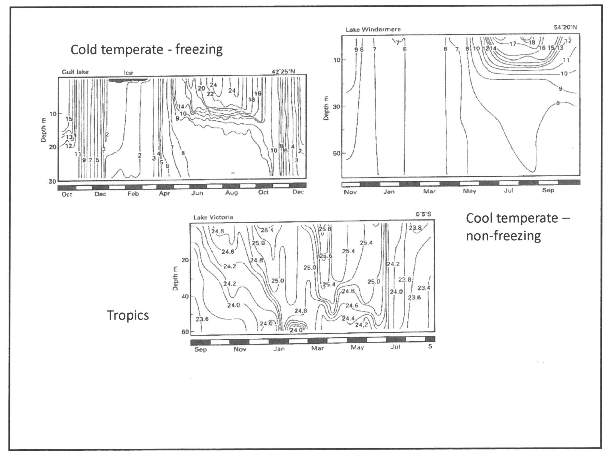

## Hydrological components. 

### Physiological conditions

#### Water quality 
Water quality is generally taken as a combination of several different physical and chemical factors. \newline 

 #. Solubility 
 #. Temperature. 
 #. PH 
 #. Dissolved oxygen 
 #. Dissolved inorganic nutrients ($PO_4^2-$ $NO_3^-$), 
    #. Such nutrients are a very important limiting factor in biological growth and productivity, and their concentration is normally increased dramatically by human activity in affected areas, i.e. near human cities or industrial plants. 
 #.  Dissolved organic nutrients. 
    #.Tannins in the western cape lead to brown coca cola colored water. 
 #. Toxins 
    #. Toxins may occur naturally but are often related to human activities, 
    #. The most common toxins present are heavy metals and hydrocarbons (such as oil/fuel spills from cars). 

#### Temperature. 
under 'normal' pressure conditions water will freeze at $0^\circ C$ and boil at $100^{\circ}C$, with increasing altitude however the boiling point will decrease (boiling point is directly proportional to the vapor pressure). This reduction can become significant at high altitudes, water boils at $45^\circ C$ at the top of mount Everest. 

Furthermore due to the hydrogen bonding which occurs in the ice crystal lattice water is in fact most dense just before freezing at temperatures of $0-3.94^\circ C$ (at $\approx 1atm$(?)). \newline 
IN its liquid phase the density of water varies directly with its temperature. implying that colder water will sink below warmer water within large water bodies with relatively little distrurbance (lotic). 

### Suspended solids 

#### Turbidity
Two different sources of turbidity. 

##### Landscape 
Wash in with run off. 

##### River bed. 
additional suspension. 

##### Effects. 
(Vanishing waters by Dvies and dae(?), good reference book)

 #. shading of phytoplankton and micaropytes, 
 #. reduced availability for preditors. 
 #. some marcovertibrates require clean rocks, blanketing of benthos removes Their environment, (such as caddis flies)

###### Conductivity 
Conductivity is a measure of the ability of water to conduct electricty.
Conductivity is measured in Semems, it is usally measured per area $\muS.cm^{-1}$ for low conductitvty headland streams, for highly conductive $mS.cm^{-1}$. 

Conductivity must be measured in conjunction with temperature as conductivity varies directly with temperature, (and hence is required for comparison)

###### As a measure of water pollution 
Conductivty is a good blanket measure of pollution especially in the case of metal (ion) polution which increases conductivity. Some goelogies do have more metals and will lead to higher natural conductivity measures, natural variation. 10 

## Hydrological regime  

Hydrology is defined as the study of the interactions and interrelationships between water and its environment 

NOT: conductivity is the inverse of resistance

### Water cycle 
water condences and falls as precipitation, once the water is intercepted by the ground it can flow along the top of the land,(runoff) or infultrate as seepage. when water comes out of ground water to enter ecosystem it is referred to as run out. Evaporation brings water to the atmosphere competing the cycle. 

wetlands tend to accumuae very fine sediments/clays resulting in far more water retention as a pose to infultration, in course soil most of the water infultrates little is retained. 

Once the water infultrates it can flow in a number of different layers known as aquifers. 
Aquifers are bands of rock with enough holes/space that water cacn perculate through them, normally they have a confining bed of rock separating them out. Aquifers have differnt flow rates (different flow regimes. ), days to years between infultration and run out in surface, lower down there might aquifer under the bed will be more like a centuaries. Even lower down there are aquifers which take millenia to fill up (deep confined aquifers), eg table mountain aquifer. 

#### Ephemeral
influent stream, net loss, very little retention porous, tend to dry up
Dry $\geq 90\%$ of the year only present after intense rainfall

#### Intermittent 
Varies between ephermeral and effulent, with a net neutrality (no net flow), varies with time. 
Eg in the eastern cape,may dry up in sections. 

#### Effluent 
net inflow of groudwater to water body, tend to be constant. 

### Rain fall related variation 
By the east coast, 1000-1200 to west <100 at the extreme. Evaporative potential is measured using A pans, it is far higher in the (north) west, combining high rainfall will low evaporation allows for high run off and perrenial streams. 
Dry west is ephermeral, east is perrenial, band between them contains intermittent. 

### Artificial 
land owver use a wear to divert water from a river to croplands/ orchards. 

### Catchment/drainage basin 
The region from which water drains into a stream. All the water which falls within the catachemnt will flow into the stream. different draingage basins are dived by watershed/ the highest point between twon drainage basins. 

#### Drainage density 
The amount of stream channel required to drain one unit of catchment area. The same area drained by more tributaries has a higher drainage density. 

#### Tributary arrangment. 
 
 #. dendritic: (many fingers,from indivindual to single)
 #. raidal, outwards in all dirrections 
 #. Centripital, multiple tributaries draining to central point (depression/pan)

GEology will also affect formation, with specific weathering leading to standard shaping. 

 #. paralelled 
    #. very hard rock which tributaries cant penetrate so all go into same bands. 
 #. trellis 
    #. hard rock formed in perpendicular shapes, so water can only erode the land scape in 90 degree angle. 
 #. Distributary, river breaks up into distrubutary channels (just before entering the sea for example.   
 
 
### Stream slope 
The stream slope is the vertical drop along a hoizontal distance, it measures how altitude changes along a stream from head waters to mouth. 

$SS=\frac{\text{elevation at contuor A}-\text{elevation at contour B}}{\text{length of sttream between contours}}=\frac{\text{Vertical slope}{\text{Horizontal slope}}$
<<<<<<< HEAD
expressed as 2m per 10km or as percentage or ratio.

## Rivers 
how rivers are classified, by braniching network and how they accumulate flow. 

 ### Stream water
 Ad rate tends to decreasenumber is assigned to each branch, to reflect the draignatge area the channel dimentions and the wvater going through it per unit voulme. 
er. 
The discharge volume tends to increase. 
The particle size of su
 #### Strahler method 
 Numbers are assigned in a cummulative fashion based on the confluence of streams. 
 

 A second order stream is characterised as being below the junction of two second order streams. 
Howver the junction of a f.irst and second orer stream is still a second order stream. The junction of two  second order streams leads to the formation of a third order stream. 

(ise a third order is belw the junction of two second order streams. 
These orders reflect the basic rules of drainage basin geometry. 
Firstly the average slope is decreasnig (normally) as first order are in moutnaous/high regions, a exception is the highveld which drains a huge high up plateu. 
The channel width tends to increase wiith the 
discharge volume increases . (as two streams are joining. )
Particle size of substrata decreases, (through a filtering porcess, )

### DFischarge. 
Dishcarge is the rate at which a volume of water flows pst a [pomt over a unit of time. 

$Q=m^3s^{-1}$
NOTE: $m^3s^{-1}$ are reffered to as cumecs (?) 

#### Measurement. 
See in back of prac handout one 

The stream is divided into equal width rectangular cells vertically downwards. 
The width and the depth of each cell will be measured. (the depth at the start and end of each cell is measured and averaged). A flow device is then used to measure the vvelocity of the water going through each cell. The sum of the discharge across all cells is the transect discharge. 

$Q=\displaystlye\sum _{i=1}^{n}w_id_iv_i$

Dishcarge is often ,easured remotely with the use of gagine wears, which temporariily stop the flow and thenmeasure the height of the stream. Such wears are places at strategic [ponyts across the catchment. 

(eatern cape only on main dams, as others decomissioned in the 80s

A logger logs the flow depth for every hour or half hour for months, and then the data will be retrieved by an engineer. However the data is only height , so a racing curve, which has a relation of measures of height and discharge. (basically a standard curve. ))Discharge should be measured a bit before the wear as the wear retards the flwo, also in a riffle/rapid there is too much turbulance, so a smooth depp laminar flow is best. N
 
NOTE: the volume is the same thrtought but some areas are more accurate to measure. 
=======
expressed as 2m per 10km or as percentage or ratio. 

 #. Very steep gradient by source, 
 #. waterfalls upper streams, slope still very high, more rocky bed material with frequent riffles. In almost all biomes such areas are forested, with overhanding branches also affecting the stream ecosystem. 
 #. lowlands, very slow and very turbid with less heterogenous sediment, (more snadly and silty) 
 
### Zones. 

#### Production 
The production zone contains 1st to 40rth level streasm, and recieves water primarily as run off, hence a lot of sediment is also brought in to the stream in this fasion. 

#### Transfer zone
recieves water predominately from upstream, and moves the majority of this water down stream out of the zone. 

#### Storage Zone. 
In the storage zone the flow of water is so slow that suspended subrate is alleviated in mass to form terrestrial environments (sandbanks/islands) within the water channel. 

#### General trends 
there are several general trends when moving from the head waters downwards. 

 #. Bed material grain size progressively decreases. 
 #. Accumulated discharge increases. 
 #. Depth and width increases. (However the depth does not change much and always shows a large local variation.)

NOTE: Velocity does not significantly increase, as in any given section the ration of fast water to slow water remains relatively constant. 

#### Mesohabitats. 
Variation in channel profile leads to the development of distinct habitats, which can facilitate different species. For example catfish require shallow fast flowing waters (which have a high oxygen concentration), where as silver mouth sucker fish require additional depth.

#### Local variation 
Pools riffles and rubs are formed through a combination of hydraulic force and sediment size. 

from annual flow data collected over long periods can be used to give of long term climate patterns and stability as well as climate change. Monthly data reveals annual variation which is important in controlling biotic and abiotic processes in the river. For example changes in water flow rate can act as spawning triggers for fish 

With increase in mean annual run off coefficients of variation for flooding increases, That is, generally speaking arid zones have high variation in rainfall, and high rainfall zones tend to have low variation in rainfall. In south Africa in particular rainfall is very unpredictable. It follows that in around countries the need for water storage in increased, leading to many artificial lentic catchments (i.e dams). 

## Wetlands 

### Exorheic 
Exorheic wetlands are defined by the fact that water flows through them and off into an adjacent water body. Water flowing into there wetlands can come from an adjacent stream, (This is often the same stream that water flows off into from the wetland.

### Endorheic 
Endorheic wetlands are defined by the fact that water once in them will not run off but can only evaporate or infiltrate. Endorheic wetlands are low points in the landscape which receive water in the from of runoff, and hence tend to accumulate high salt concentrations, (as salt dissolved in run off is brought to the wetland and remains there when the water evaporates)

#### Okavango Delta 
The Okavango Delta is an endorheic pan on a subcontinental level which drains the Kalahari basin. Summer rainfall flow from the Angola highlands. Within the Okavango Delta contains many exorheic wetlands lying alongside the main channel. After the summer rains the lake swells to about three times it's permanent size. Approximately sixty percent of the contained water is the evaporated off and the remain water is lost by infiltration. About 2% of the summer run off flows over into the adjacent Lake Ngati when the Okavango Delta overfills, however this only occurs in irregular seasonal overflows. The area in which the Ngati lake formed was completely dry for nearly 20 years, but after a period of particularly heavy rainfall between 2010 and 2012 the Okavango Delta was filled to capacity and run off formed Lake Ngati. This run off contained not only water but also nutrients, invertebrates and fish to colonise the new environment. Fishing communities migrated on mass to the new lake. In Very large floods, such as a one in fifty year flood water will overflow into the adjacent basin, the Makgadikgadi salt pans.

## Physical habitat conditions 

### System 
A strech of river above a kilometer forms a system. 

### Segments 
Segments are rough $10^2m$ stretches of a system. Large Predatory Fish tend to move between segments at different stages of their life  cycle.

### Reaches 
Reaches are stretch of river of a $10^1m$ magnitude. 

### Riffles 
Rifles are stretches of river of a $10^0m$ magnitude. Different fish species tend to spend most of their time in different habitats.When the water level in the river is low the difference between environments is much more pronounced. More diverse flow conditions result in more habitats for macro-invertebrates. Deep pools in sequence with shallow rifles form vertical meanders.

#### Pool
Pools are deep and contain slow flowing water. In pools the base material tends to be fine sediment. 

#### Riffles 
Riffles are fast flowing and shallow containing turbulence created by the uneven bed. The base material in riffles tends to contain large rocks in sand. 

#### Runs 
The base material in runs tends to be gravel. 

### Microhabitats 
Microhabitats occur at a magnitude of $10^{-1}m$ magnitude. Insects live in specific habitats such as moss covered boulders, or sandy rock etc. 

### raperian Habitats
A raperian gabitat is the area between the waters endge and the boundary where the water no longer influences the terrestrial environment. In upper water the raparian zone is very narrmow, but further down stream (in the storage zone) The raperian zone becomes very extensive, especially due to the formation of terrerial environments dirrectly in the water channel from alluviation. In the storage zone terraces, (which are ancestral flood plane deposits) surround the current flood plain deposit, in which the steam channel lies. Such areas are referred to as backstamps. Endorheic wetlands form around stream separated from it by berms, (alluvial) deposits. 

NOTE the presence of alluvial deposits (e.g. terraces and benches) adjacent to the active channel is a good indication of zone changes. 
(ise a third order is belw the junction of two second order streams.
 135 These orders reflect the basic rules of drainage basin geometry.  
 136 Firstly the average slope is decreasnig (normally) as first order are in moutnaous/high regions, a exception is the highveld which drains a huge high up plateu.
 137 The channel width tends to increase wiith the
 138 discharge volume increases . (as two streams are joining. )
 139 Particle size of substrata decreases, (through a filtering porcess, )
 140 
 141 §§§ DFischarge. 
 142 Dishcarge is the rate at which a volume of water flows pst a [pomt over a unit of time. 
 143 
 144 $Q=m^3s^{-1}$
 145 NOTE: $m^3s^{-1}$ are reffered to as cumecs (?) 
 146 
 147 #### Measurement. 
 148 See in back of prac handout one 
 149 
 150 The stream is divided into equal width rectangular cells vertically downwards. 
 151 The width and the depth of each cell will be measured. (the depth at the start and end of each cell is measured and averaged). A flow device is then used to             measure the vvelocity of the water going through each cell. The sum of the discharge across all cells is the transect discharge. 
 152 
 153 $Q=\displaystlye\sum _{i=1}^{n}w_id_iv_i$
 154 
 155 Dishcarge is often ,easured remotely with the use of gagine wears, which temporariily stop the flow and thenmeasure the height of the stream. Such wears are places 
     at strategic [ponyts across the catchment. 
 156 
 157 (eatern cape only on main dams, as others decomissioned in the 80s
 158 
 159 A logger logs the flow depth for every hour or half hour for months, and then the data will be retrieved by an engineer. However the data is only height , so a          racing curve, which has a relation of measures of height and discharge. (basically a standard curve. ))Discharge should be measured a bit before the wear as the         wear retards the flwo, also in a riffle/rapid there is too much turbulance, so a smooth depp laminar flow is best. N
 160 
 161 NOTE: the volume is the same thrtought but some areas are more accurate to measure. 
 162 

## Run
Such areas are reffered to as a run 

### Hydrograph 
Plots water flow against time, in a flood a rapid increase (rising limb) is seen floowed by a pea and a falling (hyperbolic) limp back to the baseline level. the peak incodes not only the flood water but also the normal baseline. Rain captured per unit time can alos be tracked and related. Ground water recession can reacharge/boost the water table raising it (ground water recession is the decrease of ground water back to its original level. , flooding recession is simple the dease in stream discharge. The size of the storm can be measured in terms of time. The center of mass of the rainstorm can be measure. The time between the heaviest rainfall and the peak detected by the wear is the basin lag. 
 The overall profile of the hydrograph can affect the flood responce. The profile of the landscape is also important. In a mountanous situation a sharper higher peak in flow will occur, whereas a plateu tends to have low sloping hydrograph. (This is becuase water is travelling faster donw the steeper gradient. )
 
 The shape of the gaging wier is also important, if there is more catchment closer than further away then the majority of the drained water is being drained closer to the wier (the majority of drainage density is close to wear), the peak will be sooner, conversely if the drainage density is concentrated further waay the peak will be lower. If there are two distinctive drainage areas one closer and on efurther there will be two peaks (a bimodal responce.) A higher drainage density leads to a higher peak. 
 
 In a tttrelliced catchment there is a much smaller area that can actually e drained leading to a lower hydrograph. 
 # BAnk lefull flodd
 Wilrl full up the entire bank fuulled area , occurs about every year. 
 
 ### Catostrophic 
 About every 50 years,the depth is twice as high, as the normal one. 

Lots of recently deposited material in the storage zone is an indication of a lot of flooding in the hydrology of the river. 

NOTE:o South Africa is a very ancient landscape, and so very stable with less obvious terraces. In newzeland however the land scape os very young geologically speaking, so more radical geological features surrounding rivers are present. 

COPY IMAGE.
 #. Flat valley bottom 
 #. little 
 berms on either side of the main river channel. (Alluvial berms are constantly changing as the river path deviates sloghtly from side to side cutting into th terraces over time) 
 #. Riparian welotlands
 #. Theer.  water table is still very close to the surface even at some distance  from the rivers edge which allows for the survival of endemic wetland plants which require water logged soil. 

 Even if the geology around a river is not distonctive the vergitation around it will be, as there is a c;ear difference in composition and structure going up from the edge of the river up slope. (even when the slope is not particularly steep. There are thwo primary causes for this change, water availability and flood disturbance. 
the 
 #### Water availabili
 the water table is closer tp the surface closer to the river. 

 #### Flood disturbance 
 Strong floods can uproot grasses anf bushes but larger trees will be far more resistant to disturbance. Trees further back will be less resistant to flooding than those dirrectly in or along the river channel. 

 COPY IMAGE. 
Futhermore due to the alluvial deposits the soil alongside the stream has a higher nutrient concentration. Soil quality in addition to water availbility helps to create the sharp distinction to between the terrestrial and riperian zone. 

## Savannah hydrology 

$$$ Catena 
A catena is a chain of soils linked by topography.

Soil moisture and nutrient concentration varies from hill tops to valley bottoms as a result of errosion, with higher moisure and nutrient concentration moving downwards. 

$$$$ Formation 
Catena formation is driven by the natural processes of wind and water errosion, operating over thousands of years. (Catena formation is not associated with catestrophic flooding, so no alluvial deposits are formed. After hundereds and thousands of years have passed the landscape comes to eqillibrium with the rate of deposition matching the rate of errosion. 

#### Vegitation 
The Catena drives the types of vegitation found. 
COPY Image. 
Baked ion/clay soils by the seepline block the infiltration of water, driven by hard rock materials. Broad leafed unpallatable trees grow on the hill tops with fine leag, pallatable trees in the velley bottoms, closely associated with the Raperian Zone. Variation within tree type is driven by interactions between the Catena and the raperian zone. 

### Drainage network. 

##t## Longitidinal
Increasing influence of fluvianl forms (i.e. terraces.)
heaf
#### Transeverse. 
There is a lateral decrease in fluvial depositis moving uphill from the river. 

#### Combined affect. 
In the hills, by the streams headwaters there are no alluvial deposits (sediment is removed from this zone not diposited), so no real physical heterogenaity exists, there is no obvious Raperian zone and only terrestrial life forms, i.e. broad leafed trees are present. 

Lower down, by the valley bottom, alluvaial deposits are present as well as backswamps and berms. Additional there is enough space now for a Catena gradeint to develop leading down towards the river, which in conjunction lead to much greater variation between the Raperian and terrestrial zones.

# Diversity of freshwater organisms. 

## Biodiversity 
Biodiveristy can be considered at a number of different levels, some important measures of diversity to consider are: 

 #. Species richness.
 #. Relative abundance.
 #. habitat diversity 
 #. genetic diversity. 
 #. Behavioural diversity. 

 In short biodiverity is everything which contributes to variation/variety within a ecosystem

### Species diversity 
Species diveristy can be evalutated in different terms. 

#### Species richness. 
Species richmess is simply a measure of the number of distinct species within a given ecosystem/area. 

#### Endemism. 
Endemism is a measure of how spacially restricted somed species are. A ecosystem with a high number of organisms restricted to it will have a high endemism and so will  be important with respect to conservation biology. 

### Marrine systems. 
Marrine system tend to be more diverse in regard to higher taxa (i.e. classes and orderes as a pose to species), which means they are, in some regard at least more diverse. For example seas contain many differnt phyla, such as echinoderms, jayfish, and authropodds. 

### Drivers. 
The patterns seen in biodiversity are driven by biological processes, (operating at different size and time scales. ) Organisms are adapted to the condition in which they live and the resources avaiable to them, which consitutes their fundamental niche. A organism can only survive in a limitted range of variations around this niche. The morphology, behaviour, and life history of an organism is reflect its adaptions to its environment, and also the adaptions of its ancestors. 

For example, The mayfly, has over millions of years develped a effecient body shape. the phylogeny refelcts the modern morphology. Habitat range and currentl geographical ditributaion are reflections of historical events and environmental constraints and opotunities. 

### Fresh water organisms. 
Early evolution of all major phyla occured in the sea. Most phylla evolved in the cambrain explosion (which was an exclusively marrine event). 

### Colonisation of land and freshwater. 

#### Dirrect upstream 
Some animals entered freshwater from the marrine environment dirrectly by swipping upstream from esturies. Prosobranch snails (snails with a gill) plathyelminths, ologocheate, and crustaceans are examples thereof. 

#### Through terrestrial 
Some animals first entered the land and addapted to terrestrial living before later on adaption to a freshwater environment. Insects, flowering plants (actually evolved on land full stop), lunged snails, birds, mammals and reptiles are examples there of. 

NOTE: there organisms often do not live perminantly in the water using it primarily just to feed. 

#### Moviment in ice 
Movement of ice over the surface of the land, in the northern hemishpere during the ice ages, folled by the formation of lakes as the ice receeded could have isolated organisms is the newly formed salt water lakes which later become freshwater. 

NOTE: Insects have not re-entered the sea, but have entered freshwater environments, for several reasons:
 #. There are many other authropods (crustaceans such as decapods/shrimp))already filling the niches which insects would fill, so the competition would be intense. 
 #. Insects reproductive strategy involves egg laying, and eggs would get damaged in rocky shore of stormy sea environments. 
 #. Insects live partly on land, which is difficult in the middle of the ocean. 

All in all after terrestrial adaptation the marrine environment proved too hostile and compeditive, the freshwater did not. 

## Plate techtonics. 
Plate techtonics is well decribed since the Permean period, 286mya. The terrestrial world was all goined to from one large landmass, Pangea at this point, surrounded by the oceans. 

Pangea broke up just north of the equator to form Lurasia and Gondwana land, and the tethys sea was formed. Critically this change lead to a change in hwo water flowwed from the north to the south poles, and a change in migratory patters, which lead to the splitting of phylogenies. 

## Vaceriance. 
Vacarinence is the formation of new species by the imposition of a physical barrier which lead to reproducive isolation of differnt populations of the species. 

For example, the genetic phylogeny of Chiroomids, (non biting midges) which are very abundant in freshwater systems can be used to track the continental rearrangmenr. 
 
 #. South africa split from antartica. 
 #. new zeeland slipt from antartica. 
 #. Australian and east antartica split off from south america and west antartica. 
 
 NOTE: the relatively shallow divergence between Africa and Lurasia is explaned by the fact that theses continents crashed into eachother again laer on, at which point chiomoods species again mixed and interbred. 

## Climate change 
Climate change can change the shape and extent of dryland, primarily through changing seas levels. Climate change occurs at different rates in different peridos, it has occurred at a relatively rapid rate for the last 30 million years. 

### River capture. 
Due to fluctuations in geographic shape and sea level, river patterns can change. 
In the early plastocease the whole of the aguleus bank was drained by the old fish river which flowwed over namibia. Th organhe river connected to the olifancts and entered the sean west of langerbaan. Then the sea levels rose and the orange river changed its course capturing the fish river. Vacarience then occured in the Olifants and Orange rivers. 

For example catfish, Austroglonidid. evolded in the ancinet orange/ olifants system, In the modern Olifants an alleopathic species arose endemic to the Orange (orange/vall catfish), and one endemic to the Olifants (clanwilliams catfish)

### Great lakes. 
In Africa the great lakes, Victorial, Malawe, and Tangnyito show very high levels of diversity. 

COPY diagram 

In particular there is high diversity in chiclids in Lake Malawe. Many different species f chiclid are present, differentaied predominatel by mouth shape. For example there are, scael eaters, eye bites mullosuc crushes, vegitation eaters, etc. Chiclids from the sub family Haplochromine are the root othe the diversity. This diveristy is facillitated by the short generation times of such fish, as well as maternal brooding (where the eggs, and even sometimes the young fish are brooded in the mother's mouth, or nest gaurding (usually  by the father.), Becuase of this reporductive behaviour different species do not intermix. The basic adaptable body plan of the fish allows it to ocupy any given general niche, and its mouth parts can be optimised to avoid competition within this general niche. 

The phsyical drivers of speciation in this case, could be classic alleopathic specieation in rivers followed by colonisation of the lakes or more porbably micrographic speciation within the lakes themselves, dirven by changes in lake levels leading to isolation of groups for periods long enough for speciation to occur. (the time required is shortened considerable by the specific morphological and behavioural adaptions of these fish)

NOTE: river capture occurs when a river changes its course and flows into anther river. 

### History 
In was long oberved by scientists that South america fit rather neetly into Africa, and based on this the theory of continental drift was proposed. However it was not until after WW2 that any mainstream credence was given to this theory. in WW2 antisubmarine sonar technology was developed, which was later used to map out the ocean floor. Large ridges along the ocean floor were discovered

COPY IMAGE. 

These ridges were caused by magma from the center of the earth swelling up, and cooling forming new rock in the process and pushing the old rock asside to make way, which has the effect of pushing the contintents further apart. Continents can also be brough together if two plates meet and one slodes under the other. 

#### True Dirrect 
A very small number of organisms may have evolved dirreclty in freshwater systems.  

