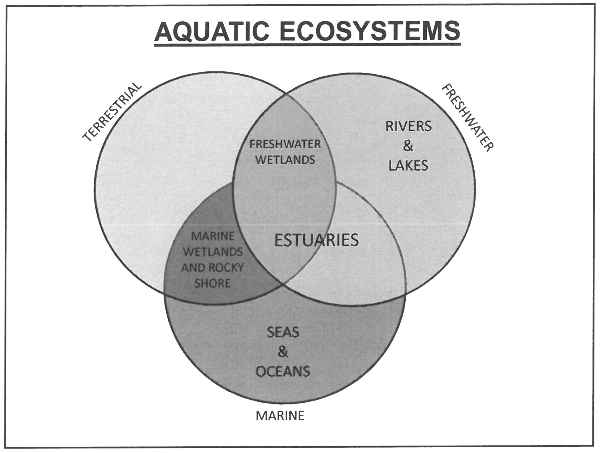

---
title:"Aquatic Ecosystem Taxonomy"
output: html_document

---

# Imports
import RiverTaxonomy as RiverTaxonomy

# Aquatic Ecosystem Taxonomy
The seas and freshwater constitute the two major forms of aquatic ecosystems. Additionally, the ecotone between sea and the terrestrial ecosystem forms marine wetland and rocky shore ecosystems, and the overlap between freshwater systems and the terrestrial ecosystem forms freshwater wetland systems. Finally the overlap of terrestrial, freshwater and marine systems form estuaries. 

> NOTE: Estuaries could also be thought of as the overlap of freshwater wetlands with the sea. 

># River Taxonomy
>
>## Ephemeral
>Ephemeral rivers are influent, i.e. they experience a new low of water by infiltration. Such rivers are characterised by porous bed material with very little water retention, and tend to dry out periodically. In some cases they may even be dry $\geq 90\%$ of the year, filling only after intense rainfall.
>
>## Intermittent
>Intermittent rivers vary between influent and effluent, with a no net flow between the river water and the ground water, the amount of water in the river, and hence the flow rate and other related factors vary with time/season. In some instances, such as in the eastern cape they river may dry up completely in sections. 
>
>## Perennial
>Perennial rivers are effluent, i.e there is a net inflow of ground water into the river, they are present through the year. 
>
>## Artificial
>Artificial water channels occur in the form of wears, which land owners use to divert water from rivers to croplands or orchards. 

# Appendix

