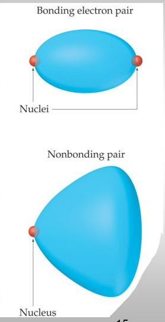

# tutorial question and additional work

## chapter 1
section 1.1-1.3

self test 1.1

self test1.2

read 1.3d-1.3g

(see section 1.3 for explanation)

section 1.5-1.6

Self test 1.7-1.11

Exercises 1.9-1.15, 1.17-1.26, 1.28-1.31 (pp 32-33)
 
# section one general review

## Quantum numbers

### Introduction
Orbitals are a spacial distribution of electron density.All energy states of electrons within atoms are negative by convention, (as the are considered to be the minimum energy necessary to free that electron from its parent atom)

### principle quantum number
n

#### range
$n \in \mathbb{Z}^+| n \geq 1$

NOTE: although n is theoretically unbounded values greater than five have not yet been observed in reality.

#### details
Identifies a specific energy state
Orbitals of the same quantum number form an part of the same electron shell

### Azimuthal quantum number (orbital angular momentum number)
l

#### encoding
values of l are given letters for identification

$\quad 0\rightarrow s$

$\quad 1\rightarrow p$

$\quad 2\rightarrow d$

$\quad 3\rightarrow f$

#### range
$l\in \mathbb{Z}\quad | \quad 0 \leq l \leq n-1\quad$

#### details
determines the size and shape of the sub shell/ determines the area around the nucleus which the electron may inhabit.

### Magnetic quantum number
$m_s$

#### range
$m_{l} \in \mathbb{Z} \quad | \quad -l \leq m_{l} \leq l\quad$

#### details
determines the three dimensional orientation of sub shell.  

#### spacial orientations
P orbitals have three possible orientations

X,Y,Z

{width=50%}

D orbitals have five possible orientations

$xy,xz,zy,z^{2},x^{2}-y^{2}$

{width=50%}

F orbitals have seven possible orientations.

{width=50%}

### magnetic spin number $m_{s}$

#### range
$m_{s} \in \left( \frac{+1}{2},\quad\frac{-1}{2} \right)$

#### details
determines the direction of spin/ gyration of the electron in regard to the magnetic axis of the atom.

### representation diagrams

#### Standard representation

$nl^{s}$

Where:

      n= principle quantum number
      l= azimuthal number
      x= number of electrons within the l subshell.      

#### Condensed representation
[noble gases] valence shell in standard representation

### Pauli Exclusion Principles.
no too electron within one atom can have the same set of quantum numbers

### Aufbau Priciple
electrons must always fill into the lowest energy levels available, this provides the sable ground state for of the atom.  

### Hundu's
degenerate orbitals must always be filled singly and by electrons with the same spin number before 2 electrons may fill the same orbital, and opposite spin numbers are permissible.  

#### exchange with higher sub-shells
electrons are most lightly to be promoted into higher sub-shells when in doing so they can lead to completely singly filled, or completely double filled orbitals.

##### examples
Chromium

$[Ar]4s^{1}3d^{5}$

Copper

$[Ar]4s^{1}3d^{10}$

## Effective nuclear charge
effective nuclear charge is the charge exerted on a given electron within an atom by the (positively charged) nucleus of that atom

### shielding
shielding is the reduction of the full nuclear charge which and in isolation the nucleus would exert on an electron.

$Z_{eff} = Z - \sigma\quad$

where:
    $Z_{eff}$ = effective nuclear charge
    Z= nuclear charge
    $\sigma$ = shielding effect of other electrons.

this shielding effect is due to the present of other electrons within the atom which repel the electron in question reducing the net attractive force towards the nucleus which it feels.

(this reduction is often expressed as the reduction of  $Z \quad to \quad Z_{eff}$ )

### penetration
the potential for the presence of an electron inside shells of other electrons. (?)

### Slater's Rules
Estimated value for sigma

#### final electron is in a s or p orbital

* n-1 electrons contribute 0.85
* ns and np electrons contribute 0.35 to $\sigma\quad$
* n-2 or lower electrons contribute 1.0  to $\sigma\quad$

#### final electron is in a d or f orbital

* nf and nd electrons contribute 0.35  to $\sigma\quad$
* electrons in lower shells contribute 1. to $\sigma\quad$

### Trends

#### #1
The closer to the nuclear an electron is the smaller the difference between Z and $Z_{eff}$ will be.

#### #2
In terms of energy levels d>p>s

#### summary
Increases up and across the periodic table.

##### Exceptions

###### Hydrogen
the 2s and 2p orbitals have the same energy level.

###### potassium and calcium
4s energy level is lower than the 3p (?)
(see section 1.3 for explanation)

## Periodic table

### History
first proposed in 1869 based on increased atomic weight.

families of elements with similar chemical properties (groups) with gaps in these families allowing for prediction.

### classifying elements.

#### Metallic character
##### metals
Good Conductors
High lustre
generally solid
malleable
ductile

##### metalloids
goo semiconductors
some High lustre some low lustre
generally solid
some malleable some not malleable
some ductile some not ductile

##### Non metals
not malleable
low to no lustre
not ductile
poor conductors
brittle
gas

##### mixtures

###### metals and metals
alloys

###### non metals and metals
hard

###### non metals and non metals
volatile

{width=50%}

{width+50%}

## Atomic properties

### Atomic and Ionic radii
radii measures are not very precise

#### Trends
increases down group and decreases across period.

this trend is offset between strontium and barium because $Z_{eff}$ is increased as there are more protons but few effectively shielding electrons. For orbitals are very bad at shielding (?)

##### Lanthanoid Contractions  
D block elements don't tend to expand or shrink properly

#### Covalent radius
half of the difference between centres of atoms in covalent bond (there is some overlap)

#### Ionic Radius
radius of atoms within ionic compounds, an average must be taken over many different ionic compounds as there is no reason to assume it would be half way between the atom centres.  

##### mono atomic cations
monatomic cations are smaller than the parent atoms, as there is less shielding but equal nuclear charge so high effective nuclear charge.

##### monatomic anions
monoatomic anions are larger than their parent ions because they experience more shielding so lower effective nuclear charge

#### Metallic
half of the distance between atoms in a solid.

### Ionization Energy
Ionisation energy is the energy require to remove an electron from and atom (the standard is measure in gaseous conditions)

#### Trends
Ionisation energy increases up a group and across a period.

Correlated with atomic radii, but there are often exceptions depending on which sub-shell the electron in question is removed from.

### Electron Affinity

#### Electron enthalpy gain $\Delta_{eg}H^{\circ}\quad$

$\Delta_{eg}H^{\circ}\quad=-E_{a}-\frac{5}{2RT}$

$E_a$ is determined by the energy of the lowest unfilled or half filled orbital.

$E_a$ can be high if the electron added can experience a strong effective nuclear charge.

### ELectronegativity $\chi\quad$
the power of an element to attract electrons towards itself when it is part of a compound.

#### Mulliken Electronegativity ($\chi_{M}\quad$)
Atoms with higher ionisation energies and electron affinities are more likely to gain electrons

Atoms with low ionisation energies and low electron affinities are more likely to lose electrons.

$\chi_{M}=(I+E_{a})$

#### Pauling Electronegativity
Pauling energetics is related to the energetic of bond formation

If $BE(A-B)>\frac{1}{2}(BE(A-A)+BE(B-B))$ then the covalent bond contains an ionic contribution

Equation (?)

#### Trends
related to atomic size and electron configuration

increases up group and across period.

### Polarizability
the ability of an atom to be distorted by an electric field

#### polarizable
large highly charged anions are highly polarisable.

Cations that do not have noble gas configuration are easily polarisable.

#### polarizing or polarizing ability.
small highly charge cations have high polarisability.

## Electron structures

###Lewis structures.
A covalent bond is formed when two neighbouring atoms share an electron pair.

#### The Octet Rule
Each atom share electrons with neighbouring atoms to achieve a total on 8 valence electrons.

(there are many exceptions to this rule.)  

#### Procedure.

1. Count the total number  of valence electrons from all atoms involved, (add/subtract for ions as necessary.)
2. Atom which is least electronegative (cannot be hydrogen )
3. Make octets around outer atoms.
4. Share as many outer electron pairs with central atom to make covalent bonds as necessary to create an octet around central atom.
5. determine which structure has the lowest overall formal charge, and the most electro-negative formal charge on the most negative atom.

#### Exceptions

##### Expanded Octets
the presence of available d orbitals within acceptable energy ranges allows for more than 8 valence electrons around the central atom. this confirmation is known as hypervalent.

#### Formal charge.
The number of electrons assigned to each atom. is The sum of its unshared valence electrons plus 1 electron per covalent bond it forms

the formal charge of an atom in a compound is the number of electrons normally present in its valence shell minus the number of electron assigned to it in its given lewis structure.

NOTE: Sometimes lowest formal charge violates octet rule for central atom

#### Resonance
when two, or more lewis structure with identical formal charges and atomic conformation indicates a resonance structure. this compound exist in a state between the two formal structures, with intermediate bond lengths and energy levels.
As bonding is distributed across the whole molecule so the energy of the resonance hybrid is lower than any single structure

### Predicting Shapes

#### Bonding vs Non Bonding pairs.
non bonding electrons have a greater repellent force, hence their position equatorial/ axial must place them as far away from each other as possible, and as far away from as many other electrons pairs as possible.

Bonding pair are also physically smaller than non bonding pairs.

{height=50%}

#### Bond Angles

{width=50%}

##### Exceptions
1. Lone pairs distort bond angles by about 2.5 degrees
2. multiple bonds also distort bond angles.

*d

| Number Of Electron Dense areas 	| Electron Pair Geometry  	| No Lone Pairs        	| 1 lone Pair           	| 2 Lone Pairs  	| 3 Lone Pairs 	| $
|--------------------------------	|-------------------------	|----------------------	|-----------------------	|---------------	|-------------- |
| 2                              	| Linear                  	| Linear               	|                       	|               	|               |
|--------------------------------	|-------------------------	|----------------------	|-----------------------	|---------------	|-------------- | 	  
| 3                              	| Trigonal Planar         	| Trigonal Planar      	| Bent                  	|               	|               |
|--------------------------------	|-------------------------	|----------------------	|-----------------------	|---------------	|-------------- |
| 4                              	| Tetrahedral             	| Tetrahedral          	| Trigonal bipyramidal  	| Bent          	|               | 	|--------------------------------	|-------------------------	|----------------------	|-----------------------	|---------------	|-------------- |
| 5                              	| Trigonal bipyramidal    	| Trigonal Bipyramidal 	| Sawhorse              	| T-Shaped      	| Linear        |	|--------------------------------	|-------------------------	|----------------------	|-----------------------	|---------------	|-------------- |
| 6                              	| Octahedral              	| Octahedral           	| Square Pyramidal      	| Square Planar 	| T-Shaped     	|  
|--------------------------------	|-------------------------	|----------------------	|-----------------------	|---------------	|-------------- |

This table is fucked, it will not display for shit*

 

# Spectroscopy 

Spectroscopy is a set of techniques in which the response of molecules t the input of energy is measured, that is , electromagnetic radiation is applied to compounds and their response is then measured. 

## Electromagnetic waves. 

### Wave nature. 
Electromagnetic waves consist of and electric and magnetic field which oscillate orthogonally to each other, and orthogonally to the direction of propagation of the wave. 

#### Wavelength 
Wavelength is donated by $\lambda$ and measured in meters (sometimes nm are used such as when UV or visible light is being discussed). 

#### Velocity 
Speed is donated by $c$. The speed of light in a vacuum ($c_0$) is constant ($3.00 \cdot 10^{8}m\cdot s^{-1}$), normally the speed of light is given in $m\cdot s^{-1}$ 

#### Frequency
frequency is donated by $\nu$ (?) and is measured in Hertz (Hz) that is $s^{-1}$

#### Wavenumber 

Wavenumber is donated by $\overline{\nu}$, and is the reciprocal of wavelength. It is measured in $cm^{-1}$ and used most commonly in IR spectra. 

### Particle nature.
Photons are particles of light. There particles posses a distinct quantised energy given by $E=h\nu$ 

### Gamma rays. 
The energy of photons is too high breaking up molecules changing their structure. 

### X rays. 
The energy of photons is too high breaking up molecules changing their structure. 

### Ultra violet and visible light. 
Affect the valence electrons of molecules exciting them to a higher state. 

## Infra red 
Interact with bond stretch, affecting virational energy levels. 

### Microwaves. 
Affect bond bending. 

#### radiowaves. 
Affects the erergy levels associated with the magnetic field which is associated with electron, or protons within the nucleus.

## Obtaining spectra. 
Radiation of known wavelength is passed through the sample and the decrease in intensity of the radiation is observed. The absorbance of the sample is them calculated. The process is repeated over a range of wavelengths to give a graph of intensity or absorbance against time. 

### Beer-lamert Law. 
The Beer lambert law given by the expression. 
$A=cb\epsilon$ 

NOTE: The energy of the regions of EM of interest have energies of $1-^{-20}-10^{-28}$, i.e very small. 

## Absorbance spectra 
Absorbance results when molecules in a low energy state are excited to a higher energy state by the absorption of a photon of energy. The change in energy which occurs is donated as $\Delta E$. (This form of absorption is that which is typically used for IR, UV, visible and NMR spectra)

## Double bond equivalents. 
The advantage of double bond equivalents is that they can be used to at least propose several possible structure for a compound. The presence of several structural components including double or triple bonds, cyclic compounds and aromatic rings can be speculated, and the related functional 
groups identified. 

### Aromatics. 
The DBE for a benzene ring is 4, and in general if a compound has a DBE above 4 there is a good chance that it contains benzene, (if its DBE is bellow four then obviouly it cannot contain benzene. )

## IR spectra 
IR spectra are very good at identifying specific functional groups present. 
The absorbance spectra, resulting from the distinct absorbance of differeng bonds is plotted against wavenumber. Some frequencies absorb more than others, which forms the basis for functional group identification. 

### Interaction of radiation. 
IR radiation interacts with the vibrational level associated with bonds between atoms,i.e. bond stretching and bond bending.  The size of the dipole moment changes in the interaction. The larger the change in the dipole moment the stronger the signal. If the bond is symmetrical then there will be no IR signal, i.e. it will not absorb any IR 
radiation. 

#### Important bonds. 
The most important bonds in IR are the bonds that stretch more or less independently of the rest of the molecule. Such bonds are bonds that are much weaker or stronger than other neighboring bonds within the molecule. Bonds in which one atom is much heavier than the other also tend to have strong and distinctive absorption patterns. 

#### Peak classification. 
Peaks are generally grouped into one of four categorized based on the extent of absorption which they represent, (i.e. how low the spectrum falls): very strong, strong, medium, and weak. Peaks may be further described as either sharp or broad depending on the range of wavelengths which are absorbed in interaction with the bond. 

#### Peak position. 
The $\bar{\nu}$ at the lowest point in a peak are taken as the peak position. The section of the spectra from $1500-400-cm^{-1}$ generally focused on as peaks in this region are easier to resolve, in the fingerprint region many overlapping and weaker peaks makes it far more difficult to identify specific bonds. 

#### Equations. 
As bond stretching is being considered Hooke's law which gives the frequency of oscillation for a spring, can be used, that is: \newline 

$v=\frac{1}{2\pi}\sqrt{\frac{k}{\mu}}$\newline 
$\rightarrow \bar{\nu}=\frac{1}{2\pi c}\sqrt{\frac{k}{\mu}}$\newline 
where: \newline 
$k$= The force constant. \newline 
$\mu=\frac{m_xm_y}{m_x+m_y}$= The reduced mass (C-C:6.0, C-H: 0.92)\newline
$m_x, m_y$ = Atomic mass of compounds x and y respectively. 

From Hooke's law it can be seen that: \newline 
$\bar{\nu}\propto$

### Informational content
The information gained from an IR spectra is information about bonds, as this is what the IR interacts with. 

#### Quantitative. 
IR spectra can be used to obtain quantitative information about the strength and or length of bonds, calculated suing force constants, however this is not the main application of IR in organic chemistry. 

#### Qualitative 
The main application of IR in organic chemistry is inferring which functional groups may be present, (which is qualitative information). 

NOTE: The electronic component of the IR radiation is involved in the interaction, not the magnetic.

### Operating range. 
A IR spectra is typically taken over a range of $400-4000cm^{-1}$ ($\lambda$=2.5 \cdot 10^{-6}- 2.5 \cdot 10^{-5}$) 

### Infra-red radiation introduces (??) tranformations in molecules. 

### Machine.
The Infra-Red radiation used is obtained from a heated coil. This radiation passes through the sample before arriving at the detector. Some of the incident radiation is diverted to a inferometer which producer a interferogram for the source radiation. This interferogram is decoded by furier tranfer. On its way to the sample the incident beam passes through a specially shaped (normally diamond) crystal to allow for attenuated total reflection (ATR). 

# Organic chemistry 

## Course Background. 

###  Lecturer
Dr Kennedy Ngwira, C407, Dr Amond Rouseou. C503. 

### Isomers. 

#### Structural isomers. 
Structural isomers are compounds with the same atomic composition and molecular formula, but different atomic arrangments.

#### Structural isomers

#### Stereo isomers. 

##### Conformational 
Conformational isomers are characterised by free rotation around a particular (C-C) bond, hence at least one single bond is required in the structure. Due to the free rotation the different isomeric forms can be rapidly interconverted. 

###### Staggered 
In eclipsed conformation, when view along the axis of the bond the groups attached to the atoms of the bond do not lie dirrectly behind eachother but are displaced by a given angle ($60^\circ$) 

###### Eclipsed. 
In eclipsed conformation, when view along the axis of the bond the groups attached to the atoms of the bond lie dirrectly behind eachother. 

###### Cyclic compounds 
cyclic compounds can also form coformational isomers which take on the boat, or chair conformation. 

##### Geometric
Geometric isomers require a rigidn unit such as a double bond ($\pi$ bond), or a cyclic compound which prevents free rotation.

###### Cis trans. 
In cis trans nomeclature the cis conformation has groups of higher proprity on the same size, the trans has them on opposite sides. ( higher priority is assigned to the group which is connected by the atom with the higher atomic number, if atomic number is equal then mass number is used))

###### Carn-Ingold Prelog (E,Z)
The Carn-Ingold Prelog system (C.I.P rules) are used to assign priorities.  higher priority is assigned to the group which is connected by the atom with the higher atomic number, if atomic number is equal then mass number is used. If the first atom is identical then the atomic weight of the next atom in the chain is compared. multiple bonds are considered as an equvalent number of single bonds to the given atom. 

If the higher priorety groups are on the same side then the molecule is in Z conformation (where Z stands for Zussamen/together). If the higher priorety groups are on opposite sides then the molecule is th the E, Enitgen conformation. 

##### Enantiomers (Optical isomers)

Moeluces whise mirror images are not superimposed. 

###### Requirements. 
$sp^3$ hybridised carbon, with four differernt substituents ()i.e a steric carbon. 

The sp^3 hybridised carbon must have four different groups attatched to it.(For example alanine). The resulting system is asymetrical, and will have a non-superimposable missor image. 

NOTE: the central carbon may be refferd to as a steriocarbon, a steriogentic centre or a hydrocarbon. 

###### Properties. 
Inantomers have practically identical(almost indistinguishable) physical and chemical properties are therfore very hard to separate. Furthermore Racemic mixture are hard to detect. This is porblematic as often one inatomer may be a powerful medical drug and the other may be seriously toxic. 

###### Polarised light 
inantomers will rotate plane polerised light differently. They will rotate the plane of polerised light to the same extend to one will rotate to the right (+, dextrorotatory) the other will rotate to the plane to the left (-, levorotatory)(equal but opposite). 

###### Optical activity 
optically active substances will rotate plae polerised light. A Racemic mixture is opticcally inactive.

NOTE: A Racemic mixture is a mixture containing an equal concnetration of both enantomers. 

### Nomecalture. 
The + or - is prefixed to the compound name. The problem is that the + and - configuration are determined experimentally and cannot be determined dirrectly from the steriochemistry around the steriocenter.

A new system was developed to overcome this problem, the process for which is as follows. 

 #. Priorities are assigned to each group using the C.I.P rules. (note 1 is used for highest priorety, on to 2 etc). 
 #. The molecule is orientated with the lowest priority group at the back. 
 #. If the remaining 3 substituents run from highest to lowest clockwise then the isomer is on R configuration. 
 #. If they are arranged anticlockwise the entantomer is S. 
 
 Example: 
 Br>Cl>C>H
 
 #. Clockwise, R
 #. anticlockwise S. 
 
 NOTE: Flipping any two groups will result in the opposite entantomer. swapping inverts the configuration from R to S. 
  
 ## Diasteriomers. 
Occur if more than one steriocentre is present. Diastereomers are not mirror images.

(Copy flag diagram)
For a diassteriogentic centres there are a maximum of $2^n$
 stereoisomers. Half of these will be enantomers of the other half. 
all of the other relationships are diateriomers. 

