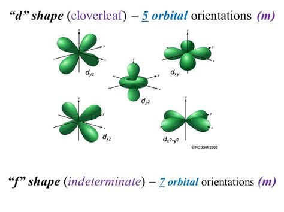
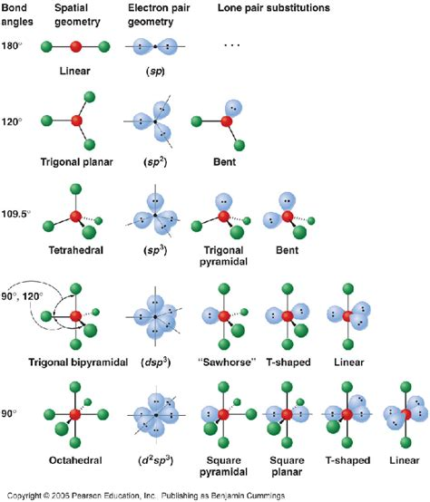

# Imports

import Modules/Spectroscopy as Spectroscopy

import Modules/OrganicChem as OrganicChem 

import Modules/InorganicChem as InorganicChem

import Modules/Spectrometry as Spectrometry

# Chemistry

## Background

### Lecturer
Dr Kennedy Ngwira, C407, Dr Amond Rouseou. C503. 

## Inorganic Chemistry

># Inorganic Chemistry
>
>## Quantum numbers
>
>### Introduction
>Orbitals are a spacial distribution of electron density.All energy states of electrons within atoms are negative by convention, (as the are considered to be the minimum energy necessary to free that electron from its parent atom)
>
>### principle quantum number
>n
>
>#### range
>$n \in \mathbb{Z}^+| n \geq 1$
>
>
>NOTE: although n is theoretically unbounded values greater than five have not yet been observed in reality.
>
>#### details
>Identifies a specific energy state
>Orbitals of the same quantum number form an part of the same electron shell
>
>### Azimuthal quantum number (orbital angular momentum number)
>l
>
>#### encoding
>values of l are given letters for identification
>
>$\quad 0\rightarrow s$
>
>$\quad 1\rightarrow p$
>
>$\quad 2\rightarrow d$
>
>$\quad 3\rightarrow f$
>
>#### range
>$l\in \mathbb{Z}\quad | \quad 0 \leq l \leq n-1\quad$
>
>#### details
>determines the size and shape of the sub shell/ determines the area around the nucleus which the electron may inhabit.
>
>### Magnetic quantum number
>$m_s$
>
>#### range
>$m_{l} \in \mathbb{Z} \quad | \quad -l \leq m_{l} \leq l\quad$
>
>#### details
>determines the three dimensional orientation of sub shell.  
>
>#### spacial orientations
>P orbitals have three possible orientations
>
>X,Y,Z
>
>{width=50%}
>
>D orbitals have five possible orientations
>
>$xy,xz,zy,z^{2},x^{2}-y^{2}$
>
>{width=50%}
>
>F orbitals have seven possible orientations.
>
>{width=50%}
>
>
>
>### magnetic spin number $m_{s}$
>
>#### range
>$m_{s} \in \left( \frac{+1}{2},\quad\frac{-1}{2} \right)$
>
>#### details
>determines the direction of spin/ gyration of the electron in regard to the magnetic axis of the atom.
>
>### representation diagrams
>
>#### Standard representation
>
>$nl^{s}$
>
>Where:
>
>      n= principle quantum number
>      l= azimuthal number
>      x= number of electrons within the l subshell.      
>
>#### Condensed representation
>[noble gases] valence shell in standard representation
>
>### Pauli Exclusion Principles.
>no too electron within one atom can have the same set of quantum numbers
>
>### Aufbau Priciple
>electrons must always fill into the lowest energy levels available, this provides the sable ground state for of the atom.  
>
>### Hundu's
>degenerate orbitals must always be filled singly and by electrons with the same spin number before 2 electrons may fill the same orbital, and opposite spin numbers are permissible.  
>
>#### exchange with higher sub-shells
>electrons are most lightly to be promoted into higher sub-shells when in doing so they can lead to completely singly filled, or completely double filled orbitals.
>
>##### examples
>Chromium
>
>$[Ar]4s^{1}3d^{5}$
>
>Copper
>
>$[Ar]4s^{1}3d^{10}$
>
>## Effective nuclear charge
>effective nuclear charge is the charge exerted on a given electron within an atom by the (positively charged) nucleus of that atom
>
>### shielding
>shielding is the reduction of the full nuclear charge which and in isolation the nucleus would exert on an electron.
>
>$Z_{eff} = Z - \sigma\quad$
>
>where:
>    $Z_{eff}$ = effective nuclear charge
>    Z= nuclear charge
>    $\sigma$ = shielding effect of other electrons.
>
>    $Z_{eff}$ = effective nuclear charge
>    Z= nuclear charge
>    $\sigma$ = shielding effect of other electrons.
>
>this shielding effect is due to the present of other electrons within the atom which repel the electron in question reducing the net attractive force towards the nucleus which it feels.
>
>(this reduction is often expressed as the reduction of  $Z \quad to \quad Z_{eff}$ )
>
>### penetration
>the potential for the presence of an electron inside shells of other electrons. (?)
>
>### Slater's Rules
>Estimated value for sigma
>
>#### final electron is in a s or p orbital
>
>* n-1 electrons contribute 0.85
>* ns and np electrons contribute 0.35 to $\sigma\quad$
>* n-2 or lower electrons contribute 1.0  to $\sigma\quad$
>
>#### final electron is in a d or f orbital
>
>* nf and nd electrons contribute 0.35  to $\sigma\quad$
>* electrons in lower shells contribute 1. to $\sigma\quad$
>
>### Trends
>
>#### #1
>The closer to the nuclear an electron is the smaller the difference between Z and $Z_{eff}$ will be.
>
>#### #2
>In terms of energy levels d>p>s
>
>#### summary
>Increases up and across the periodic table.
>
>##### Exceptions
>
>###### Hydrogen
>the 2s and 2p orbitals have the same energy level.
>
>###### potassium and calcium
>4s energy level is lower than the 3p (?)
>(see section 1.3 for explanation)
>
>## Periodic table
>
>### History
>first proposed in 1869 based on increased atomic weight.
>
>families of elements with similar chemical properties (groups) with gaps in these families allowing for prediction.
>
>### classifying elements.
>
>#### Metallic character
>##### metals
>Good Conductors
>High lustre
>generally solid
>malleable
>ductile
>
>##### metalloids
>goo semiconductors
>some High lustre some low lustre
>generally solid
>some malleable some not malleable
>some ductile some not ductile
>
>##### Non metals
>not malleable
>low to no lustre
>not ductile
>poor conductors
>brittle
>gas
>
>##### mixtures
>
>###### metals and metals
>alloys
>
>###### non metals and metals
>hard
>
>###### non metals and non metals
>volatile
>
>{width=50%}
>
>{width+50%}
>
>
>## Atomic properties
>
>### Atomic and Ionic radii
>radii measures are not very precise
>
>#### Trends
>increases down group and decreases across period.
>
>this trend is offset between strontium and barium because $Z_{eff}$ is increased as there are more protons but few effectively shielding electrons. For orbitals are very bad at shielding (?)
>
>##### Lanthanoid Contractions
>D block elements don't tend to expand or shrink properly
>
>#### Covalent radius
>half of the difference between centres of atoms in covalent bond (there is some overlap)
>
>#### Ionic Radius
>radius of atoms within ionic compounds, an average must be taken over many different ionic compounds as there is no reason to assume it would be half way between the atom centres.  
>
>##### mono atomic cations
>monatomic cations are smaller than the parent atoms, as there is less shielding but equal nuclear charge so high effective nuclear charge.
>
>##### monatomic anions
>monoatomic anions are larger than their parent ions because they experience more shielding so lower effective nuclear charge
>
>#### Metallic
>half of the distance between atoms in a solid.
>
>### Ionization Energy
>Ionisation energy is the energy require to remove an electron from and atom (the standard is measure in gaseous conditions)
>
>#### Trends
>Ionisation energy increases up a group and across a period.
>
>Correlated with atomic radii, but there are often exceptions depending on which sub-shell the electron in question is removed from.
>
>### Electron Affinity
>
>#### Electron enthalpy gain $\Delta_{eg}H^{\circ}\quad$
>
>$\Delta_{eg}H^{\circ}\quad=-E_{a}-\frac{5}{2RT}$
>
>$E_a$ is determined by the energy of the lowest unfilled or half filled orbital.
>
>$E_a$ can be high if the electron added can experience a strong effective nuclear charge.
>
>### ELectronegativity $\chi\quad$
>the power of an element to attract electrons towards itself when it is part of a compound.
>
>#### Mulliken Electronegativity ($\chi_{M}\quad$)
>Atoms with higher ionisation energies and electron affinities are more likely to gain electrons
>
>Atoms with low ionisation energies and low electron affinities are more likely to lose electrons.
>
>$\chi_{M}=(I+E_{a})$
>
>#### Pauling Electronegativity
>Pauling energetics is related to the energetic of bond formation
>
>If $BE(A-B)>\frac{1}{2}(BE(A-A)+BE(B-B))$ then the covalent bond contains an ionic contribution
>
>Equation (?)
>
>
>#### Trends
>related to atomic size and electron configuration
>
>increases up group and across period.
>
>### Polarizability
>the ability of an atom to be distorted by an electric field
>
>#### polarizable
>large highly charged anions are highly polarisable.
>
>Cations that do not have noble gas configuration are easily polarisable.
>
>#### polarizing or polarizing ability.
>small highly charge cations have high polarisability.
>
>
>## Electron structures
>
>### Lewis structures.
>A covalent bond is formed when two neighbouring atoms share an electron pair.
>
>#### The Octet Rule
>Each atom share electrons with neighbouring atoms to achieve a total on 8 valence electrons.
>
>(there are many exceptions to this rule.)  
>
>#### Procedure.
>
>1. Count the total number  of valence electrons from all atoms involved, (add/subtract for ions as necessary.)
>2. Atom which is least electronegative (cannot be hydrogen )
>3. Make octets around outer atoms.
>4. Share as many outer electron pairs with central atom to make covalent bonds as necessary to create an octet around central atom.
>5. determine which structure has the lowest overall formal charge, and the most electro-negative formal charge on the most negative atom.
>
>#### Exceptions
>
>##### Expanded Octets
>the presence of available d orbitals within acceptable energy ranges allows for more than 8 valence electrons around the central atom. this confirmation is known as hypervalent.
>
>
>#### Formal charge.
>The number of electrons assigned to each atom. is The sum of its unshared valence electrons plus 1 electron per covalent bond it forms
>
>the formal charge of an atom in a compound is the number of electrons normally present in its valence shell minus the number of electron assigned to it in its given lewis structure.
>
>NOTE: Sometimes lowest formal charge violates octet rule for central atom
>
>#### Resonance
>when two, or more lewis structure with identical formal charges and atomic conformation indicates a resonance structure. this compound exist in a state between the two formal structures, with intermediate bond lengths and energy levels.
>As bonding is distributed across the whole molecule so the energy of the resonance hybrid is lower than any single structure
>
>### Predicting Shapes
>
>#### Bonding vs Non Bonding pairs.
>non bonding electrons have a greater repellent force, hence their position equatorial/ axial must place them as far away from each other as possible, and as far away from as many other electrons pairs as possible.
>
>Bonding pair are also physically smaller than non bonding pairs.
>
>{height=50%}
>
>#### Bond Angles
>
>2. multiple bonds also distort bond angles.
>
>
>*d
>
>| Number Of Electron Dense areas 	| Electron Pair Geometry  	| No Lone Pairs        	| 1 lone Pair           	| 2 Lone Pairs  	| 3 Lone Pairs 	| $
>|--------------------------------	|-------------------------	|----------------------	|-----------------------	|---------------	|-------------- |
>| 2                              	| Linear                  	| Linear               	|                       	|               	|               |
>|--------------------------------	|-------------------------	|----------------------	|-----------------------	|---------------	|-------------- | 	  
>| 3                              	| Trigonal Planar         	| Trigonal Planar      	| Bent                  	|               	|               |
>|--------------------------------	|-------------------------	|----------------------	|-----------------------	|---------------	|-------------- |
>| 4                              	| Tetrahedral             	| Tetrahedral          	| Trigonal bipyramidal  	| Bent          	|               | 	|--------------------------------	|-------------------------	|----------------------	|-----------------------	|---------------	|-------------- |
>| 5                              	| Trigonal bipyramidal    	| Trigonal Bipyramidal 	| Sawhorse              	| T-Shaped      	| Linear        |	|--------------------------------	|-------------------------	|----------------------	|-----------------------	|---------------	|-------------- |
>| 6                              	| Octahedral              	| Octahedral           	| Square Pyramidal      	| Square Planar 	| T-Shaped     	|  
>|--------------------------------	|-------------------------	|----------------------	|-----------------------	|---------------	|-------------- |
>
>This table is fucked, it will not display for shit*
>
>
>
> 

## Spectroscopy

># Spectroscopy
>
>## Background
>Spectroscopy is a set of techniques in which the response of molecules to the input of energy is measured. Electromagnetic radiation is applied to compounds and the interaction of this radiation with the compound is then observed. 
>
> ># Electromagnetic waves
>>
> >## Wave nature.
>>Electromagnetic waves consist of and electric and magnetic field which oscillate orthogonally to each other, and orthogonally to the direction of propagation of the wave. 
>>
> >## Wavelength
>>Wavelength is donated by $\lambda$ and measured in meters (sometimes nm are used such as when UV or visible light is being discussed). 
>> 
> >## Velocity
>>Speed is donated by $c$. The speed of light in a vacuum ($c_0$) is constant ($3.00 \cdot 10^{8}m\cdot s^{-1}$), normally the speed of light is given in $m\cdot s^{-1}$ 
>>
> >## Frequency
>>Frequency is donated by $\nu$ (?) and is measured in Hertz (Hz) that is $s^{-1}$
>>
> >## Wavenumber
>>Wavenumber is donated by $\overline{\nu}$, and is the reciprocal of wavelength. It is measured in $cm^{-1}$ and used most commonly in IR spectra. 
>>
> >## Particle nature.
>>Photons are particles of light. There particles posses a distinct quantised energy given by $E=h\nu$
>>
> >### Interactions with matter
>>
> > ># Absorbance
>>>Absorbance is a measure of the extent to which a substance transmits electromagnetic radiation. 
>>>
> > >## Equation
>>>Absorbance (A) is defined by equation to as: \newline 
>>>
>>>$A=-\text{log}_{10}$. ($=\text{log}_{10}(\frac{I_0}{I})$)\newline 
>>>
>>>Where:\newline 
>>>> $T$ =Transmittance. 
>>>> $I_0$ = Intensity of incident radiation and 
>>>> $I$ = Intensity of transmitted radiation. 
>>>
> > >## Appendix
>>>
> > > ># Transmittance
>>>>Transmittance is a material property relating to how radiant energy moves through a substance. 
>>>>
> > > >## Equation
>>>>The transmittance (T) of a surface is given by the expression. 
>>>>
>>>>$T=\frac{I}{I_0}$ 
>>>>
>>>>where: 
>>>>>$I_0$ = The intensity of light incident onto the surface
>>>>> $I$ = The intensity of light transmitted by the surface.
>>>>
>>>>> NOTE: Transmittance is often given as a percentage.
>>>>
>>
> > ># Transmittance
>>>Transmittance is a material property relating to how radiant energy moves through a substance. 
>>>
> > >## Equation
>>>The transmittance (T) of a surface is given by the expression. 
>>>
>>>$T=\frac{I}{I_0}$ 
>>>
>>>where: 
>>>>$I_0$ = The intensity of light incident onto the surface
>>>> $I$ = The intensity of light transmitted by the surface.
>>>
>>>> NOTE: Transmittance is often given as a percentage.
>>>
>>
> > ># Beer-Lambert Law
>>>The Beer Lambert law related the attenuation of electromagnetic waves to the properties of the material through which they are propagating and the distance which they have propagated through the material. 
>>>
> > >## Equation.
>>>For a particular wavelength incident on a suspension of absorbing particles the Beer Lambert law is given by:\newline 
>>>
>>>$A=\epsilon bC$
>>>
>>>Where: \newline 
>>>> $A$ = Absorbance \newline 
>>>> $\epsilon$ = Molar absorptivity ($L\cdot mol^{1-}\cdot cm^{-1}$)\newline 
>>>> $C$= Concentration of absorbing particles. 
>>>
> > >## Appendix
>>>
> > > ># Absorbance
>>>>Absorbance is a measure of the extent to which a substance transmits electromagnetic radiation. 
>>>>
> > > >## Equation
>>>>Absorbance (A) is defined by equation to as: \newline 
>>>>
>>>>$A=-\text{log}_{10}$. ($=\text{log}_{10}(\frac{I_0}{I})$)\newline 
>>>>
>>>>Where:\newline 
>>>>> $T$ =Transmittance. 
>>>>> $I_0$ = Intensity of incident radiation and 
>>>>> $I$ = Intensity of transmitted radiation. 
>>>>
> > > >## Appendix
>>>>
> > > > ># Transmittance
>>>>>Transmittance is a material property relating to how radiant energy moves through a substance. 
>>>>>
> > > > >## Equation
>>>>>The transmittance (T) of a surface is given by the expression. 
>>>>>
>>>>>$T=\frac{I}{I_0}$ 
>>>>>
>>>>>where: 
>>>>>>$I_0$ = The intensity of light incident onto the surface
>>>>>> $I$ = The intensity of light transmitted by the surface.
>>>>>
>>>>>> NOTE: Transmittance is often given as a percentage.
>>>>>
>>>
>
> >## Infra Red Spectrometry
>>Interact with bond stretch, affecting vibrational energy levels. 
>>
>>
>
> >### Gamma Rays
>>The energy of photons is too high breaking up molecules changing their structure. 
>>
>
> >### X Ray Spectroscopy
>>The energy of photons is too high breaking up molecules changing e
>>
>
> >### Ultra Violet and Visible Light Spectroscopy
>>Affect the valence electrons of molecules exciting them to a higher state. 
>
> >### Microwave Spectroscopy
>>Affect bond bending. 
>
> ># NMR Spectroscopy
>>Affects the energy levels associated with the magnetic field which is associated with electron, or protons within the nucleus.
>>
> > ># Proton NMR Spectroscopy
>>
> > ># Carbon 13 NMR Spectroscopy
>>> 
>>
>>
> >## NMR.
>>
> >### Chemically equivalent positions.
>>How many signals, gives info about number of non-equivalent nuclei.  
>>
> >### Chemical shifts,
>>GIves information about the environment of nuclei and possible functional groups (Use correlation tables adn charts)
>>
> >### Integration
>>Gives information about the number of H responsible for each signal 
>>
> >### Spin-spin splitting.
>>gives the number of H on the adjacent. 
>>
>>NOTE: for carbon 13 it is similar and DEPT spectra is used to give infor about the number of hydrogen (off resonance decoupled spectra not included as normally DEPT is used instead). 
>>
>>
> >### Decoupling
>>
>>Carbon 13 decoupled spectra is designed so that there is no coupling between $^{13}C$ and hydrogen.
>>DEPT experiment, any carbon carrying 3 protons appears as positibve/ above the baseline, and any coarbon with 2 hydrogen appears are negative, below the basline. C atoms carrying no protons, (quantinary carbon atoms) do not appear  in the DEPT spectrum. 
>>
>>Always run in conjunction with a full spectrum, to provide more information. 
>>Usually DEPT-135 
>>COPY IMAGE.
>>$CH$ and $CH_3$ signals are up and $CH_2$ signals are down, quantinary carbon signals dissapear. 
>>
> >### Protons attatchced to nitrogens or oxygens,
>>hydrogen bonding often occurs, and there can be a rapid exchange of H molecules between molecules. 
>>
>>This results in 
>> #. broader peaks. 
>> #. $\delta$ values ca vary greatly
>> #. Positions also depend on solvent and concentration 
>> #. very seldom see coupling
>>
> >#### $D_2O$ exchange.
>>One ca take advantage of H exchange between molecules to locate H attatched to N or O, 
>>$D_2O$ is added to the sample, and the OH signal is removed by exchanging H for D in the organic compound, the $D_2O$ itself will not interfere as it sits as a layer on the surface, (the organic molecule is dissolved in chloroform. 
>>
>>THis only works for H attatched to O or N, as onyl in theses groups can the rapid exhchange of H with other molecules occur. (this will be alcohols and amines/amindes). 
>>
>>NOTE: only the H dirrectly next to an unsaturated bond are deshielded. 
>>
>>NOTE: $CH_2$ s tend to be more deshielded than $CH_3$ s. 
>>
> >### PRocess
>>
>>Try and identify for each signal 
>> #, Chemical shift. ()
>> #. The number of H integration, (the integration )
>> #. the multiplicity, (singlet, doublet, etc) 
>> #. the number of H adjacent,
>>
>>NOTE: check at the end that the patterns all make sense
>> NOTE: remember for an ester the O side is far more desaturated. 
>>
>>
> >### Examples
>> #. start with the DBE.
>> 	#. 
>> #.look at peaks. 
>>	#. a meta aromatic has an doublet of doublets and an apparent triplet (or very close doublet of doublets) 
>>	#. A para aromatic has only a doublet of doublets. 
>>
>>NOTE: the OH can be anywhere in the NMR, but can be identified by $D_2O$
>>(exchanges) implies a signal is removed when $D_2O$ is added.
>>
>>NOTE: use the fact that the number of aromatic protons can give the number of substituents on an aromatic ring. 
>>NOTE: aldehyde proton is extremely deshielded but does not exchange. 
>>
>>for a multiplet (i.e. a complex signal) the number of adjacent H cannot be determined. 
>>do not confuse the number of signals with the number of peaks derived from splitting, each signal may be split into several peaks. 
>>
>>aromatic H do not normally couple outside of the ring. 
>>
>>in a para-substituted aromatic four carbon signals are seen. 
>>Carbon next to H form bigger peaks. (higher), than those which are substituted.
>>
>>There are two different effects on electro density, the inductive effect, which is an electron withdrawing throughbond effect. oxygen however can donate its lone pair into the $\pi$ system of an aromatic ring, which leads to increased electron density in the ortho and para positions, so relatively more shielded than the meta position. 
>>
>>Sometimes very similar shift values although not equivalent will not, overlap to give a multiplet.
>>
>>heteroatom protons do not normally couple. 
>>
>>Do next example.
>>
>>
>
> >## Double Bond Equivalents
>>The advantage of double bond equivalents is that they can be used to at least propose several possible structure for a compound. The presence of several structural components including double or triple bonds, cyclic compounds and aromatic rings can be speculated, and the related functional 
>>groups identified. 
>>
> >### Aromatics.
>>The DBE for a benzene ring is 4, and in general if a compound has a DBE above 4 there is a good chance that it contains benzene, (if its DBE is below four then obviously it cannot contain benzene.)
>

## Organic chemistry

># Organic Chemistry
> 
>## NMR.
>
> ### SAmple preparation. 
>COPY Image. 
>Sample in a tube which spins rapidly, and is often in solution (solid state NMR is possible but not often used). The solvent must be chosen so as not to interfere. 
>
>The most common solvent is deuterated chloroform. ($CCl_4$) is toxic, $D_2O$ and $CD_3CO_D$ are also used. (and several others copy)
>
>### Electromagnet
>jacket of liquid helium, and jacket of liquid nitrogen. 
>
>## # Analysis
>
>#### Number of signals
>
>##### Chemical shift.
>Gives information about the groups surrounding the proton in question. Each different chemical environment gives a signal.
>The first question is are the nuclei in question readily chemically distinguishable. In general it is easy to tell groups apart but more difficult within a group all attatched to the same atom and constantly rotating, (NMR cannot distinguish between them either). For all chemically equivalent  hydrogens/nuclei only one peak will be seen. For each set of protons in a unique environment a different peak will be seen.  The smae will apply to $^{13}C$ carbons. 
>
>The height of the signal depends on the time of relaxation to ground state, as a general rule quanternary carbons will relax slower giving s smaller peak. 
>
>#### Symmetry
>Symmetry implies there will be different nuclei in identical environments. 
>
>In summary the position of signals depends on the environment of the nuclei, and the number of signals depedns on how many nuclei are non equivalent. 
>
>#### Restricted rotation.
>Around a double bond consideration must be given as to what a given nuclei is cis and trans to. / 
>
>NOTE: look at Claden the second addition. 
>
>NOTE: even very similar groups which have a environment which differes to any degree will give a peak.
>
>
>### Shielding.
>Electrons are charged and moving so can set up their own field around the carbon nucelus which will slightly modify the strength of the applied field felt. As a general rule the tiny local magnetic fields that are set up oppose $H_0$. So the effective field is $H_{\text{overall}}=H_0-H_\text{electrons}$. 
>
>The extent of the field  reduction depends on the density of the electron cloud.
>
>Each nuclei experiences a different magnetic field, even though the external field is the same and therefore each nucleus resonate at its own frequency. 
>deshielded implies more of the applied field is felt. 
>
>### Chemical shift.
>The scael is universal so adjusts to the strength of the magnetic field.  ie at 60mHz 1$\delta$ unit = 60Hz, at 300mHz 1 delta unit = 300Hz. , in general $\delta $ = 1 part per million. 
>
>
>##### Referecne compound
>The compound tetramethylsilane the $\delta$ of $^{29}Si$ $^1H$ and $$^{13}C$$ are by definition given as zero.  by definition $\delta =\frac{frequency(Hz)-frequency TMS (Hz)}{instrument operating frequency MHz}$ 
>Typically H is between 0 and 10 and $^{13}C$ $0<\delta <220$
>
>
>NOTOE: the NMR is callibrated with tMS to give the zero reference value. with shielding $\delta$  will decrease this is upfield, conversely deshielding leads to increase in deshilding moving the peak downfield. 
>
>ANy carbon nucleus surrounded by protons is normally fairly shielded as the protons share electrons about equally with the carbon. If the carbon is bonded to a electronegative atom deshielding will occur, conversely if the carbon is bonded to an electropositive atom it will be more shielded, as its electron cloud will be pulled closer to it. 
>
>
>
>
>
>#### Electroinductive effect.
>Electronic effect transmitted through neighboring $\sigma$ bonds . the effect is still significant for about three bonds down the line. 
>
>NOTE: the effect is additive. 
>
>#### Unsaturation
>A ring current develops in the ring of an aromatic in this case the induced field of the $\pi$ electrons reinforces and does not reduce the applied magnetic field.
>The same is true of alkenes, and in general all unsaturated compounds. The same applies to carbons 
>
>NOTE: the protons of aldehydes are extrememly deshilded, the carbonyl carbon is generally the most deshielded carbon one will find.
>
>NOTE: alykes are a little bit of an exception as there are not as deshielded as the alkenes , READ UP ON THIS. 
>
>### Integration of signals
>NOTE: only applies to protons. 
>
>The area under a peak is proportional to the number of protons giving rise to that signal. The instrument can integrate peak areas . INtegral is plotted as steops, the height of the steps are proportional to the number of protons, integration works with protons but fails with most othe nuclei. (esp $^{13}C$ )
>
>The height signifies the number of protons, this height may nto always be exactly identical, this is not an issue and may result from some impurity in the sample. the ration between heights can then be found, the lowest whole number ration will be correct generally (as there must be a whole number and this number cannot exceed )
>---
>title: "CHEM2003 Notes"
>NOTE: the protons of aldehydes are extrememly deshilded, the carbonyl carbon is generally the most deshielded carbon one will find.
>
>NOTE: alkynes are a little bit of an exception as there are not as de-shielded as the alkenes , READ UP ON THIS. 
>
>### Integration of signals
>NOTE: only applies to protons. 
>
>The area under a peak is proportional to the number of protons giving rise to that signal. The instrument can integrate peak areas. Integral is plotted as steps, the height of the steps are proportional to the number of protons, integration works with protons but fails with most other nuclei. (esp $^{13}C$ )
>
>The height signifies the number of protons, this height may not always be exactly identical, this is not an issue and may result from some impurity in the sample. the ration between heights can then be found, the lowest whole number ration will be correct generally (as there must be a whole number and this number cannot exceed )
>
>only 2 or three questions on section 2 and section 4. 
>
>## Aspects of reactivity
>
>### Effects of bond polarity.
>
>#### Bond breaking.
>(manual section 18-22)
>
>##### Non Polar bonds
>undergoes homolytic cleavage, reprisente by fish hooke arrows. More often than not homolytic cleavage gives rise to radicals. to make a bond each atom donates an electron.givesss rise to free radicals 
>
>
>##### Polar bonds.
>one atom already has aaa dedlta negative bond sso someone takes all the electrons. In a heterolytic cleavage the two electrons go onto the side which is more electronegative (already delta negative charged ). heteroytic cleaavage gives rise to the formation of electrophiles and nucleophiles. electron move from the electrophiles to the neutrophiles. Electrophiles initiate the reaction. Most reactions stem from the 
>
>
>ns effect transmitted through a $\sigma$ bond framework of molecules. 
>as electrons spend more time on the electronegative atom this atom gains a delta  negative charge, the other atom in this bond will have a delta positive charge.  
>
>the effect falls off after about 3 bonds. alkyl groups are electron donating, by induction.The electronic effects are donated transmitted by a sigma bond. 
>
>alkyl groups are electron donating. 
>
>Stability of carbocations and carboanions. 
>If a carbon is carrying apositive chrge, additional alkyle groups attatched to this carbon will stabalise it by donating electrons to cangel out this charge. so tertiary carbocations are more stable thatn secondary which are more staable than primary. In the case of a carbon anion however the electron releasing effect of the alkyl groups will lead to a destabalising effect. a negative charge can however be stabalised by an electronwithdrawing group. with a free radical stability increases with more alkyle groups, 
>
>inductive effect, occurs through a sigma structire 
>
>mesomeric/ resonance effect. 
>works through a $\pi$ bond  
>a $pi$ bond is waeker than a $\sigma$ bond, becuase this bond is weaker is allows ofr resonance with fully charged structures where the more electronegative, atom tkes both electrons in the bond. resonance structure can be donated by dotted lines in which case it is known as a resonance hybrid. elcalisation of charge gives rises to resonance structure.
>
>## Conjugated systems .
>(i.e alternating single and double bonds. ). COPY delocalised structure. radicals can be shifted around a structure in much the same way a a double bond. by homolytically breaking adjacent bonds, to from a new bond, and a new radical. 

## Spectrometry

># Spectrometry
>
> ># Mass Spectrometry
>>
>>In not a spectroscopy becuase it ddoes not involllve bsorption of electromgnetic raiation. it is usedd to determine the molecular mass of a compound. Structural information can also be gained by looking at fragments  formed when high energy molecules break up. 
>>
>>mass spec allows for measurment by rrent ion, high resoution pectraa allow for distighing between different molecular formulma of similar compounsd. Many are desktop size, gass cromotographers are often combined with the sspectrometer. 
>>
>>Blast molecule with a beeam of high-energy particles (usually electrons). 
>>$\approx 70eV=6700kJ\cdot mol^{-1}$ 
>>deflection is dependant on bothe mass charge ration, those difflected insufficiently or too much will not be een the rgestpeaal cp,es from the paA
>>These dislodegg a valence electron from the molecule, leaving behind a radical cation. 
>>
>>$M:\rightarrow M^{+}_\cdot +e^-$. 
>>
>>the molecular ion is only one of the possible fragments, fragmentation patterns are consistent and therefore diagnostic, relating to the strength o bonds in the compound, lone pair or $\sigma$ or $\pi$ bonds caan be disodgen and the parent ion can furthe break down, charged and neutral fragments.
>>
>>The istrument decetcs all positive ions and sorts them according to mass charge ratio, usuallt +1 charge in samll moelcules with mlarger chargers on polymers . 
>>
>>
>>COPY NOETS of instrument from video. 
>>
>>the parent will have the same mass as the largest radical mass fragments. (do not use the average molecular mass for low res max spec use the appropriate integer value
>>C-C bonds are weaker than C-H bonds so cleavage is far more likely to occur at C-C bonds than at C-H bonds. 
>>
> >### Relative abundance
>>everything is judged in relation to the largest peak which is given a value of 100\%. 
>>
>>oulby chraged fragments reulting rom ionition o rgment by chrged prticle i rre in small molecules as thier fragemnts are very unstable. 
>>
>>each line derrives from a different ion. the pecific iotope compoition i een in the ms spec.isotomes can lead to higher mass fragments such as carbon 13. (he average value cannot be used in this case. )
>>
>>n the case of carbon the abunadnce is 1.1% in bromine it is 50\% ($^{79}Br$, $^{81}Br$). 
>>(there will be doulbed peaks for all fragments which contain bromine. ). 
>>
>>Chlorine, $^{35}Cl$ 75\% $^{37}Cl$ 25\%. 
>>
>>
>>

# Appendix

