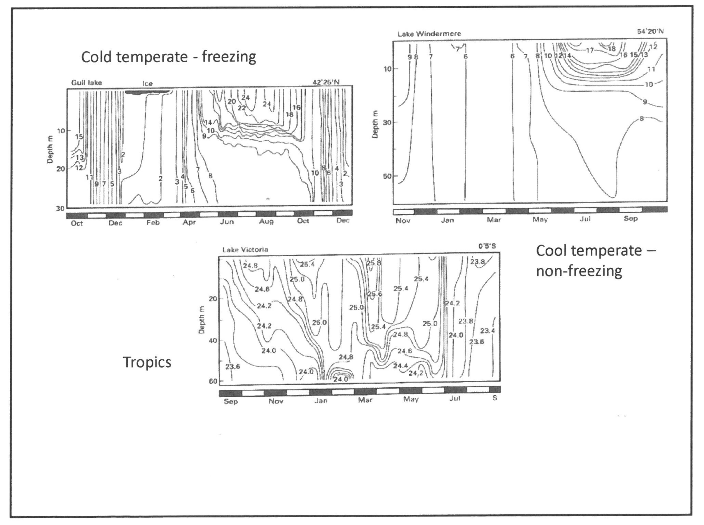

---
title: "Aquatic Ecology"
output: pdf_document
editor_options: 
  chunk_output_type: inline
---  

# Imports
import Modules/EvaporativePotential as ep

import Modules/AquaticEcosystemTaxonomy as AquaticEcosystemTaxonomy

import Modules/SARiverDistribution as SARiverDistribution

import Modules/WaterQuality as WaterQuality

import Modules/CatchmentDrainage as CD

import Modules/Rivers as Rivers

import Modules/Wetlands as Wetlands

# Aquatic Ecology
Aquatic Ecology

## Background

># Evaporative Potential
>Evaporative potential is measured using A pans, the unit derives from the evaporation observed with an evaporating pan, which is a standardised piece of measuring equipment. 

># Aquatic Ecosystem Taxonomy
>The seas and freshwater constitute the two major forms of aquatic ecosystems. Additionally, the ecotone between sea and the terrestrial ecosystem forms marine wetland and rocky shore ecosystems, and the overlap between freshwater systems and the terrestrial ecosystem forms freshwater wetland systems. Finally the overlap of terrestrial, freshwater and marine systems form estuaries. 
>
>
>
>> NOTE: Estuaries could also be thought of as the overlap of freshwater wetlands with the sea. 
>
> ># River Taxonomy
>>Rivers are classified, by branching network and how they accumulate flow. 
>>
> > ># River Flow Accumulation
>>>
> > >## Ephemeral
>>>Ephemeral rivers are influent, i.e. they experience a new low of water by infiltration. Such rivers are characterised by porous bed material with very little water retention, and tend to dry out periodically. In some cases they may even be dry $\geq 90\%$ of the year, filling only after intense rainfall.
>>>
> > >## Intermittent
>>>Intermittent rivers vary between influent and effluent, with a no net flow between the river water and the ground water, the amount of water in the river, and hence the flow rate and other related factors vary with time/season. In some instances, such as in the eastern cape they river may dry up completely in sections. 
>>>
> > >## Perennial
>>>Perennial rivers are effluent, i.e there is a net inflow of ground water into the river, they are present through the year. 
>>>
> > >## Artificial
>>>Artificial water channels occur in the form of wears, which land owners use to divert water from rivers to croplands or orchards. 
>>
> > ># River Branching Network
>>>In general when classifying streams within a drainage network, a number is assigned to each stream to reflect the drainage area the channel dimensions and the discharge volume.
>>>
> > >## Strahler method
>>>Numbers are assigned in a cumulative fashion based on the confluence of streams. A second order stream is characterised as forming from/lying directly below the junction of two first order streams, or the junction of a first order and a second order stream. A third order stream is formed from the junction of two second order streams and so forth. A stream must junction with another stream of equivalent order to result in the formation of a higher order stream, because otherwise there would not be a significant increase in the amount of water in the higher order stream forming the junction. These orders reflect the basic rules of drainage basin geometry. 
>>>
>>
>
>

># South African River Distribution
>
>## Rain fall related variation
>The annual precipitation rate decreasing moving from the east coast where it is around $1000-1200ml$ across to the west  coast where it goes as low as $100ml$ at the extreme. Evaporative potential is also far higher in the (north) west. In the combination of high rainfall will low evaporation allows for high run off a high water table, and the formation of perennial streams. Conversely, in the west, high evaporation and low rainfall result in  the formation of ephemeral rivers. Between these two extremes exists a band of intermediate conditions which allow for the formation of intermittent rivers. 

># Water Quality
>Water quality is generally taken as a combination of several different physical and chemical factors. \newline 
>
> ># Hydrological Components
>>
> >## Dissolved inorganic nutrients
>>$PO_3^2-$ $NO_3^-$ are generally the most important dissolved inorganic nutrients to consider. Dissolved nutrient concentration forms an important limiting factor in biological growth and productivity. This concentration is normally increased dramatically in areas affected by human activity, i.e. near cities or industrial plants. 
>>
> >## Dissolved organic nutrients.
>>Tannins such as those that lead to the brown coca cola colored waters of western cape rivers are a form of dissolved organic nutrients. 
>> 
> >## Toxins
>>Toxins may occur naturally in a system but are often related to human activities.  The most common toxins encountered are heavy metals and hydrocarbons (such as oil/fuel spills from cars). 
>
> ># Physiological Conditions
>>
> > ># Suspended Solids
>>>
>>>some text
>>>
> > >## Turbidity
>>>The turbidity of a water body is the degree to which it absorbs/ blocks the passage of light. The more suspended solid particles there are in the water column, the greater its turbidity. 
>>>
> > >## Source
>>>
> > >### Landscape
>>>Run off from the landscape is an important contributor of suspended solids. 
>>>
> > >### River bed.
>>>The river bed forms an additional source of solid material for suspension. 
>>>
> > >## Effects.
>>>
>>>>NOTE: (Vanishing waters by Dvies and Dae(?) is a good reference book for this section
>>>
> > >### Shading
>>>Increased turbidity can lead to shading of phytoplankton and macrophytes, leading to a decrease in photosynthesis based primary production. 
>>>
> > >### Predation
>>>Turbidity can reduce the ability of visual predators such as fish to hunt effectively. Additionally as there is less primary production there will be a corresponding decrease in primary and secondary (i.e predators) and higher levels of consumption. 
>>>
> > >### Reproduction
>>>Some Marco-invertebrates, such as Caddis flies require clean rock habits, especially for activities such as egg laying, blanketing of benthos by sediment removes their environment. 
>>>
>>
> > ># Water Temperature
>>>Under sea level, atmospheric pressure conditions water will freeze at $0^\circ C$ and boil at $100^{\circ}C$. With increasing altitude, however, the boiling point will decrease as the boiling point is directly proportional to the vapor pressure over the liquid which is directly proportional to the atmospheric pressure, which decreases with increased altitude. This reduction can become quite significant at very high altitudes, for example, water boils at $45^\circ C$ at the top of mount Everest. 
>>>
> > >## Density Temperature Relationship
>>>Due to the hydrogen bonding which occurs in the crystal lattice of ice, water ($H_2O$)  in fact most dense just before freezing at temperatures of $0-3.94^\circ C$ 
>>>
>>>> Question: Is the most dense temperature pressure dependant?
>>>
>>>In its liquid phase the density of water varies directly with its temperature. Implying that colder water will sink below warmer. This effect is readily observable in large water bodies with relatively low levels of disturbance (lotic). 
>>>
> > > ># Temperature Profile
>>>>The temperature profile is used to depict cyclic (usually annual) changes in water temperature within a water body. Temperature is shown as isotherms with depth plotted against time.
>>>>
>>>>
>>>>
>>>
>> 
> > ># Water Conductivity
>>>Conductivity is a measure of the ability of water to conduct electricity. Conductivity is measured in Siemens ($S$), and water conductivity is usually measured in Siemens per unit area, $\muS.cm^{-1}$ for low conductivity headland streams, for highly conductive $mS.cm^{-1}$. Conductivity must always be measured in conjunction with temperature as conductivity varies directly with temperature. Provided the temperature is recorded the reading can be standardized for comparison. 
>>>
>>>>NOTE: Conductivity is the inverse of resistance
>>>
> > >## Pollution Indicator
>>>Conductivity is a good blanket measure of pollution especially in the case of metal (ion) pollution which significantly increases conductivity. However, some geologies naturally have more metals and therefore higher associated conductivity, so some variation is not necessarily indicative of contamination. 
>>
> > ># Water PH
>>
> > ># Dissolved Oxygen

># Catchment Drainage
>All the water which falls within a given catchment will flow into the stream. Different drainage basins are dived by a watershed (the line connecting the highest points between the two basins. 
>
>## Drainage density
>The drainage density is defined as the amount of stream channel required to drain one unit of catchment area. The same area drained by more tributaries has a higher drainage density. 
>
>## Tributary arrangement.
>The tributary arrangement can vary, related to both topography, which can dictate direction of water flow, and geology, which leads to specific weathering patterns and channel formation. 
>
>### Dendritic
>In the dendritic arrangement many small tributaries drain into one main channel
>
>> NOTE: Dendritic Meaning hand-like
>
>### Radial
>In the radial arrangement many tributaries run outwards from a central point in all directions 
>
>### Centripetal
>Multiple tributaries draining inwards towards a central point, a depression/pan of some form.
>
>### Paralleled
>In a parallel system tributaries run remarkably parallel to each other down the landscape. This phenomenon results where the drainage occurs over rock formations including very hard rock types which the water cannot easily penetrate. As a result water penetrates on either side of the bands of hard rock present in the formation, and so parallel channels on either side of each band result.
> 
>### Trellis
>In a trellis system within tributaries water flows with consecutive right angle changes in its direction. This pattern results when the rock formation which the water drains over contains blocks of very hard impermeable rocks in a perpendicular pattern, with softer rock in between. Channels form by erosion of the softer rock, changing direction to flow perpendicularly whenever a block of hard rock is encountered, in this way the water always flows parallel to the hard rock depositions. 
>
>### Distributary
>In a distributary system the river breaks up into distributary channels. This conformation occurs often, just before entering the sea for example.
>
 
># Rivers
>
>## Background
>
>### Important Measurements
>
> ># River Discharge
>>Discharge is the rate at which a volume of water flows past a given point. 
>>
> >## Units
>>Discharge is measured in Cumecs ($m^3s^{-1}$)
>>
> >## Measurement.
>>To measure the discharge in a stream, the stream is divided horizontally into rectangular cells of an equal width. The depth at the start and end of each cell is then measured and the two value averaged to give an estimate of average depth. A flow device is then used to measure the velocity of the water moving through each cell. The sum of the discharge across all cells is the transect discharge. 
>>
> >### Equation
>>$Q=\displaystyle\sum _{i=1}^{n}w_id_iv_i$
>>
> >### Remote measurement
>>Discharge is often measured remotely with the use of gauging wears. Gauging wears temporarily stop the flow, measuring the height of the water which builds up behind the temporary obstruction, and the slight drop in stream height just in front of the barrier. This difference in height is then used to calculate the water velocity, using a, so a racing curve, which gives a standard relation between height and velocity. (basically a standard curve. Gauging wears are placed at strategic points across the catchment. A logger is used to record this flow data every hour or half hour for months, and all the collected data is stored until an engineer comes to retrieve it.
>>
>>Discharge should be measured a bit before the wear as the wear retards the flow. Additionally riffles/rapids should be avoided as there is too much turbulence within them, a smooth deep laminar flow is best. This provides a more accurate measure of water volume. 
>>
>> > NOTE: in the Eastern cape gauging wear are only present on main dams, as all other gauging wears in this region were decommissioned in the 80s
>>
>>
>>
>>
>>
>>
>>
>>
>>
>>
>>
>>
>>
>>
>>
>>
>>
>>
>
> ># Stream Slope
>>The stream slope is the vertical drop along a horizontal distance, it measures how altitude changes along a stream from head waters to mouth. 
>>
>>$SS=\frac{\text{elevation at contuor A}-\text{elevation at contour B}}{\text{length of stream between contours}}=\frac{\text{Vertical distance}}{\text{Horizontal distance}}$
>>
>>Stream slope is expressed in meters per kilometer, meters per 100 kilometers, or as a percentage or ratio.
>>
>
> ># River Taxonomy
>>Rivers are classified, by branching network and how they accumulate flow. 
>>
> > ># River Flow Accumulation
>>>
> > >## Ephemeral
>>>Ephemeral rivers are influent, i.e. they experience a new low of water by infiltration. Such rivers are characterised by porous bed material with very little water retention, and tend to dry out periodically. In some cases they may even be dry $\geq 90\%$ of the year, filling only after intense rainfall.
>>>
> > >## Intermittent
>>>Intermittent rivers vary between influent and effluent, with a no net flow between the river water and the ground water, the amount of water in the river, and hence the flow rate and other related factors vary with time/season. In some instances, such as in the eastern cape they river may dry up completely in sections. 
>>>
> > >## Perennial
>>>Perennial rivers are effluent, i.e there is a net inflow of ground water into the river, they are present through the year. 
>>>
> > >## Artificial
>>>Artificial water channels occur in the form of wears, which land owners use to divert water from rivers to croplands or orchards. 
>>
> > ># River Branching Network
>>>In general when classifying streams within a drainage network, a number is assigned to each stream to reflect the drainage area the channel dimensions and the discharge volume.
>>>
> > >## Strahler method
>>>Numbers are assigned in a cumulative fashion based on the confluence of streams. A second order stream is characterised as forming from/lying directly below the junction of two first order streams, or the junction of a first order and a second order stream. A third order stream is formed from the junction of two second order streams and so forth. A stream must junction with another stream of equivalent order to result in the formation of a higher order stream, because otherwise there would not be a significant increase in the amount of water in the higher order stream forming the junction. These orders reflect the basic rules of drainage basin geometry. 
>>>
>>
>
> ># River Longitudinal Trends
>>
> >## Slope
>>The average slope (and altitude), trends to decrease moving down a river, as the first order streams of headwaters are  as usually in high altitude, mountainous regions. A significant exception to this trend is in the highveld in which the rivers drain a huge high altitude plateau. 
>>
>>
> >## Channel width
>>The channel width tends to increase moving down the river
>>
> >## Discharge volume
>>The discharge volume tends to increases moving down the river, as streams join up combining their discharge. 
>>
> >## Substrate size
>>Particle size of substrate, in particular bed substrate, tends to decrease moving down the river, essentially through the action of a filtering process. 
>>
>>
>
> ># River Longitudinal Divisions
>>
> >## Upper Reaches
>>
> >### Hydrology
> >### Physical conditions
>>
> >#### Slope
>>In general rivers have a very steep gradient by their source, with waterfalls in their upper streams.
>> 
> >#### Bed material
>>The bed material in upper reaches is normally more rocky, and this combined with the shallow water depth frequently leads to the formation of ripples.
>>
> >### Ecology
>>
> >#### Riparian zone
>>In almost all areas the riparian zone is heavily forested, with overhanding canopy with numerous branches extending over the river. 
>> 
> >## Lower Reaches/ Lowlands
>>
> >### Hydrology
>>
> >#### Flow rate
>>In the lower reaches the flow rate is very slow.
>>
> >### Physical conditions
>>
> >#### Turbidity
>>Lowland rivers are generally very turbid, due do fine suspended particles
>>
> >#### Bed material
>>Lowland rivers have a more uniform bed composition that headwater streams, consisting mainly of sand and silt. 
>>
> > ># River Zones
>>

># Wetlands
>
> ># Wetland Taxonomy
>>
> >## Exorheic
>>In an exorheic wetland, water flows through the wetlands and off into an adjacent water body. In many such wetlands water will flow into the wetland from an adjacent stream and then from the wetland back into the same stream, slightly further downstream.
>>
> >### Endorheic
>>In Endorheic wetland, water flows into the wetland from the surroundings but once in  the wetland has nowhere to flow off too, dissipating only by evaporation or infiltration. Endorheic wetlands are low points in the landscape which receive most of their water in the from of runoff. As a result sediment accumulates in these wetlands, and high concentrations of soluble substances such as salt are also accumulated. 
>>
>
>## Bed
>Wetlands tend to accumulate very fine sediments/clays resulting in far more water retention as a pose to infiltration.
>
>
>## Important Examples
>
> ># Okavango Delta
>>
>>The Okavango Delta is an endorheic pan (on a subcontinental level) which drains the Kalahari basin. Summer rainfall flows from the Angola highlands down into the Okavango Delta. After the summer rains the wetland/lake swells to about three times it's permanent size. Approximately sixty percent of the contained water is then evaporated off in the dry season, and the remain water is lost by infiltration.
>>
> >## Lake Ngati
>>About 2% of the summer run off flows over into the adjacent Lake Ngati when the Okavango Delta overfills, however such overflows are only irregular and seasonal.In 
>>fact the area in which the Ngati lake formed was completely dry for nearly 20 years, but after a period of particularly heavy rainfall between 2010 and 2012 the Okavango Delta was filled to capacity and run off into the adjacent area formed Lake Ngati. This run off contained not only water but also nutrients, invertebrates and fish to colonise the new environment. Fishing communities soon migrated on mass to the new lake.
>>
> >### Catastrophic Floods
>>In Very large floods, such as a one in fifty year flood, water will overflow into the adjacent basin, the Makgadikgadi salt pans.
>>
>>
>>>NOTE: The Okavango Delta contains many smaller scale exorheic wetlands within it, lying alongside the main channel. 
>>
