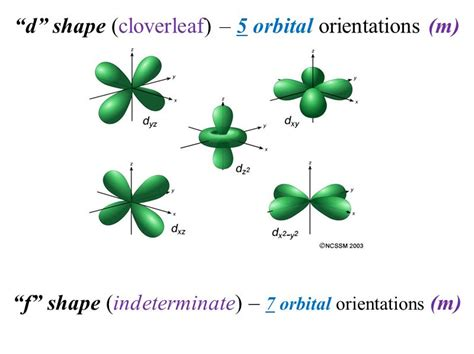
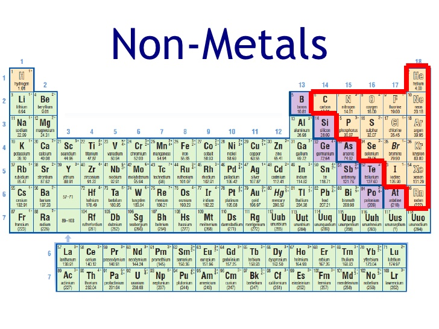
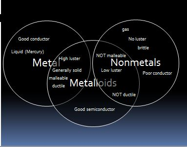
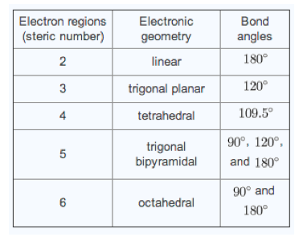

\maketitle
tutorial question and additional work
=====================================

chapter 1
---------

section 1.1-1.3

self test 1.1

self test1.2

read 1.3d-1.3g

(see section 1.3 for explanation)

section 1.5-1.6

Self test 1.7-1.11

Exercises 1.9-1.15, 1.17-1.26, 1.28-1.31 (pp 32-33)

section one general review
==========================

Quantum numbers
---------------

### Introduction

Orbitals are a spacial distribution of electron density.All energy
states of electrons within atoms are negative by convention, (as the are
considered to be the minimum energy necessary to free that electron from
its parent atom)

### principle quantum number

n

#### range

[\[range\]]{#range label="range"}

$n \in \mathbb{Z}^+| n \geq 1$

NOTE: although n is theoretically unbounded values greater than five
have not yet been observed in reality.

#### details

[\[details\]]{#details label="details"}

Identifies a specific energy state Orbitals of the same quantum number
form an part of the same electron shell

### Azimuthal quantum number (orbital angular momentum number)

l

#### encoding

[\[encoding\]]{#encoding label="encoding"}

values of l are given letters for identification

$\quad 0\rightarrow s$

$\quad 1\rightarrow p$

$\quad 2\rightarrow d$

$\quad 3\rightarrow f$

#### range

[\[range-1\]]{#range-1 label="range-1"}

$l\in \mathbb{Z}\quad | \quad 0 \leq l \leq n-1\quad$

#### details

[\[details-1\]]{#details-1 label="details-1"}

determines the size and shape of the sub shell/ determines the area
around the nucleus which the electron may inhabit.

### Magnetic quantum number

$m_s$

#### range

[\[range-2\]]{#range-2 label="range-2"}

$m_{l} \in \mathbb{Z} \quad | \quad -l \leq m_{l} \leq l\quad$

#### details

[\[details-2\]]{#details-2 label="details-2"}

determines the three dimensional orientation of sub shell.

#### spacial orientations

[\[spacial-orientations\]]{#spacial-orientations
label="spacial-orientations"}

P orbitals have three possible orientations

X,Y,Z

\centering
{width="50%"}

D orbitals have five possible orientations

$xy,xz,zy,z^{2},x^{2}-y^{2}$

\centering
{width="50%"}

F orbitals have seven possible orientations.

\centering
{width="50%"}

### magnetic spin number m\_{s}

#### range

[\[range-3\]]{#range-3 label="range-3"}

$m_{s} \in \left( \frac{+1}{2},\quad\frac{-1}{2} \right)$

#### details

[\[details-3\]]{#details-3 label="details-3"}

determines the direction of spin/ gyration of the electron in regard to
the magnetic axis of the atom.

### representation diagrams

#### Standard representation

[\[standard-representation\]]{#standard-representation
label="standard-representation"}

$nl^{s}$

Where:

      n= principle quantum number
      l= azimuthal number
      x= number of electrons within the l subshell.      

#### Condensed representation

[\[condensed-representation\]]{#condensed-representation
label="condensed-representation"}

\[noble gases\] valence shell in standard representation

### Pauli Exclusion Principles.

no too electron within one atom can have the same set of quantum numbers

### Aufbau Priciple

electrons must always fill into the lowest energy levels available, this
provides the sable ground state for of the atom.

### Hundu's

degenerate orbitals must always be filled singly and by electrons with
the same spin number before 2 electrons may fill the same orbital, and
opposite spin numbers are permissible.

#### exchange with higher sub-shells

[\[exchange-with-higher-sub-shells\]]{#exchange-with-higher-sub-shells
label="exchange-with-higher-sub-shells"}

electrons are most lightly to be promoted into higher sub-shells when in
doing so they can lead to completely singly filled, or completely double
filled orbitals.

##### examples

[\[examples\]]{#examples label="examples"}

Chromium

$[Ar]4s^{1}3d^{5}$

Copper

$[Ar]4s^{1}3d^{10}$

Effective nuclear charge
------------------------

effective nuclear charge is the charge exerted on a given electron
within an atom by the (positively charged) nucleus of that atom

### shielding

shielding is the reduction of the full nuclear charge which and in
isolation the nucleus would exert on an electron.

$Z_{eff} = Z - \sigma\quad$

where: $Z_{eff}$ = effective nuclear charge Z= nuclear charge $\sigma$ =
shielding effect of other electrons.

this shielding effect is due to the present of other electrons within
the atom which repel the electron in question reducing the net
attractive force towards the nucleus which it feels.

(this reduction is often expressed as the reduction of
$Z \quad to \quad Z_{eff}$ )

### penetration

the potential for the presence of an electron inside shells of other
electrons. (?)

### Slater's Rules

Estimated value for sigma

#### final electron is in a s or p orbital

[\[final-electron-is-in-a-s-or-p-orbital\]]{#final-electron-is-in-a-s-or-p-orbital
label="final-electron-is-in-a-s-or-p-orbital"}

-   n-1 electrons contribute 0.85

-   ns and np electrons contribute 0.35 to $\sigma\quad$

-   n-2 or lower electrons contribute 1.0 to $\sigma\quad$

#### final electron is in a d or f orbital

[\[final-electron-is-in-a-d-or-f-orbital\]]{#final-electron-is-in-a-d-or-f-orbital
label="final-electron-is-in-a-d-or-f-orbital"}

-   nf and nd electrons contribute 0.35 to $\sigma\quad$

-   electrons in lower shells contribute 1. to $\sigma\quad$

### Trends

#### \#1

[\[section\]]{#section label="section"}

The closer to the nuclear an electron is the smaller the difference
between Z and $Z_{eff}$ will be.

#### \#2

[\[section-1\]]{#section-1 label="section-1"}

In terms of energy levels d\>p\>s

#### summary

[\[summary\]]{#summary label="summary"}

Increases up and across the periodic table.

##### Exceptions

[\[exceptions\]]{#exceptions label="exceptions"}

Hydrogen

the 2s and 2p orbitals have the same energy level.

potassium and calcium

4s energy level is lower than the 3p (?) (see section 1.3 for
explanation)

Periodic table
--------------

### History

first proposed in 1869 based on increased atomic weight.

families of elements with similar chemical properties (groups) with gaps
in these families allowing for prediction.

### classifying elements.

#### Metallic character

[\[metallic-character\]]{#metallic-character label="metallic-character"}

##### metals

[\[metals\]]{#metals label="metals"}

Good Conductors High lustre generally solid malleable ductile

##### metalloids

[\[metalloids\]]{#metalloids label="metalloids"}

goo semiconductors some High lustre some low lustre generally solid some
malleable some not malleable some ductile some not ductile

##### Non metals

[\[non-metals\]]{#non-metals label="non-metals"}

not malleable low to no lustre not ductile poor conductors brittle gas

##### mixtures

[\[mixtures\]]{#mixtures label="mixtures"}

metals and metals

alloys

non metals and metals

hard

non metals and non metals

volatile

\centering
{width="50%"}

{width+50%}

Atomic properties
-----------------

### Atomic and Ionic radii

radii measures are not very precise

#### Trends

[\[trends-1\]]{#trends-1 label="trends-1"}

increases down group and decreases across period.

this trend is offset between strontium and barium because $Z_{eff}$ is
increased as there are more protons but few effectively shielding
electrons. For orbitals are very bad at shielding (?)

##### Lanthanoid Contractions

[\[lanthanoid-contractions\]]{#lanthanoid-contractions
label="lanthanoid-contractions"}

D block elements don't tend to expand or shrink properly

#### Covalent radius

[\[covalent-radius\]]{#covalent-radius label="covalent-radius"}

half of the difference between centres of atoms in covalent bond (there
is some overlap)

#### Ionic Radius

[\[ionic-radius\]]{#ionic-radius label="ionic-radius"}

radius of atoms within ionic compounds, an average must be taken over
many different ionic compounds as there is no reason to assume it would
be half way between the atom centres.

##### mono atomic cations

[\[mono-atomic-cations\]]{#mono-atomic-cations
label="mono-atomic-cations"}

monatomic cations are smaller than the parent atoms, as there is less
shielding but equal nuclear charge so high effective nuclear charge.

##### monatomic anions

[\[monatomic-anions\]]{#monatomic-anions label="monatomic-anions"}

monoatomic anions are larger than their parent ions because they
experience more shielding so lower effective nuclear charge

#### Metallic

[\[metallic\]]{#metallic label="metallic"}

half of the distance between atoms in a solid.

### Ionization Energy

Ionisation energy is the energy require to remove an electron from and
atom (the standard is measure in gaseous conditions)

#### Trends

[\[trends-2\]]{#trends-2 label="trends-2"}

Ionisation energy increases up a group and across a period.

Correlated with atomic radii, but there are often exceptions depending
on which sub-shell the electron in question is removed from.

### Electron Affinity

#### Electron enthalpy gain \\Delta\_{eg}H\^{\\circ}\\quad

[\[electron-enthalpy-gain-delta\_eghcircquad\]]{#electron-enthalpy-gain-delta_eghcircquad
label="electron-enthalpy-gain-delta_eghcircquad"}

$\Delta_{eg}H^{\circ}\quad=-E_{a}-\frac{5}{2RT}$

$E_a$ is determined by the energy of the lowest unfilled or half filled
orbital.

$E_a$ can be high if the electron added can experience a strong
effective nuclear charge.

### ELectronegativity \\chi\\quad

the power of an element to attract electrons towards itself when it is
part of a compound.

#### Mulliken Electronegativity (\\chi\_{M}\\quad)

[\[mulliken-electronegativity-chi\_mquad\]]{#mulliken-electronegativity-chi_mquad
label="mulliken-electronegativity-chi_mquad"}

Atoms with higher ionisation energies and electron affinities are more
likely to gain electrons

Atoms with low ionisation energies and low electron affinities are more
likely to lose electrons.

$\chi_{M}=(I+E_{a})$

#### Pauling Electronegativity

[\[pauling-electronegativity\]]{#pauling-electronegativity
label="pauling-electronegativity"}

Pauling energetics is related to the energetic of bond formation

If $BE(A-B)>\frac{1}{2}(BE(A-A)+BE(B-B))$ then the covalent bond
contains an ionic contribution

Equation (?)

#### Trends

[\[trends-3\]]{#trends-3 label="trends-3"}

related to atomic size and electron configuration

increases up group and across period.

### Polarizability

the ability of an atom to be distorted by an electric field

#### polarizable

[\[polarizable\]]{#polarizable label="polarizable"}

large highly charged anions are highly polarisable.

Cations that do not have noble gas configuration are easily polarisable.

#### polarizing or polarizing ability.

[\[polarizing-or-polarizing-ability.\]]{#polarizing-or-polarizing-ability.
label="polarizing-or-polarizing-ability."}

small highly charge cations have high polarisability.

Electron structures
-------------------

### Lewis structures.

A covalent bond is formed when two neighbouring atoms share an electron
pair.

#### The Octet Rule

[\[the-octet-rule\]]{#the-octet-rule label="the-octet-rule"}

Each atom share electrons with neighbouring atoms to achieve a total on
8 valence electrons.

(there are many exceptions to this rule.)

#### Procedure.

[\[procedure.\]]{#procedure. label="procedure."}

1.  Count the total number of valence electrons from all atoms involved,
    (add/subtract for ions as necessary.)

2.  Atom which is least electronegative (cannot be hydrogen )

3.  Make octets around outer atoms.

4.  Share as many outer electron pairs with central atom to make
    covalent bonds as necessary to create an octet around central atom.

5.  determine which structure has the lowest overall formal charge, and
    the most electro-negative formal charge on the most negative atom.

#### Exceptions

[\[exceptions-1\]]{#exceptions-1 label="exceptions-1"}

##### Expanded Octets

[\[expanded-octets\]]{#expanded-octets label="expanded-octets"}

the presence of available d orbitals within acceptable energy ranges
allows for more than 8 valence electrons around the central atom. this
confirmation is known as hypervalent.

#### Formal charge.

[\[formal-charge.\]]{#formal-charge. label="formal-charge."}

The number of electrons assigned to each atom. is The sum of its
unshared valence electrons plus 1 electron per covalent bond it forms

the formal charge of an atom in a compound is the number of electrons
normally present in its valence shell minus the number of electron
assigned to it in its given lewis structure.

NOTE: Sometimes lowest formal charge violates octet rule for central
atom

#### Resonance

[\[resonance\]]{#resonance label="resonance"}

when two, or more lewis structure with identical formal charges and
atomic conformation indicates a resonance structure. this compound exist
in a state between the two formal structures, with intermediate bond
lengths and energy levels. As bonding is distributed across the whole
molecule so the energy of the resonance hybrid is lower than any single
structure

### Predicting Shapes

#### Bonding vs Non Bonding pairs.

[\[bonding-vs-non-bonding-pairs.\]]{#bonding-vs-non-bonding-pairs.
label="bonding-vs-non-bonding-pairs."}

non bonding electrons have a greater repellent force, hence their
position equatorial/ axial must place them as far away from each other
as possible, and as far away from as many other electrons pairs as
possible.

Bonding pair are also physically smaller than non bonding pairs.

\centering
{height="50%"}

#### Bond Angles

[\[bond-angles\]]{#bond-angles label="bond-angles"}

\centering
{width="50%"}

##### Exceptions

[\[exceptions-2\]]{#exceptions-2 label="exceptions-2"}

1.  Lone pairs distort bond angles by about 2.5 degrees

2.  multiple bonds also distort bond angles.

\*d

+-----------+-----------+-----------+-----------+-----------+-----------+
| \raggedri | \raggedri | \raggedri | \raggedri | \raggedri | \raggedri |
| ght       | ght       | ght       | ght       | ght       | ght       |
| Number Of | Electron  | No Lone   | 1 lone    | 2 Lone    | 3 Lone    |
| Electron  | Pair      | Pairs     | Pair      | Pairs     | Pairs     |
| Dense     | Geometry  |           |           |           |           |
| areas     |           |           |           |           |           |
+:==========+:==========+:==========+:==========+:==========+:==========+
| \raggedri | \raggedri | \raggedri | \raggedri | \raggedri | \raggedri |
| ght       | ght       | ght       | ght       | ght       | ght       |
| 2         | Linear    | Linear    |           |           |           |
+-----------+-----------+-----------+-----------+-----------+-----------+
| \raggedri | \raggedri | \raggedri | \raggedri | \raggedri | \raggedri |
| ght       | ght       | ght       | ght       | ght       | ght       |
| --------- | --------- | --------- | --------- | --------- | --------- |
| --------- | --------- | --------- | --------- | ------    | -----     |
| --------- | -------   | ----      | -----     |           |           |
| -----     |           |           |           |           |           |
+-----------+-----------+-----------+-----------+-----------+-----------+
| \raggedri | \raggedri | \raggedri | \raggedri | \raggedri | \raggedri |
| ght       | ght       | ght       | ght       | ght       | ght       |
| 3         | Trigonal  | Trigonal  | Bent      |           |           |
|           | Planar    | Planar    |           |           |           |
+-----------+-----------+-----------+-----------+-----------+-----------+
| \raggedri | \raggedri | \raggedri | \raggedri | \raggedri | \raggedri |
| ght       | ght       | ght       | ght       | ght       | ght       |
| --------- | --------- | --------- | --------- | --------- | --------- |
| --------- | --------- | --------- | --------- | ------    | -----     |
| --------- | -------   | ----      | -----     |           |           |
| -----     |           |           |           |           |           |
+-----------+-----------+-----------+-----------+-----------+-----------+
| \raggedri | \raggedri | \raggedri | \raggedri | \raggedri | \raggedri |
| ght       | ght       | ght       | ght       | ght       | ght       |
| 4         | Tetrahedr | Tetrahedr | Trigonal  | Bent      |           |
|           | al        | al        | bipyramid |           |           |
|           |           |           | al        |           |           |
+-----------+-----------+-----------+-----------+-----------+-----------+
| \raggedri | \raggedri | \raggedri | \raggedri | \raggedri | \raggedri |
| ght       | ght       | ght       | ght       | ght       | ght       |
| 5         | Trigonal  | Trigonal  | Sawhorse  | T-Shaped  | Linear    |
|           | bipyramid | Bipyramid |           |           |           |
|           | al        | al        |           |           |           |
+-----------+-----------+-----------+-----------+-----------+-----------+
| \raggedri | \raggedri | \raggedri | \raggedri | \raggedri | \raggedri |
| ght       | ght       | ght       | ght       | ght       | ght       |
| 6         | Octahedra | Octahedra | Square    | Square    | T-Shaped  |
|           | l         | l         | Pyramidal | Planar    |           |
+-----------+-----------+-----------+-----------+-----------+-----------+
| \raggedri | \raggedri | \raggedri | \raggedri | \raggedri | \raggedri |
| ght       | ght       | ght       | ght       | ght       | ght       |
| --------- | --------- | --------- | --------- | --------- | --------- |
| --------- | --------- | --------- | --------- | ------    | -----     |
| --------- | -------   | ----      | -----     |           |           |
| -----     |           |           |           |           |           |
+-----------+-----------+-----------+-----------+-----------+-----------+

This table is fucked, it will not display for shit\*

\centering

Steriochemistry
===============

Spectroscopy is a set of techniques in which the rtespose of molecules
ot the input of energy is measured, that is , eletromagnetic radiation
is applied to compounds and their response is then measured.

Electromagnetic waves.
----------------------

### Wave nature.

Electromagnetic waves consist of and electric and magnetic field which
oscillate orthogonally to each other, and orthogonally to the direction
of propagation of the wave.

#### Wavelength

[\[wavelength\]]{#wavelength label="wavelength"}

Wavelength is donated by $\lambda$ and measured in meters (sometimes nm
are used such as when UV or visible light is being discussed).

#### Velocity

[\[velocity\]]{#velocity label="velocity"}

Speed is donated by $c$. The speed of light in a vacuum ($c_0$) is
constant ($3.00 \cdot 10^{8}m\cdot s^{-1}$), normally the speed of light
is given in $m\cdot s^{-1}$

#### Frequency

[\[frequency\]]{#frequency label="frequency"}

frequency is donated by $\nu$ (?) and is measured in Hertz (Hz) that is
$s^{-1}$

#### Wavenumber

[\[wavenumber\]]{#wavenumber label="wavenumber"}

Wavenumber is donated by $\overline{\nu}$, and is the reciprocal of
wavelength. It is measured in $cm^{-1}$ and used most commonly in IR
spectra.

### Particle nature.

Photons are particles of light. There particles posses a distinct
quantised energy given by $E=h\nu$

### Gamma rays.

The energy of photons is too high breaking up molecules changing their
structure.

### X rays.

The energy of photons is too high breaking up molecules changing their
structure.

### Ultra violet and visible light.

Affect the valence electrons of molecules exciting them to a higher
state.

$$$ Infra red Interact with bond stretch, affecting virational energy
levels.

### Microwaves.

Affect bond bending.

#### radiowaves.

[\[radiowaves.\]]{#radiowaves. label="radiowaves."}

Affects the erergy levels associated with the magnetic field which is
associated with electron, or protons within the nucleus.

Obtaining spectra.
------------------

Radiation of known wavelength is passed through the sample and the
decrease in intensity of the radiation is observed. The absorbance of
the sample is them calculated. The process is repeated over a range of
wavelengths to give a graph of intensity or absorbance against time.

### Beer-lamert Law.

The Beer lambert law given by the expression. $A=cb\epsilon$

NOTE: The energy of the regions of EM of interest have energies of
$1-^{-20}-10^{-28}$, i.e very small.

Absorbance spectra
------------------

Absorbance results when molecules in a low energy state are excited to a
higher energy state by the absorption of a photon of energy. The change
in energy which occurs is donated as $\Delta E$. (This form of
absorption is that which is typically used for IR, UV, visible and NMR
spectra)

Double bond equivalents.
------------------------

The advantage of double bond equivalents is that they can be used to at
least propose several possible structure for a compound.

Organic chemistry
=================

Course Background.
------------------

### Lecturer

Dr Kennedy Ngwira, C407, Dr Amond Rouseou. C503.

### Isomers.

#### Structural isomers.

[\[structural-isomers.\]]{#structural-isomers.
label="structural-isomers."}

Structural isomers are compounds with the same atomic composition and
molecular formula, but different atomic arrangments.

#### Structural isomers

[\[structural-isomers\]]{#structural-isomers label="structural-isomers"}

#### Stereo isomers.

[\[stereo-isomers.\]]{#stereo-isomers. label="stereo-isomers."}

##### Conformational

[\[conformational\]]{#conformational label="conformational"}

Conformational isomers are characterised by free rotation around a
particular (C-C) bond, hence at least one single bond is required in the
structure. Due to the free rotation the different isomeric forms can be
rapidly interconverted.

Staggered

In eclipsed conformation, when view along the axis of the bond the
groups attached to the atoms of the bond do not lie dirrectly behind
eachother but are displaced by a given angle ($60^\circ$)

Eclipsed.

In eclipsed conformation, when view along the axis of the bond the
groups attached to the atoms of the bond lie dirrectly behind eachother.

Cyclic compounds

cyclic compounds can also form coformational isomers which take on the
boat, or chair conformation.

##### Geometric

[\[geometric\]]{#geometric label="geometric"}

Geometric isomers require a rigidn unit such as a double bond ($\pi$
bond), or a cyclic compound which prevents free rotation.

Cis trans.

In cis trans nomeclature the cis conformation has groups of higher
proprity on the same size, the trans has them on opposite sides. (
higher priority is assigned to the group which is connected by the atom
with the higher atomic number, if atomic number is equal then mass
number is used))

Carn-Ingold Prelog (E,Z)

The Carn-Ingold Prelog system (C.I.P rules) are used to assign
priorities. higher priority is assigned to the group which is connected
by the atom with the higher atomic number, if atomic number is equal
then mass number is used. If the first atom is identical then the atomic
weight of the next atom in the chain is compared. multiple bonds are
considered as an equvalent number of single bonds to the given atom.

If the higher priorety groups are on the same side then the molecule is
in Z conformation (where Z stands for Zussamen/together). If the higher
priorety groups are on opposite sides then the molecule is th the E,
Enitgen conformation.

##### Enantiomers (Optical isomers)

[\[enantiomers-optical-isomers\]]{#enantiomers-optical-isomers
label="enantiomers-optical-isomers"}

Moeluces whise mirror images are not superimposed.

Requirements.

$sp^3$ hybridised carbon, with four differernt substituents ()i.e a
steric carbon.

The sp\^3 hybridised carbon must have four different groups attatched to
it.(For example alanine). The resulting system is asymetrical, and will
have a non-superimposable missor image.

NOTE: the central carbon may be refferd to as a steriocarbon, a
steriogentic centre or a hydrocarbon.

Properties.

Inantomers have practically identical(almost indistinguishable) physical
and chemical properties are therfore very hard to separate. Furthermore
Racemic mixture are hard to detect. This is porblematic as often one
inatomer may be a powerful medical drug and the other may be seriously
toxic.

Polarised light

inantomers will rotate plane polerised light differently. They will
rotate the plane of polerised light to the same extend to one will
rotate to the right (+, dextrorotatory) the other will rotate to the
plane to the left (-, levorotatory)(equal but opposite).

Optical activity

optically active substances will rotate plae polerised light. A Racemic
mixture is opticcally inactive.

NOTE: A Racemic mixture is a mixture containing an equal concnetration
of both enantomers.

### Nomecalture.

The + or - is prefixed to the compound name. The problem is that the +
and - configuration are determined experimentally and cannot be
determined dirrectly from the steriochemistry around the steriocenter.

A new system was developed to overcome this problem, the process for
which is as follows.

1.  Priorities are assigned to each group using the C.I.P rules. (note 1
    is used for highest priorety, on to 2 etc).

2.  The molecule is orientated with the lowest priority group at the
    back.

3.  If the remaining 3 substituents run from highest to lowest clockwise
    then the isomer is on R configuration.

4.  If they are arranged anticlockwise the entantomer is S.

Example: Br\>Cl\>C\>H

1.  Clockwise, R

2.  anticlockwise S.

NOTE: Flipping any two groups will result in the opposite entantomer.
swapping inverts the configuration from R to S.

\#\# Diasteriomers. Occur if more than one steriocentre is present.
Diastereomers are not mirror images.

(Copy flag diagram) For a diassteriogentic centres there are a maximum
of $2^n$ stereoisomers. Half of these will be enantomers of the other
half. all of the other relationships are diateriomers.
