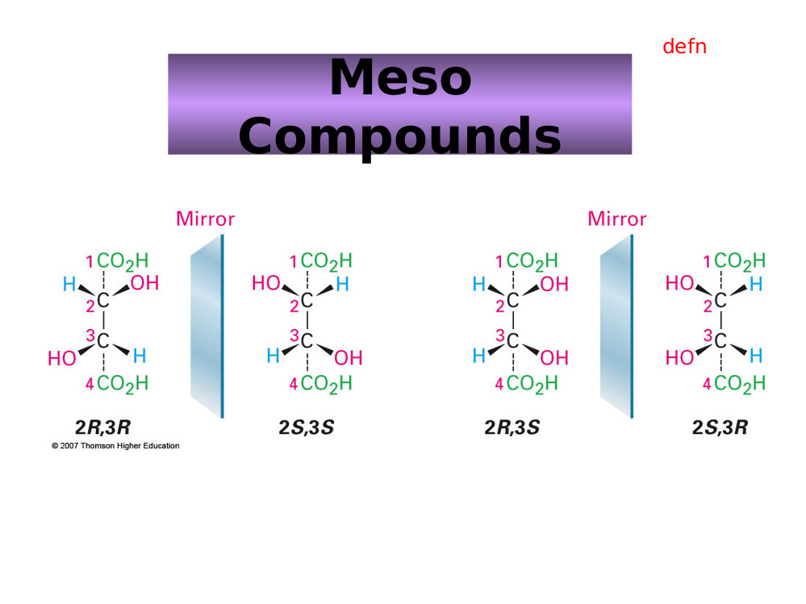

# Imports

import ../../Modules/Biology/Viruses as Viruses

import ../../Modules/Biology/BiologicalMolecules as BiologicalMolecules

import ../../Modules/Biology/Solutions as Solutions

import ../../Modules/Biology/ScientificReasoning as ScientificReasoning

import ../../Modules/Biology/AcidsandBases as AcidsandBases

import ../../Modules/Biology/Steriochemistry as Steriochemistry

import ../../Modules/Biology/Electrophoresis as Electrophoresis

import ../../Modules/Biology/Immunology as Immunology

import ../../Modules/Biology/Microorganisms as Microorganisms

# Scientific practice

## Background

># Solutions
>
>### electrolytic solutions
>Ionic dissociation occurs when the addition of a solvent or energy in the form
>of heat causes molecules if crystals of a substance to break down into ions.
>
>### Osmotic effects.
>spontaneous net movement of solvent molecules through a semipermeable membrane
>
>### tonicity
>
>#### hypotonic
>lower ions concentration, high solvent concentration lower osmotic pressure
>
>#### hypertonic
>higher ion concentration, higher solute concentration, lower solvent
>concentration, higher osmotic pressure
>
>#### isotonic
>equal osmotic pressure. and solute/solvent concentrations.
>
>### Ideal Solutions
>an ideal solution is a solution which has a enthalpy of solution equal to zero
>NOTE: bonds forming releases heat energy.
>FR: the concentration of water in a typical cell is 55molar.
>
>### concentration measurements
>
>#### molar/molarity/molar concentration
>concentration of solute in a solution in terms of moles of solute per volume of
>solution
>
>#### molality
>concentration of solute in a solution in terms of moles of solute per mass of
>solvent.
>
>#### Other measures.
>%w/w weight of solute per weight of (solvent?)
>
>%w/v weight per volume.
>
>%v/v volume per volume.
>
>#### osmolarity
>concentration of solute as total number of solute particles per litre (?)
>
>#### osmolality
>Concentration of solute as total number of solute particles per kilogram.
>
>#### osmol
>number of solute particles which contribute towards the osmolarity of the
>substance.
>

># Biological Molecules
>
>### Basic list
>* Carbohydrates (2%)
>* Lipids (2.5%)
>* Proteins (15%)
>* Nucleic Acids (RNA 20% E. Coli < 10% mammalian DNA is functional )
>* Inorganic ions (3% Salts, 1% small metabolites)
>* water (70%)
>
>### Water
>
>#### general properties
>covalent bonds.
>dipole moment.
>
>##### hydrogen bonds.
>many hydrogen bonds are formed which together gain considerable strength.
>
>Hydrogen bonds are typically up to $ angstroms in length, which a strength of 2-10kcal/mol.
>
>NOTE: the advantage of hydrogen bonds is that they do not take too much energy to break down so the body can readily re-purpose/recycle organic compounds.
>
>##### polarity
>high polarity means water has a large ability to stabilise other charges
>
>##### 
>auto ionisation.
>water can auto ionise into hydroxide ions and hydronium ions, the concetrations of which in solution can be measured by pOH and pH respectively.  
>
>##### Solvation of ionic and polar solutes
>
>$\text{Coulomb’s law : } F = k\frac{ q_{1}q_{2}}{ Dr^{2}}$
>
>Where D is a measure of solvent polarity.The higher the polarity, the greater the ability to stabilise charges. water forms solvations shells around each ion.
>
>##### Solvation of apolar groups and molecules (the hydrophobic effect)
>free amphipathic molecules will associate in water to form hydrophobic internal environments. molecules (amphipathic molecules contain both polar and a polar groups )
>
>###### Examples
>
>Integral proteins within the cell membrane are amphipathic, and allow for non polar channels through the membrane.
>
>fatty acids form micelles (globules) and bilayers in water.
>
>
>###### Septicaemia
>Certain bacteria, respond to antibiotics by releasing proteins which punch holes in the cell surface membrane creating freely permeable pore through which cell contense can leak out, and killing the cells.
>
>
>#### water and protein structure
>water proteins can be buried in the interior of protein structures where they may furfill vital functions
>
>##### examples
>proteases only work if the have a water molecule imbedded within their internal structure, without this one molecule the entire enzyme becomes inactive.
>
>other examples are reverse transcriptase and HIV protease and GST (detoxifying enzyme) which all rely on water molecules to function.
>
>

># Scientific Reasoning
>
>## Basic structures of an argument
>
>### Premises
>A Premise is a statment. This statement may be true or false.
>
>In science the orginial premise is known as the hypothesis.
>this hypothesis will be tested, usually impirically.
>
>### Conclusions
>A conclusion should be well supported by all premises. The conclusion leads one to decide if the hypothesis is true fo false.
>
>
>## A good argument
>A good argument can be deductively, or nondecuctive but abductively, or inductively strong.
>
>NOTE: Arguments can be invalid even if all of the premises and the conclusion are true. If they do not actually imply eachother then it is simply a collection of facts and not an argument.  
>
>### Deductive arguments
>$A \in B \wedge B \in C \rightarrow C \in B$
>
>#### Conditional
>$\exists P \rightarrow \exists Q$
>
>#### Contrapositive
>$\nexists P \rightarrow \nexists Q$
>
>#### Converse
>$\exists Q \rightarrow \, \exists P$
>
>#### deductive validity
>1. Are the premices true (this is difficult if not impossible to establish in mathematics. )
>2. Do the premices guarentee the truth on the conclusion.
>3. does the argument beg the question (Not really one of the criteria)
>
>### Non deductive arguments
>most of science is actually non deductive reasoning. science will often venture conclusions beyond the scope of observation (induction).
>
>#### Inductive Reasoning
>In Inductive reasoning premises are veiw as strong support of the truth of the conclusion. however they do not garuntee the truth of the conclusion. Induction allows for conclusions to be made about issues outside the scope of ovservation.
>
>##### Inductive strength
>two factor influence the inductive strength of an argument, sample size and bias.
>
>### Deductive arguments
>### Abduction
>abductive arguments seek to explain what is observed, otherwise known as inference to best explination.
>
>#### Abductive arguments
>abductive hypothesies should be able to predict easily testable results, such that if the predicted result is achieved during experimentation then the validity of the hypothesis is supported, and if it is not the hypothesis can be rejected.
>
>(Abductive arguments usually rely on a number of assumptions which can be supported by the predictive power of the argument)
>
>NOTE: if testing two alternative theories H1 and H0 then a good test experiment will be set up such that the the observation of event P supports H0 and negates H1 and visa versa.
>
>#### Evaluating Abductive Inferences.
>
>##### Surprise principles
>If an observation supports a hypothesis, then it must strongly favour that hypothesis over others with which it competes
>
>In order to satisfy this principle:
>1. the hypothesis should make no fasle predictions
>2. Within the set of true predictions which the hypothesis makes, there should be predictions which are expected NOT to come true if the hypothesis is false (Is this not mixed up somewhere?)
>
>##### Abductive fallacy
>A widely used and accepted expination is not necessary at all plausible, (even if no competing explination exists)
>
>
>### Making observations
>
>obervations can be made by human senses as well as by sophisticated scientific equipment.
>
>
>#### examples
>
>##### Medelian genetics.
>mendal made conclusions very far beyond his premises, abducting from color change to the existance and role of gentic elements.
>
>## A bad argument
>
>### Circular arguments.
>$A \in B \rightarrow A \in B$
>
>
>## Definitions
>
>### Premise
>A Premise is a statment. This statement may be true or false.
>
>### Conclusion
>### Bias
>factors which may skew the results of a test in some form.
>
>

># Acids and Bases
>
>### Bronsted and lowery
>acids are proton donors
>bases are proton acceptors.
>difference between acid/base and its conjugate is a proton.
>
>### lewis
>acids are electron pair acceptors
>bases are electron pair donors.
>
>#### lewis bases
>* alchohol
>* organophosphates.
>
>### buffering
>relies on weak acids or bases which do nto fully dissociate.
>
>

## Lab Techniques

># Electrophoresis
>
>## Background.
>Electro refers to the flow of electrons/current.
>Phoresis refers to moviment (of sample elements)
>
>### Definitions
>Electrophoresis is a separation method where by charged molecules in solution, most commonly proteins of nucliec acids, migrate in respose to an electric field.
>
>
>NOTE: As Electrophoresis is the moviment (of sample consitituents) under electric current,electrophoresis can only be used as a separation technique for molelecules which will move within an electric field ie charged molecules.
>
>#### Cathode
>The cathode is the negatively charged electrode. Cations (positively charged ions) will be attracted to and move towards the cathode during elecrophoresis.
>
>#### Anode.
>The anode is the positively charged electrode. Anions (negatively charged ions) will move towards the anode during electrophoresis.
>
>### History
>Arne tiselius.
>nobel chemistry prize for electrophoresis and adsorbtion analysis, especially complex nature of ther serum proteins.
>
>#### Cell
>bend glass tube with electrolyte reservior containing cathode and anode, and a buffer containing sample molecules to be separated.
>Horse serum tested gave four different bands. Albumin and 3 globulins ($\alpha, \beta \text{ and } \gamma$).
>
>
>## Rate of migration
>
>### Affecting fators
>
>#### Field Strength.
>Higher field strength will lead to faster moviment but it may also in turn heat up the gel destroying its structure.
>
>
>#### Net charge (sample molecules)
>#### Size
>Smaller molecules will move faster as they have an easier path through the gel.
>
>#### Shape
>More spherical molecules will move faster and then linear molecules of the same molecular wieght, as they will be able to move through pores regardless fo their orientation. linear molecules will have to line up correctly (with their long side more of less purpendicular to the pore), to be able to pass through the pore.
>
>supercoiled nucleic acids will migrate faster.
>
>#### media/solution porperties.
>
>##### Ionic strength
>Higher ionic strength will lead to more shielding and hence slower moviment (?)
>
>##### Viscosity
>Higher viscosity will result in slowr moviment through the gel.
>
>##### Temperature.
>Higher temperature (provided the structure of sample consitiuets is not disrupted) will lead to faster moviment through the gel.
>
>#### Voltage
>#### Intercalculating dyes.
>### Equation
>
>$\mu=\frac{qE}{r}$
>
>where:
>
>  $\mu$=Mobility
>  q= net charge
>  E= field strength ($V.cm^{-1}$)
>  r= molecular radius
>
>NOTE: r is also commonly reffered to as frictional coefficient f, and is dependant on size.
>
>#### Relating resistance, voltage, current, and power.
>
>##### Ohms law
>$V=IR$
>
>Increased voltage with constant resistance increases current.
>Increased current leads to increased heat which must be dissapated or it will be absorbed by the system. Too much heat can cause the sample to migrate irregularly within the sample lane, leading to sample bands which form a "smile", in the extreme case the gel can literally fall apart.
>
>
>##### Power
>$P=IV$ ($P=I^2R$)
>
>## Set up
>Slab gel electrophoresis can be performed ither horizontally or vertically. If run vertically samples are introduced into the wells at the top of the gel.
>
>
>NOTE: In electrophoresis one parameter,  resistance, voltage, current, or power is always held constant.
>
>##### Constant current
>Velocity of molecules is constant, but heat is generated.
>
>NOTE: velocty is dirrectly proportional to current.
>
>##### Constant voltage
>velocity will slow (over the course of the reaction), but heat is generated.
>
>##### Constant Power.
>Velocity slows, but heat generated is kept constant.
>
>
>## Set up
>Slab gel electrophoresis can be performed ither horizontally or vertically. If run vertically samples are introduced into the wells at the top of the gel.
>
>### Electrode
>The negative electrode is black. the positive electrode is red.
>
>### Wells
>The well are created by inserting a comb into the set up before the gel is set. Once the gel is set the comb can be removed, leaving evenly sized, evenly spaced wells where the teeth of the comb used to be.
>
>#### Regular comb
>The wells are separated by an "ear" of gel
>
>#### Houndstooth comb
>The wells are immediataely adjacent.
>
>### Gel
>
>#### Function
>The solid support matrix inhibits convection and diffusion which would otherwise impede separation of molecules, and allows for a permanent record of the results. It can provide additional separation (by size) through molecular sieving.
>
>NOTE: A perminant record is made through staining after running, and trichloroacetic acid which acts as a fixing agent for proteins.
>
>#### Structure
>Both agarose and polyacrilamide gels are porous in structre. A porous gel acs as a sieve by retarding or, in some cases, by completely obstructing the movment of macromolecules while allowing smaller molecules to migrate freely. A gel with a restrictive pore size can differentiate sample molecules based on size. Both gel types are also relatively electrically neutral.
>
>### Polyacrylamide.
>Polyacrylamide is a cross-linked polymer of arcylamide. It can be used to separate molecules from 0.2-500kD, eg most proteins and oligonucleotides.
>
>NOTE: Acrylamide is a potent neurotoxin.
>
>### Concentration
>Polyacilamide gels\% are made at 3.5-20\% by mass.
>
>### Agarose.
>
>#### Structure
>Agarose is a polysaccharide, harvested from rhodophyceae algal cell walls. Alternating sugar units form linear chains. These two subunits are $1,3-\beta-d-\text{galactose}$ and $1,4-\alpha-3,6-\text{anhydrogalactose}$. These chains are cross-linked via hydrogen bonding to form the porous matrix. Cooling a liquid form of the gel forms a matrix with an 'average' pore size.
>
>To make the gel, a solid sample of agarose, in a random structure is heated from menting from $45-100^\circ C$, the inital gel structure begins to form as unifrom cooling takes place, and by the time the gel has cooled back to room structure it has taken on its final porous conformation. Agarose gel will dissolve again if immerced in boiling water only solidifying when the temperature is lowered to about $40^\circ C$
>
>The pore size of the gel can be predetermined but by adjusting the cencentration of agarose in the gel.
>
>Agarose gels are fragile as they are hydrocolliods and they are held together by the formation of weak hydrogen bonds and hydrophobic interactions.
>
>NOTE: heat can break these H bonds breaking the matrix apart.
>
>
>#### Function
>Used for separating large molecules 8-800,000kD. Agarose is effective at separating these larger molecules, such as nucleic acids and protein complexes because of its larger pore size.
>
>
>#### Concentration
>Agarose gels are made to be 0.5-5\% agarose by mass.
>
>### Buffer
>In most electrophoresis units the gel is mounted between two buffer chambers containing separate electrodes so that the onyl electrical connnection between the two chambers is through the gel.
>
>#### Function
>The function of buffer is to carry current and protect samples.
>
>#### Types
> #. Tris Borate EDTA (TBE).
> #. Acetate EDTA (TAE).
> #. Tris Phosphate EDTA (TPE) used most often for DNA.
> #. 10mM sodium phosphate buffer: used for RNA.
>
>Buffer additives can also modify sample molecules such as (denaturing agents)
>
>### Dye
>Tracking dye is loaded to keep track of the moviment of sample consituents on the gel, the tracking dye is visible during the electrophoresis process and moves just ahead of the samples.
>
>### Loading adgent/dye
>The loading adjent or density agent is used to to weigh down the sample so that it remains in the wells, and does not move through the buffer above the gel.
>
>## Detection
>Bands are ditected on the gel by staining during or after electrophoresis using a number of different stains.
>
>### Stains
>
>#### Ethidium Bromide
>Ethidium Bromide is used to mark double stranded DNA. It is flourescent under UV light.  
>
>#### SyBr green or Sybr gold.
>Used to stain single or double stranded DNA, or for RNA.
>
>#### Silver stain
>Siler stain is a more sensitive tha the SyBr gells but is also used for single or double stranded DNA or for RNA, or even for proteins.
>
>#### Coomassie blue
>Commassie blue is used for proteins.
>
>## Interpretation
>Molecular weight markers, using fragments of known size are run along side sample for comparison. A semiquantitive measure can also be obtained by comparison of band intensity.
>
>
>## Proteins
>The net charge on proteins is derrived from amino and carboxylic groups on it sode chains and terminals.
>
>### Charge
>
>#### PH
>Charge is dependant on pH as R groups of the protein will posses different charges based on the pH of the solution. The exact responce of a given protein to PH change will depend on the particular amino acids which make up that specific protein.
>
>NOTE: Proteins are amphoteric as they possess both basic and acidic amino acids.
>
>## Nucleic acids
> Nucleic acids are loaded at the the cathode and move towards the anode,  
>### Charge
>Nucleic acids are always negatively charged due do their phosphate backbone.
>
>## RNA
>
>### Process
>
>#### Buffer
>RNA is heated in dilute formamide or glyoxal(which form part of the buffer solution) to prevent formation of secondary structures. Therefore RNA electrophoresis is said to use denaturing gels.
>
>#### Quality
>RNA qualtiy can be determined by the relative intensity of the 18s rRNA and 28s rRNA bands. In a pure sample the ration is expected to be, 28:18 $\equiv$ 2:1.
>
>NOTE: 28s rRNA comes from the cells main ribosomes. 18s rRNA comes from mitochondirial, or choroplastic(?) ribosomes.
>
>
>
>## Temperature
>
>### Polymerization
>
>#### Exothermic reaction
>#### Gel irregularities
>Pore sizes may differ.
>
>### Electrophoresis
>
>#### Denaturation of proteins
>Denatured proteins can also lead to the smile effect.
>
>#### Change in buffer.
>Some buffers will change their pH based on the temperature, which leads changes in protein charge and moviment.
>
>## Pulse field gel electrophoresis (PGFE)
>
>### Process
>PGFE used two or more alternating electric fields. Larger molecules will take longer to reorrientate than smaller molecules hence separation is on the basis if size.
>
>### Function
>PGFE is used to separate large DNA fragemtns up to 12Mb.
>
>## Function
>
>### Nucleic acid Separation
>### Analysis of protein purity
>### Separation of DNA and RNA.
>### Determination of the isolelectric point. (Proteins)
>### Estimation of native size (Proteins)
>
>
>
>NOTE: $\text{Dalton}=g.mol^{-1}$
>

># Steriochemistry
>
>## Rotamers
>
>Isomers which can be interconverted by rotation (of a given part of the molecule)  about a particular bond
>
>Different isomers are known as Isoforms.
>
>NOTE: bonds within molecules can lengthed, shorted,bend and rotate, depending on what stresses are excerted upon them.
>
>### Newman Projections
>A visualisation of a moleculeviewed from the front.
>
>  the front atom is reprisented as a dot
>  the back atom is reprisented as a circle.
>
>### Conformations
>
>#### Staggered
>Surrounding atoms/hydrogens are all equally spaced.
>
>this conformation is more stable for two reasons
>
>##### Steric Hinderance
>in the eclipsed conformation outside atoms are forced to close to eachother, raising the energy level of the conformation
>
>##### Hyperconjugation
>stabilising interactions of the electrons in a $\sigma$-bond (usually C-H or C-C) with an adjacent empty or partially filled p-orbital or a $pi$-orbital to give an extended molecular orbital that increases the stability of the system)
>
>#### Eclipsed
>Outside atoms line up with each other.
>
>#### Dihedral Angle
>
>There is a whole range of conformations depending on the exact angle of rotation.
>1. anti (180 orinetation)
>2. gauche (60 orientation)
>
>
>
>##### Protiens
>protiens also exibit a dihedral structure with peptide bods forming planes whith a given angle between them
>
>
>this angle can be calculated which is very useful as most protein analysing techniques are very low res (for example obsorbance spectra to distinguish protein (max absorbance 280nm) from DNA/RNA (max absorbance 260nm)
>)
>
>###### Solving protein structure
>1. complex maths in necessary (furner(?) transfer analysis)
>2. complex measuring equipment is needed.
>
>## Inantomers.
>
>### Enantiomers
>opposite conformation at all chiral centers.
>
>#### Chiral compounds
>a chiral compound consists of four separate atoms bonded to one central (tetrahedral,carbon) molecule.
>
>NOTE: this central carbon atom will always be $sp^{3}$ hybridized.
>
>##### Optical activity
>certain molecules rotate plane polerised light to the right (dextrorotatory + ) or to the left (levorotatory - )
>
>the exact degree of rotation depends on the length of substance which the light is shon through, the composition of the substance, and the optical properties of the substance.
>
>###### Poleriser
>only allows light of certain phases (that is light with a particular electric and magnetic component) through. the light alowed throguh is now plane polerised.
>
>###### Analyser
>observes/ analyses how light interacts with certain molecules.
>
>
>### Diastereomers
>opposite conformation at some chiral centers.
>
>#### Allo Diastereomers
>
>
>#### Messo Diastereomers
>2S3R mirror image is 2R3S,
>also possilbe to be identical but rotated by 180 degrees.
>
>
>
>### Drawing structures
>
>#### simple system
>1. wedges indicate bonds coming out of the page
>2. straight lines are in the line of the page.
>3. dotted line are receding back out of the page.
>
>#### Fisher Convention.
>2 dimentional reprisentation of a three dimentional molecule.
>
>The stereocentre furthest from the anomeric centre. The rotation brings about two distinct configurations, $\alpha$ and $\beta$ – anomers)
>1. For sugars if the OH group is on the right it is a D sugar.
>2. If it is on the left then it is an L sugar.
>3. vertical lines reprisent atoms thatpoint away from the viewer.
>4. horizontal lines reprisent atoms that point towards the viewer.
>5. the point of intersection between thevertical and horizontal lines reprisents the centeral carbo atom.
>
>
>NOTE: the anomernic carbon is the carbon single bonded to two oxygen molecules.
>
>##### Amino Acids
>NOTE: natural Amino Acids occur in the L form only.
>
>NOTE: appart from glycine all amino acids are chiral.
>
>###### D and L convention
>L amino acids have the $H_3N^{+}$ group on the left side, D antomers have it on the right side.
>
>###### CORN.
>along the line between th COO and N group, if R is left of the central Carbon atom the antomer is L, if R is right the antomer is D.
>
>Alternative
>if the molecule is orinetated with the H group dirrectly behind the centeral carbon. then if CoRN reads clockwise the antomer is a D amino acid, if it reads Anticlockwise it is an L amino acid.
>
>###### R and S (find what R and S stand for)
>
>more generally applicable
>
>each atom around the central carbon is assigned a priority based on its atomic number (lower atomic number $\rightarrow$) lower priority. (if two atoms have equal atomic numbers then the atomic numbers of their side groups are checked and so on outwards until an order can be established)
>
>###### Cahn-Ingold-Prelog Convention
>Uses the R, S system but is still based on glyceraldehyde.
>1. priorities are assigned
>2. the molecule is orientated so that the lowest priority group is dirrectly behinf the central carbon atom.
>3. if the remain molecules arrange clockwise in terms of priority (highest to lowers) the molecule is a R antomer, if they arrange counterclockwise the molecule is a S antomer
>
>NOTE: D sugars have the R conformation and L sugars have the S conformation.
>
>#### Racemates
>rotate light equally in both dirrections with no net effect, usually made up of equal concnetrations of opposite chiral molecules.
>
>#### chirality in nature
>usually only one isomer is present due to enzymatic selection
>
>#### chirality in drug design
>It is vitally important that the right isomer is used.
>
>##### examples
>1. Prozac (S prevents migraine, R does nothing)
>2. thyidol (?), both effective to supress morning sickness but wrong insomer can lead to birth defects.
>
>#### Prochirality
>A molecule is said to be prochiral if it can convert from achiral to chiral in a single chemical step. (such as the addition of a group to a planar $sp^2$ hybridized molecule, or by the substitution into a tetrahedral molecule.
>
>##### Face
>the dirrection/ orientation in which a molecule binds. )
>Face is related to the need to assign prioritory values to differentiate between identical groups in a prochiral molecule. this identification and the idea of face is imprtant because enzymes will favour which one of the identical groups to act upon depending on its orientation with respect to the rest of the molecule (its face)
>
>

># Immunology
>
>## Background
>Microscopic organism have been observable since the 1670s whith the production of the first microscopes. These organsisms can be unicelluat or multicellular, proaryotic or eukaryotic. The most common micro-organims are bacteria, archae, and fungi, with viruses forming a separate brannch of non living micro molecules.
>
>### Robert Koch
>Koch came up with a method for confirming the relationship between a particular micro-organism and a particular disease known as kochs postulate for which he won a nobel prize.
>
>#### Kochs postulate
>Kochs postulate can be spilt into a number of steps/ requirments. If and only if all of there requirments are met then the microorganism in question can be considered to be the causative agent of the disease.
>
>##### Requirments
>(The microbe must be obervable present in every  case of the disease. )  #. The microbe must be obervalbe/ isolated from a sick individual
> #. The microbe after isolation and identification is cultured in the lab and then injected into another healthy individual.
>    #. The healthy individual must become sick (ie injected microbe causes the disease in a healthy individual)
>    #. The same microbe must be present/ isolated from the newly infected individual.
>
>NOTE: Positive identification of the microbe will rely on microscope work.
>
>### Non Pathogenic microbes.
>Not all micro-organisms are pathogenic. In fact humans have many mutualistic or commensal microbes living in and on them. These microbes are collectively reffered to as the microbiome and account for 1-2 kg of an average individuals weight.  
>
>
>### Defintitions.
>
>#### Prokaryotes
>
>Prokaryotes are classified as they are lving organsism which consist of cells, but lack a nucleus. They do have a cell wall, but lack a cytoskeleton, internal membranes, organelles. In general they are also quite small <$5\mu m$ in diameter, and are always unicellular.
>
>#### Eukaryotes.
>Eukaryotes are living organisms comprised of cells which possess a nucleus. Eukaryotes are generally large cells .$10 \mu m$ and can be uni or multicellular. Eukarryotic cells contain a cytoskeleton, internal membranes, organelles and in some cases a cell wall (such as in plants and fungi)
>
>#### Pathogen
>A pathogen is an infectious micro-organsim that causes disease.
>
>##### Examples
>
>###### Potato blight
>Plant fungal infection resonsilbe for irish famine in the 1800s
>
>###### Bacteriophage
>Phages are viruses which infect bacteria, they may provide an alternative treatment to some antibiotics.
>
>###### Rinderpest
>A Cattle Virus which killed 90\% of cows in SA in the 1890s. (the virus is now eradicated)
>
>###### Bacillus thuringiensis (Bt)
>Bacterial which kills a particular insect which ingests it, it has been used in commercial pesticides.
>
>
>#### Host.
>A host is the species/individual which becomes infected, and gets sick from a pathogen. This host will mount an immune response against the pathogen. Any form of living organism can be a host.
>
>NOTE: many pathogens are sepcies specific infection only one particular host for example HIV infects humans where as SIV infects monkeys(?)
>
>#### Immunology
>Immunology is the study of the immune system, that is ther study of the bodies natural protection from foriegn macromolecules (worm, parasite, viral protein etc) or invading organism and respoces to them.
>
>#### Immune system
>A collection of specialsied tissues and cells which can, recognise pathogens, distinguish self from non self molecules/cells, and react to eliminate pathogens.
>
>NOTE: Unicelluar prokaryotes like bacteria have a versy simple enzyme based defence system called CRISPR.
>
>Eukaryotes: invertibrates, plants, and vertibrates all have innate immunity.
>
>Jawed vertibrates have a particularly advanced immune system which includes adaptive immunity.
>
>
>### Domains of life.
>As well as being separated in prokaryotes and eukaryotes life is also separated into three domains, an idea first concieved by Woese.
>
>#### Bacteria
>Prokaryotes
>
>##### Common human pathogens
>Bacteria in general are common human pathogens, although by no means will all bacterial species be pathogenic.
>
>#### Archaea
>Prokaryotes
>
>##### Common human pathogens
>Archaea live in extreme environments and therefore are not pathogen to humans as the human body does not provide a suitable environment for their growth.
>
>#### Eucaryota
>Eukaryotes.
>
>##### Common human pathogens
>Animals, Funig, Flagellates, Trichomonads, Microsporia, and Diplomonads are all common human pathogens.
>
>### Common human Pathogens.
>
>#### Bacteria
>eg escherichia coli.
>
>##### Description
>Single celled organisms without a nucleus.
>
>##### Human diseases
>Strep throat, Staph infeftions, tuberculosis, food posioning, tetanus, pneumonia, syphilis.
>
>#### Viruses
>eg Herpes virus
>
>##### Description
>Thread-like particles that reproduce using host cell machinary.
>
>##### Human diseases
>Common cold, flu, genital herpes, cold sores, measles, AIDS, genital warts, chicken pox, small pox.
>
>#### Fungi
>eg Death cap mushroom
>
>##### Description
>Simple organisms including mushrooms and yeasts, which can grow as single cells or threadling fillaments of coencytic cells.
>
>##### Human diseases
>Ring worm, Athlete's foot, tinea candidiasis, histoplasmosis, mushroom posioning.  
>
>#### Protozoa
>eg Giardia lamblia
>
>##### Description
>
>Single celled organism with a nucleus.
>
>##### Human diseases
>Malaria, "travelers diarrhea", giardiasis, trypanosomiasis ("sleeping sickness")
>
>## Innate Immunity
>The inate immune system has components which naturally exist in the body and which can respond very fast (to patterns of amino acids of saccharides). The system does not have to learn or develop over time, but is not very sepcific and has no memory (ie the respoce will be indetical if the infectino reoccurs. )
>
>### Why innate immunity is necessary
>Pathogen can multiply very fast. Ecoli for examples doubles every 30 minutes leading to $2 \cdot 10^{143}$ bacteria in # days. whereas the adaptive immune system requires at least 3 days, and potentially closer to 14 days to respond.
>
>### Barriers
>Barriers inclue many tissues and organs within the body. The barriers can also take non many different forms such as anatomical,mechanical, chemical, and microbial.
>
>#### Skin
>The skin predominately a physical barrier, but can also be considered a chemical barrier due to its lower PH
>
>#### Mucous membranes
>Mucous membranes are present in the respiritory and reproductive tract and also pose a predominately physical barrier to pathgens trapping them in the mocus layer.
>
>#### Microbiome
>A microbial barrier the mcrobiome acts to full up all of the availbe ecological niches for microprganisms in the human body provind competition for any pathogen seeking to invade.
>
>#### Stomach
>The stomach poses a cheimcal barrier due to its very low pH and high enzyme content.
>
>
>### Pathogen recognition
>Non specific, recognises pathgen patterns.
>
>### Receptors
>Small set/ limited variety.
>
>### Memory
>No memory mechansims, subsequent exposures illicit an identical responce.
>
>### Speed
>Immediate responce, within hours.
>
>### Species
>All vertibrates.
>
>### Cells and tissues
>
>#### Barriers
>Anatomic and physiological, such as inflamation.
>
>#### Cells general
>phagocytes, NK cells,
>
>#### Humoral
>Complement antimicrobial peptides.
>
>### Cell types
>
>#### Granulocytes
>
>##### Functions
> #. Phagocytosis
> #. Cytolysis (Cytotoxic)
> #. Cytokine production/release
>
>##### Neutrophils
>##### Basophils
>##### Eosinophils
> #. Allergic reactions
>
>#### Lymphocytes
>
>##### NK cells.
> #. Cytolysis
> #. Cytokine release/production
>
>#### Monocytes
>##### Functions
> #. Phagocytosis
> #. Antigen presentation
> #. Cytokine production/release
>
>##### Monocyes
>##### Macrophages.
>##### Dendritic cells.
>## Adaptive immunity
>Components respond specifically to the invading pathogen. A memory is developed for that pathoen,and the responce to subsiquent infections with of that pathogen are much faster and more vigorous.
>
>### Pathogen recognition
>Very specific recognises particular pieces of particular pathogens.
>
>### Receptors
>Very large variety.
>
>### Memory
>Memory from one exposure leads to increased responce on subsequent exposures.
>
>### Speed
>Several days are required for responce to develop, unless it is a memory responce in which case the responce is very fast.
>
>### Species
>Only jawed vertibrates
>
>### Cells and tissues.
>
>#### Cells General
>B and T cells.
>
>#### Humoral
>Antibodies.
>
>## Physical barriers
>Physical barriers such as the skin provide the first line of defence to any prosepctive antigen.
>
>NOTE: a disease which inavdes physical barriers, the innate and the adaptive immune system will become a chronic infection.
>
>### Cells.
>
>#### T lymphocytes
>
>##### CD4 T Cells
> #. Cytokine production
>
>##### CD8 T Cells

># Microorganisms
>Microorganism is a general term used to describe all organisms too small to be seen with the naked eye. There are six main types of microorganisms namely: fungi, bacteria, viruses, protozoa, archaea and algae.
>
> ># Viruses
>>
> >## Background
>>All viruses are acellular obligate parasites. Some viruses can survive for a long period outside host cells, but no viruses can replicate independently of a host cell. This is because the translation system of the cell is required for viral replication. 
>>
>>> NOTE: Viruses should always be referred to as replicating and not reproducing, to differentiate replications as a externally dependant process. 
>>
> > ># Virion Constituents
>>>
> > >## Matrix
>>>The matrix is an additional protein structure between the envelope and the capsid. 
>>>
>>>>NOTE: not all viruses contain a matrix
>>>
> > >## Capsid
>>>Capsids are made of of multiple protein/ capsomer subunits 
>>>
>>>>SYNONYM: The viral capsid is also referred to as a protein coat. 
>>>
> > >### Icosahedral Capsid
>>>The polypeptides making up the coat pack very specifically into the triangular faces of the icosahedron. 
>>>
> > >#### Subunits
>>>Each basic triangular subunit may consist of up to 3 different polypeptides, one at each vertex. 
>>>
> > >### Evolution
>>>The Icosahedral protein capsid has evolved on many independent occasion in evolutionary history. The evolutionary advantage is that the icosahedron is a lowest energy structure, so is very stable.
>>>
> > >#### Icosahedron Structure
>>>An Icosahedron is a 3D structure with 30 identical equilateral triangular faces. Five faces form the top cap, five form the bottom cap and 5 form the middle ring.  The 20 faces are connected by 12 vertices. 
>>>
> > >##### Symmetry
>>>An icosahedron has five fol symmetry when viewed axially, and 3 fold symmetry when viewed equatorially.
>>>
> > >### Subunits
>>>Subunits can be made up of several smaller identical or non identical polypeptides. 
>>>
> > >## Envelope
>>>The envelope consists of host derived bilipid membrane containing host and viral proteins/glycoproteins. Some viruses contain protein spikes which protrude from the membrane. 
>>>
> > >### Function
>>>The envelope helps the virus evade the immune system as it appears similar to host cells. 
>>>
> > >### Function
>>>The viral capsid functions to protect the viral genome, from physical and chemical damage or enzymatic degradation
>>>
> > >## Nucleic Acid (Genome)
>>>The nucleic acid genome may be DNA or RNA, single stranded or double stranded and linear or circular.
>>>
> > >### Multipartate Viruses
>>>Viruses with more than one nucleic acid molecule are called segmented/multipartate. These molecules are non redundant each containing different and vital parts of the viral genome. 
>>>
>>>> NOTE: Most viruses contain only one nucleic acid molecule. 
>>>
>>>> NOTE: multipartate viruses can swap nucleic acid molecules leading to recombination. 
>>>
>>>
>>>
>>>
>>>
>>
> > ># Virion Structure
>>>
> > >## Size
>>>Viruses have a very large size range, from about $50nm-1\mu m$ in length/diameter. For example rabies virus is $70-170nm$, whereas Ebola is about 970nm.
>>>
>>>>NOTE: This size range implies that viruses are 10-100 times smaller than bacterial cells, and $10^3-10^4$ times smaller than eukaryotic cells. 
>>>
> > >### Icosahedral Viruses
>>>As the structure of an icosahedral virus is very set, size can only be increased by increasing the size of triangular constituents, (while maintaining their equilateral shape), or by the formation of larger (equilateral) triangular subunits from four smaller one. Increasing size of the basic triangular subunits implies increasing the size of the polypeptide(s) which they consist of. 
>>>
>>>
> > >## Shape
>>>Overall virion shape is quite diverse, but the majority of virion have an icosahedral shape. 
>>>
> > >### Enveloped viruses
>>>Virions which posses an outer envelope are polymorphic due to the fluid nature of the bilipid layer. 
>>>
> > >### Icosahedral
>>>Icosahedral viruses contain an icosahedral capsid, that is a capsid consisting of 20 equilateral triangular faces, fitted together to form an icosahedron. 
>>>
> > >### Helical
>>>Helical viruses contain a helical/rod shaped capsid, This capsid may be long and thin or short and thick. Furthermore they may be flexible folding into loops and coils. 
>>>
>>>>NOTE: Most helical viruses are ssRNA Viruses.
>>>
> > >## Internal Organisation
>>>All virions contain a capsid. Some virions, additionally contain an envelope which surrounds the capsid. Within the protein coat, and often associated with it s the nucleic acid molecule(s) of the virus. 
>>>
> > >### Nucleic acid
>>>The nucleic acid forms has a helical secondary structure with a ball like tertiary structure. An electrostatic interactions between the nucleic acid backbone and the capsid/matrix protein hold maintains this tertiary structure and holds the nucleic acid molecule in place. 
>>
>>
> > ># Viral Evolution
>>>Viruses have evolved on many time independently. Viruses evolve co-evolve with their hosts, when a host species becomes extinct so will its viruses. For example HIV evolved to recognise a receptor on human cells, by the adaption the cell receptor, Tetherin. Viruses may also evolve in their host for a long time before becoming infective, again human infection by HIV is an example. 
>>>
>>>Viruses can evolve very fast due to their very short life cycle and high replication number. 
>>>
> > >## Receptor Binding Proteins
>>>Viral membrane/capsid proteins mutate particularly fast, partly because of selective pressure supplied by the host immune system, and partly because of the evolutionary advantage conferred by more efficient entry into host cells. 
>>>
>>
> >## Important Viruses
>>
> > ># Ebola Virus
>>>
> > >## Origin
>>>Ebola Virus originated in bats, although it took a long time to trace its source. 
>>>
> > >## Constituents
>>>
> > >### Envelope
>>>Ebola is an enveloped virus
>>
> > ># Influenza
>>>
> > >## Constituents
>>>
> > >### Nucleic Acid
>>>Influenza is a multipartate RNA virus, with 7-8 non redundant RNA molecules. 
>>>
>>>>NOTE: All 7-8 RNA molecules are still packaged together within the viral capsid. 
>>>
> > >## Structure
>>>Influenza is an enveloped virus.
>>>
> > >## Host
>>>Influenza is limited to respiratory tissue but can replicate in pigs, ducks horses and birds.
>>>
>>>>NOTE: Influenza has killed more people in the history of humanity than HIV has. 
>>
> > ># Herpes Virus
>>>
> > >## Size
>>>Herpes is a very large virus
>>>
> > >## Constituents
>>>
> > >### Matrix
>>>Herpes contains a protein matrix
>>>
> > >### Envelope
>>>Herpes is an envelopes virus. 
>>
> > ># Rabies Virus
>>>
> > >## Hosts
>>>Rabies virus can replicate in multiple host species, including humans and dogs. 
>>>
>>>
>>
> > ># HIV Virus
>>>
> > >## Constituents
>>>
> > >### Matrix
>>>The HIV virus contains a protein matrix. 
>>>
> > >## Host
>>>HIV can replicate in many different host species. 
>>>
> > >## Origin
>>>HIV derived from Zoonosis from primates, which share 98\% of their genome with humans. For example HIV evolved to recognise a receptor on human cells, by the adaption the cell receptor tetherin. 
>>>
>>>HIV first emerged as a major disease in 1950s, ,though it was present in the human genome from far earlier, just in a less virulent form. 
>>>
> > >## Subtypes
>>>There are many different strains of HIV.
>>>
> > >### Subtype C
>>>Subtype C is prevalent in South Africa. 
>>
>>
> >## Classification
>>Bacteria are not classified on the tree of life, but are still classified into family (written in italics, with a capital and ending in viridae). 
>>
> >### Viral species.
>>A group of viruses sharing the same genetic information and ecological niche (i.e. the host). Common names are used for species, subspecies are designated by a number. 
>>Do not reproduction, and have no phylogenetic trees (a tree showing evolutionary relationships based on homology of nucleic acids and amino acids). 
>>
>>Viral species are host specific so are not related to each other. 
>>
>>NOTE: every living host currently on the planet has a associated virus. 
>>
>>For example HIV, is a species, there is HIVI and HIVII which both infect humans but are completely different species, within a species there are different strains/subspecies/subtypes within a species,which have amino acid or genomic variation. 
>>
>>NOTE: viruses cannot be classified by morphology either. Also as they have arisen many times during evolution there is not common ancestor.
>>
>>For example, _Herpesviridae_ is the family, _Herpesvirus_ is the genus, Human herpes virus (is the species), subtypes HHV-1 HHV-2, HHV-3. 
>>_Retroviridae_, _Lentivirus_, human immunodeficiency virs, HIVI (lost of subtypes), HIVII (constrained to particular location in west Africa).
>>
>>HIV is a very fast mutating virus, (variation of about 18\%), different host immune systems will but different evolutionary pressure on the virus to evolve.
>>
>>The amount of similarity required for viruses to be classified as a different species, depends on the virus itself. 
>>
>>NOTE: Classification can also be based on pathogenic character. 
>>
> >### Characteristics used for classification
>>Viruses are devided into different taxonomic groups based on several features
>>
> >### Genomics
>>80\% RNA 20\% DNA. classified by type of nucleic acids RNA/DNA, and doulbe/single stranded. 
>>
> >#### Double stranded DNA
>>Tend to be very large. The largest virus is small pox. 
>>
> >#### Single stranded
>>Very small 
>>
> >#### Single stranded RNA
>>There are two types 
>>
> >#### Megaviruses, gyruses.
>>Discovered about 15 years ago, (should they be viruses or a whole new domain, they contain dsDNA, )
>>
> >#### dsDNA
>>with a RNA intermediate, copied back to DNA. 
>>COntain hepatisis virus. 
>>
> >#### Retroviruses
>>Single stranded RNA, copies itself into dsDNA using reverse transcriptase, which then integrates into the DNA of the cell, (which makes it very hard to recognise. 
>>
> >### Host
> >### Shape
> >### Presence of envelope
> >### Transcription mechanism in the host
>>
>>NOTE: dsDNA replicates the same way as in cells. 
>>
>>There are seven groups, ssDNA, dsDNA, dsRNA, + sense ssRNA, -ve sense RNA ssRNA reverse transcribing virus with DNA intermediates, dsDNA with RNA intermediates. 
>>
>>NOTE: virus is classified based on the nucleic acid within the virion. 
>>
> >### Baltimore Classification Scheme
>>COPY IMAGE. 
>>
>>NOTE: remember RNA viruses have genes, some can translate directly, some require some form of intermediate. 
>>NOTE: viruses tend not have introns. 
>>
> >### Summary
>>viruses are composed of portiens nucelic acids and sometimes a lipid envelope, 
>>there are two basic symetries helical and icosohedral (polyherdal, for larger vieuses)
>>Viral caposids are mode up of portien subunits or capsomere s which fold to form specific structures. Genomes within viruses capos are lieat or circular RNA/DNA which are folded and interact with the capsid proteins through electronstatic or hydrophobic interactinos. 
>>Viable virus particles or viruses are infectious.Viruses have multiple origins and co-evolved with their hosts. 
>>viruses are classified according to the expression (mRNA) of their genes. 
>> 
>>
> >## Life cycle.
>>
> >### Attachment
>>The virus has to attach to the host
>>
> >### Inject DNA
> >### Transcribe
>>Make viral proteins important for replication. These proteins interact with the host cell, dirrecting it to replicate the virus, transcribe it and package it. Each protein can have many functions. 
>>
> >### Replication
> >### Late transcription.
> >### Packaging
> >### Maturation phase
> >### Exit
>>
> >#### Lysis
>>bursts the host cell open
>>
> >#### Exocytosis
>>bud out of the membrane by exocytosis. 
>>
>>Some insert into host DNA. 
>>
>>NOTE prac is on the one step growth curve. 
>>
>>NOTE: there is a difference between generalised and specialised transduction, 
>>
> >## Generalised transduction.
>>normally beneficial to the bacteria recieving the new bacterial DNA. 
>>
> >## Culture of viruses.
>>because viruses need a living host, a living host is required, this can be a tissue or a cell culture. (cells separated from tissue and placed in a growth medium). 
>>
>>dedifferentiated cell lines are immortalised, there is an immortalised cell line, hela (henriety lax) cells, taken from ovary tissue. had several children and eveloped the most virulent form of overian cancer ever seen, lead to a debate over who has control over other people cells.
>>
>>Growing viruses. viruses kept in living cells, which form monolayer. plant cells require removing the cell wall, to form protoplasts, or the cells can be separated with still their cell walls by dissolving the middle lamella. 
>>
>>normally cows or horses are used, and cells separated by physical and enzymatic treatment, the cells are then placed in the culture medium. 
>>
>
> ># Fungi
>
> ># Protozoa
>
> ># Bacteria
>
> ># Algae
>
> ># Archaea
>
>## Background
>
>### Nomenclature.
>The Linnaeus system of classification is used. Any given organism is described by its genus, in combination with a specific epithet, i.e. it's species name. For example *Staphylocuccus Aureus*
>
>## Ecological Niche
>Microorganisms can be producers or decomposers. 
>
>
>## Human impact.
>
>### Food Spoilage
>Microorganisms can lead to food spoilage. When humans eat food contaminated with microorganisms they are t risk of severe sickness of even death, either because the microorganism themselves are toxic or because some product of their metabolism, eg a waste product is. Closely related is the risk of infection from ingesting a pathogenic micro-organism.
>
>### Direct uses
>
> ># Microorganisms Industrial Applications
>>The two major applications of microorganisms are in production of fermented foods and beverages (for example beer/ethanol in any alcohol and yogurt) and industrial chemicals for example insulin.
>>Another example is a pair of jeans. The bleach used derrives from peroxidase in mushrooms, the indigo die is derrived from *Escherichia coli*. Even the (plastic) buttons can also be made by bacteria which can be manipulated to produce poly--toante, by manipulation (?) (or is in maniputed to produce plastic )
>>
>
>## Laboratory Work
>
>
> ># Lab Safety
>>
> >## Lab safety
>>If agar plates are cultivated with sucessive imprints of a persons fingers, normally by the sixth plate there are still enough microorganism transferred that significant growth is observed.
>>
>
>#### Aseptic techniques.
>Aseptic technique are used to avoid contamination of microorganism samples under study in the laboritory. One major source of contamination is the air itself. Millions of bacteria fall on each $m^2$ of the earths surface per day.
>
>##### Agar plates
>An agar plate consists of the agar medium, a gelly like substance extracted from seaweed which is used to form a regular support matrix to which food sources, such as sugars and proteins are added.
>
>## Nomenclature.
>
>The linnaeus system of classification is used. Any given organism is described by its genus, in combination with a specific epithet, i.e. it's species name, For example *Staphylocuccus Aureus*
>
>NOTE: Genus and species names should always be italisized, (or underlined when hand written). Furthermore the first time a microorgansim is reffered to in a text its full name should be given, after which the genus name can be abbreviated to an initial.
>
>## Bacteria
>
>### Cellular consituents.
>Bacteria are prokaryotes, so lack a nucleus and associated nuclear membrane.
>
>#### Cell wall
>All bacteria have a cell wall, and these cell walls contain peptidoglycans.
>
>### Replication
>Bacteria replicate most commonly by binary fission.
>
>#### Binary fission
>Binary fission results in two approximately equally sized daughter cells, which are genetically identical. This form of reproduction is assexual.
>
>### Energy Source.
>Bacteria can oxidise organic or inorganic chemicals, to produce energy. Some are also capable of photosynthesis.
>
>NOTE: The ability to produce energy by oxidation of inorganic chemicals is relatilvely unique to bacteria.
>
>## Archaea
>NOTE: Archae are often covered in less detail not because they are far less widespread or numberous than other microorganisms but becuase they are relatively unstudied. The lack of study is explained by their extreme habitats making them harder to sample/collect and grow in labs, and the related fact that they seldom interact with humans and do not act as human pathogens.
>
>### Cellular Components.
>Archaea are prokaryotes.
>
>### Cell walls
>Not all archae possess cell walls and those that do, do not contain peptidoglycans.
>
>### Habitat
>Archaea live in a diversity of 'extreme' envirments.
>
>#### Methalogens
>Methalogens live in environments which contain lots of methane producing bacteria (methane is a waste product of their metabolism).
>
>#### (Extreme) Halophiles
>Live in very high salt concentrations.
>
>#### (Extreme) Thermophiles.
>Live in very high temperature environments. ($>115^\circ C$  easily)
>
>NOTE: The combined biomass of all bacteria under the surface of the earth is greater than the combined biomass of all plants and animals on the earth.
>
>## Fungi
>
>### Cellular consituents.
>Fungi are eukaryotic.
>
>#### Cell wall
>All Fungi posses cell walls made of chitin.
>
>#### Energy source.
>Fungi metabolised organic molecules for an enery source.
>
>### Higher organisation
>Fungi can be unicellular in the case of yeasts, or multicellular in the case of molds and mushrooms. Multicelluar fungi consist of a mass of filamentous hyphae which together form a tangled mess known as the mycelium.  
>
>### Reproduction
>Fungi can reporduce both sexually and assexually.
>
>### Life cycle
>Fungi can be parasitic or free living.
>
>
>## Protozoa
>Absorb/ ingest organic materila.
>
>### Motility
>May be motile, due to the presence of flagella.
>
>
>### Reproduction
>Protozoa can reproduce both sexually and assexually.
>
>### Life cycle
>Protozoa can be parasitic or free living.
>
>## Algae
>
>### Cellular components.
>Algae are eukaryotes,
>
>#### Cell wall
>Algae posses a cellulose cell wall.
>
>### Energy Source
>Photosynthesis is used to produce (more more accurately store energy) in the form of carbon sugars.
>
>NOTE: photosyntheisis is not necessarily oxygenic, i.e. it does not necessarily involve the formation of oxygen.
>
>### Reproduction
>Algae reproduce sexually and assexually
>
>### Energy source.
>Algae can use the oxygen they generate in photosynthesis for their respiration, and in general to produce oxygenic compounds.
>
>### Morphology
>Strikingly algae can become unusually large for single cellular organisms, eg giant kelp.
>
>## Viruses.
>Viruses are acelluar.
>
>### Genetic material
>Viruses can contain either DNA or RNA as their genetic material.
>
>NOTE: All other microorgansims rely predominately on DNA but also contain an RNA component (eg rRNA) so extracting pure DNA or pure RNA is difficult. In the case of viruses however either exclusively DNA or exclusively RNA will be present.
>
>### Numerosity and distribution
>Viruses may in fact be the most numerous microorganisms. The evidence for this claim lies in the fact that for all studied bacteria at least one bacteriophage specific to that bacterial species has been discovered, and in fact it is currently thought that there are at least two bacteriophages per bacterial species one with a lytic and one with a lysogenic life cycle. Furthermore for each infected bacteria there will be on the order of $10^8$ phage, hence as bacteria were suspected to be the most numerous, viruses (in terms of the phage component alone) can be considered to be the most numerous.
>
>## Multicelluar animal parasites.
>These species are considered to be microorganims in the sense that they have a stage fo their life cycle which is microscopic, this is far from the general classification system however.
>
>
>### Cell constituents.
>Multicellular animal parasites are exclusively eukaryotic.
>
>### Higher organisation
>they are by definintion multicellular.
>
>### Jeans example.
>Theoretically an entire pair of jeans could be made from microorganism derrived products. The indigo dye used is derrived for *E. coli*. The bleach used is derrived from peroxidase in mushrooms, even the buttons could be made from plastics which bacteria can be manipulated to produce. 
>
>
>NOTE: Genus and species names should always be italicized, (or underlined when hand written). Furthermore the first time a microorganism is referred to in a text its full name should be given, after which the genus name can be abbreviated to an initial.
>
>### Lab safety
>If agar plates are cultivated with successive imprints of a persons fingers, normally by the sixth plate there are still enough microorganism transferred that significant growth is observed.
>
>### Lab techniques
>
>#### Aseptic techniques.
>Aseptic technique are used to avoid contamination of microorganism samples under study in the laboratory. One major source of contamination is the air itself. Millions of bacteria fall on each $m^2$ of the earths surface per day.
>
>## Bacterial structure and function
>
>### Learning Outcomes.
>
>
>#### Aseptic techniques.
>Aseptic technique are used to avoid contamination of microorganism samples under study in the laboritory. One major source of contamination is the air itself. Millions of bacteria fall on each $m^2$ of the earths surface per day.
>
>#### Agar plates
>An agar plate consists of the agar medium, a jelly like substance extracted from seaweed which is used to form a regular support matrix to which food sources, such as sugars and proteins are added.
>
>### Electron micrograph
>An electronmicrograph is prepared the following process: 
>
> #. bacteria are spun into a liquid gel medium. 
> #. the cell is solidified and dehydrated with ethanol, and then placed in a block of (liquid?) resin, which is relatively hard but soft enough to be cut by the diamond (or occasionally) glass blade cutter.
> #. nm thick sections are sliced off the block and float off onto water from which they are retrieved with the use of a special grid, and fixed onto a slide. 
>
>
> 
> NOTE: literally hundereds of slides would be required to build up a 3D image, which even then would be distorted by the process of dehydration. 
>
>## Ecological niche
>Microorganism are both producers and decomposers, (they produce organic sugars both by photosynthesis and by chemolithotrophic. 
>Microorganisms can be mutualists, some are pathogens. The are also vital in maintaining the geochemistry planet cycle.
>
>## Anthropic Appilications.
>The two major applications of microorganisms are in production of fermented foods and beverages (for example beer/ethanol in any alcohol and yogurt) and industrial chemicals for example insulin. 
>
>### Jeans example.
>Theoretically an entire pair of jeans could be made from microorganism derived products. The indigo dye used is derived for *E. coli*. The bleach used is derived from peroxidase in mushrooms, even the buttons could be made from plastics which bacteria can be manipulated to produce. 
>
>NOTE: The production of plastics is related to the natural pathway for the production of bicarbonates (?). 
>
>### Anthropic impact.
>Microorganisms can lead to food spoilage. When humans eat food contaminated with microorganisms they are at risk of severe sickness of even death, either because the microorganism themselves are toxic or because some product of their metabolism, eg a waste product is. Closely related is the risk of infection from ingesting a pathogenic micro-organism. 
>
>## Overview of microorganim types.
>
>### Bacteria
>
>#### Cellular consituents.
>Bacteria are prokaryotes, so lack a nucleus and associated nuclear membrane.
>
>##### Cell wall
>All bacteria have a cell wall, and these cell walls contain polypeptides.
>
>#### Replication
>Bacteria replicate most commonly by binary fission.
>
>##### Binary fission
>Binary fission results in two approximately equally sized daughter cells, which are genetically identical. This form of reproduction is asexual.
>
>#### Energy Source.
>Bacteria can oxidize organic or inorganic chemicals, to produce energy. Some are also capable of photosynthesis.
>
>NOTE: The ability to produce energy by oxidation of inorganic chemicals is relatively unique to bacteria.
>
>NOTE: The combined biomass of all bacteria under the surface of the earth is greater than the combined biomass of all plants and animals on the earth.
>
>### Archaea
>NOTE: Archae are often covered in less detail not because they are far less widespread or numerous than other microorganisms but because they are relatively unstudied. The lack of study is explained by their extreme habitats making them harder to sample/collect and grow in labs, and the related fact that they seldom interact with humans and do not act as human pathogens.
>
>#### Cellular Components.
>Archaea are prokaryotes.
>
>#### Cell walls
>Not all archae possess cell walls and those that do, do not contain polypeptides.
>
>#### Habitat
>Archaea live in a diversity of 'extreme' environments.
>
>##### Methalogens
>Methalogens live in environments which contain lots of methane producing bacteria (methane is a waste product of their metabolism).
>
>##### (Extreme) Halophiles
>Live in very high salt concentrations.
>
>##### (Extreme) Thermophiles.
>Live in very high temperature environments. ($>115^\circ C$  easily)
>
>### Fungi
>
>#### Cellular consituents.
>Fungi are eukaryotic.
>
>##### Cell wall
>All Fungi posses cell walls made of chitin.
>
>##### Energy source.
>Fungi metabolized organic molecules for an energy source.
>
>#### Higher organisation
>Fungi can be unicellular in the case of yeasts, or unicellular in the case of molds and mushrooms. Multicellular fungi consist of a mass of filamentous hyphae which together form a tangled mess known as the mycelium.
>
>#### Reproduction
>Fungi can reproduce both sexually and asexually.
>
>#### Life cycle
>Fungi can be parasitic or free living.
>
>
>### Protozoa
>Absorb/ ingest organic material.
>
>#### Motility
>May be motile, due to the presence of flagella.
>
>
>#### Reproduction
>Protozoa can reproduce both sexually and asexually.
>
>#### Life cycle
>Protozoa can be parasitic or free living.
>
>### Algae
>
>#### Cellular components.
>Algae are eukaryotes,
>
>##### Cell wall
>Algae posses a cellulose cell wall.
>
>#### Energy Source
>Photosynthesis is used to produce (more more accurately store energy) in the form of carbon sugars.
>
>NOTE: photosynthesis is not necessarily oxygenic, i.e. it does not necessarily involve the formation of oxygen.
>
>#### Reproduction
>Algae reproduce sexually and asexually
>
>#### Energy source.
>Algae can use the oxygen they generate in photosynthesis for their respiration, and in general to produce oxygenic compounds.
>
>#### Morphology
>Strikingly algae can become unusually large for single cellular organisms, eg giant kelp.
>
>### Viruses.
>Viruses are acellular.
>
>#### Genetic material
>Viruses can contain either DNA or RNA as their genetic material.
>
>NOTE: All other microorganisms rely predominately on DNA but also contain an RNA component (eg rRNA) so extracting pure DNA or pure RNA is difficult. In the case of viruses however either exclusively DNA or exclusively RNA will be present.
>
>#### Numerosity and distribution
>Viruses may in fact be the most numerous microorganisms. The evidence for this claim lies in the fact that for all studied bacteria at least one bacteriophage specific to that bacterial species has been discovered, and in fact it is currently thought that there are at least two bacteriophages per bacterial species one with a lytic and one with a lysogenic life cycle. Furthermore for each infected bacteria there will be in the order of $10^8$ phage, hence as bacteria were suspected to be the most numerous, viruses (in terms of the phage component alone) can be considered to be the most numerous.
>
>### Multicelluar animal parasites.
>These species are considered to be microorganism in the sense that they have a stage of their life cycle which is microscopic, this is far from the general classification system however.
>
>#### Cell constituents.
>Multicellular animal parasites are exclusively eukaryotic.
>
>#### Higher organisation
>they are by definition multicellular.
>
>## Bacterial structure and function
>
>### Learning Outcomes.
>
> #. What are bacteria
> #. What is the structure of a bacterium
> #. What are the sizes and morphologies of bacteria.
>
>### Cell constituets.
>Bacteria are prokaryotes so the have no true membrane enclosed nucleus (TMEN) ie no nucleus or nuclear membrane.
>
>#### Genetic material
>The genetic material of bacteria in compacted and contained within a region of the cytoplasm known as the nuceloid, however this region is not set or enclosed, it is merely the region in which the genetic material is found.
>
>#### Mitochondria
>bacteria do not contain mitochondria because they are essentially mitochondria (or more accurately they have a common ancestor with the mitochondria of eukarytic cells and can perform a similar respiratory process with their own cell membrane as mitochondria perform with their outer membrane. )
>
>NOTE: generally speaking prokaryotes are less complex than eukaryotes. 
>
>### Morphology
>The most common bacterial shapes are spherical/coccus and rod shaped/bacillus, however these are far from the only possible shapes. 
>
>NOTE: Most bacteria are monomorphic, i.e. only take on one shape so shape is a good identifying characteristic. 
>
>#### Colonial association
>Individual bacteria can associate in a number of different ways, but a given species will (generally) only have one form of colonial association. 
>Common forms include, Paired (Diploid), Clustered and chained. 
>
>#### Diploid
>A single division would lead to a paired conformation, provided the bacteria do not separate
>
>#### Strepto
>Repeated binary fission in the same axis would lead to the formation of a chain. 
>
>#### Tetra
>Binary fission first along one axis and then along a perpendicular axis would lead to the formation of a square
>
>#### Sarcinae
>Binary fission along three perpedicular axies. would lead to a structure consisting of eight bacteria.
>
>#### Staph
>multiple divisions along multiple axes lead to a disorganized mass of bacteria 
>
>NOTE: there is not clear advantage to these association. They are most probably caused by the presence of sticky (stuff?) on the outside of the bacteria's surface. 
>
>#### Multinucleiod
>some bacteria can take on a miltinucleoid filamentous structure.
>
>#### Angular
>some bacteria snap back into a specific angle relative to each other after binary fission, probably due to incomplete separation of the cell walls of daughter cells.
>
>#### Pallisade
>Bacteria snap back to lie directly adjacent to each other.
>
>#### Coccibacillus
>Very short rods and can be very hard to distinguish from true cocci bacteria. 
>
>#### Bifurication
>Bifurcation can occur to give Y shaped bacteria
>
>#### Vibrion
>bacteria have a distinct curved rod morphology. 
>
>#### Spriillion
>
>bacteria take on a corkscrew shape \newline 
>
>#### Spirochete
>bacteria take on a corkscrew shape ( more flexible than Spirillion)
>
>#### Walt's square bacterium
>dimensions of about $2\mu m \,\text{x}\,2-4\mu m \,\text{x}\, 0.2 \mu m$ taking on the shape of a square or a rectangle. 
>
>NOTE: some bacteria are  polymorphic changing their shape continuously. 
>
>#### Endospores
>There are often endospores within bacteria which can cause swelling changing shape. 
>
>### Plasiticty
>bacteria have the facility to adapt their environment by changing their gene expression patterns.  
>
>### Size.
>The average is about $0.2-1.0\mu \text{x} 2-8\mu m$
>For example E. coli $1.1-1.5\mu \text{x} 2-6\mu m$
>
>#### Smallest.
>$100-300nm$ range, and ultramicrobacteria which are about $50nm$ in size. Very nutrient poor so do not maintain large cytoplasm.
>
>#### Largest.
>Bacteria Epulopiscium fishelsoni
>
>$80\mu m-600\mu m$ (visible with the naked eye), about $10^6$ times larger in volume than most bacteria
>
>##### reproduction
>produces daughter cells inside the mother, which then pop out through a slit. 
>
>##### Addaptions
>The key limitation to size is SA:V, as movement of nutrients and gasses are by diffusion. This problem is overcome in part by massive invaginations of the surface membrane. (Additional problem of transporting proteins to membrane as membrane already covered in proteins.). 
>
>It was thought that a particular bacterium would have one copy of a bacterium, however in Epulopiscium fishelsoni chromosome number increases with size, also as transcription and translation are linked, if the gene is everywhere in the cell, then a protein can be produced anywhere in the cell and the need for sophisticated transport systems in removed. The number of copies of important genes can be in the hundred thousands, for example ribosomal RNA genes. 
>
>##### Thiomargarita namibiensis
>very large volume. 
>
>###### Addaptations
>cytoplasm is filled with vacuoles so minimal depth of cytoplasm from any point. Epulopiscium fishelsoni requires nutrient dense environment so lives in fish and floats around to find nutrient dense areas. 
>
>The other advantage of size is that it hep avoid (protozoan) predation. 
>
>## Structure and function
>
>NOTE: Not all structures are found in all bacteria. Some structures are specific to specific bacteria some are specific to the bacterium's environment, ie parasitic only produce a capsule when they encounter a host immune response. 
>
>(Copy image of bacteria)
>
>NOTE: cytoplasm is actually packed/ very full of constituents. 
>
>### Plasma membrane.
>they are the main contact point between the cell and its surroundings. functions splits internal and external environment in its capacity as a boundary layer, and allows the exchange of matter and information between the internal and external environment. 
>
>NOTE: bacteria are very plastic in their response to the environment improving energy efficiency 
>
>#### Fliud mozaic model
>Phospholipids+ integral and poriferal proteins
>
>#### Membrane associated lipids
>Amphiphatic, (hydrophilic and hydrophobic groups associated with them), most of these lipids are phospholipids, they spontaneously arrange with phosphate head by water to form low energy micelles or bilayers. 
>
>Phospholipids are diverse and complex groups. Phosphatidylethanolamine (75\%)
>phosphatidylglycerol (20\%)
>cardiolipin (diphosphatidylglycerol, 1-5\%)
>
>Important as they confer strength, and spread out overall negative charge of the plasma membrane and cardiolin can play a role are a chaperon, helps lactase permease fold correctly in the membrane.
>
>For a particular species of phospholipid the fluidity is adjusted by saturation/desaturation of tails, to fit the requirements of the external environment. 
>
>Lipids can also flip between leaflets of the membrane, there are proteins flipases (out to in), flopases (in to out) require ATP, and scamblases (exchange) do not require ATP. Related to adaptions to environmental changes such as  temperature (with season). 
>
>NOTE:membrane is packed with proteins, especially in bacteria which require membrane proteins for energy production, this applies especially of bacteria with less efficient respiration processes. 
>
>#### Glycolipids
>heterogeneous
>
>##### Functions
> 
> #. Help to stabilize the plasma membrane (protective function)
> #. Important in cell-cell interactions 
>    #. Adhesion. (contact inhibition, muscles, desosomes etc)
>    #. identification (the flip side is that is can be recognized by the host immune system). 
>    #. assist in signal transduction. 
>    
>#### Transport systems
>A transport system is required to move across the plasma membrane, could be for toxins such as bacteriosin which attach other bacteria in the environment, They can also trap food outside the PM to prevent its loss. Furthermore important metabolic functions such as photosynthesis and respiration involve the plasma membrane. Motility is also associated with plasma membrane associated structures, and the synthesis of many important chemicals. 
>
>NOTE: bacteria can distinguish which host they are infecting and can adapt accordingly. 
>
>#### Integral membran proteins.
>make up about 60-70\% of membrane proteins. These proteins can move around the membrane freely by diffusion.  
>
>###### Ease of removal.
>
>tend to be relatively difficult to remove in aqueous environments (as low solubility). 
>Such proteins are usually embedded deeply, some may span the entire membrane. To span the membrane they must be amphiphathic (otherwise would flip into the membrane). 
>
>
>##### Periferal proteins.
>20-30\% 
>
>###### Ease of removal
>relatively easier to remove, as they are on the outside, and more soluble in aqueous environments. 
>
>(Copy image of the plasma membrane. )
>
>
>
>
>
>
>NOTE: there is no reason for the tails to align between layers. 
>
>##### S layer
>additional very strong outer layer formed on membrane
>
>### Cell wall
>The majority of bacteria posses a cell wall. 
>
>
>### Nucleiod
>### Gas Vacoules.
>### Inclusion bodies
>### Robosomes.
>### Cell enveope.
>contains the outer membrane(where present) the cell wall and the cell membrane
> 
>### External  Structures
>
>#### Capsule
>A capsule is very similar to a slime layer but consists primarily of proteins and exhibits increased organisation and structural integrity. Capsules are also more firmly attached to the bacterium cell wall. A capsule implies a cost as many valuable food substances must be placed outside the cell to constitute it however it also confers several important benefits. A capsule makes the bacterium, more resistant to dessication and phagocytosis, (especially in mammalian hosts), it also  facilitates substrate adherence to substrate, increases antibiotic and bacteriophage resistance and acts as a readily accessible store of carbohydrates. Finally it even relieves osmotic pressure acting of the cell. 
>
>NOTE: The capsule is very thick compared to the bacterium. 
>
>NOTE: Capsules do not take up stain, so they are visualised by using a (positive) primary stain for the bacterium and a (negative) secondary stain for a background. The unstained region remain is then the capsule. Colorless shiny bacterium are likely to be pathogenic. 
>
>#### Slime layer
>A slime layer is a layer of material outside of the cell wall, consisting of extracellular, polymeric substances. (EPS)
>A slime payer consists primarily of polysaccharides , but may also contain proteins. It is not very tightly attached to the bacterium
>
>#### S layer.
>The S layer is always constituted of proteins or glycoproteins, which are set into a regular array. This layer is very hard to pull apart and behaves as a protective layer similar to chainmail. Individual links will compress into each other but only to a point, past this point further compression require very large forces. This protective layer helps to protect against bacterium such as _Del Virbio_ which crash into other bacteria at high speeds and then 'drill' into them to live inside them as paracites.  
>### Internal membrane system.
> 
>## Gram staining.
>The gram cell is able to differentiate between two major structure types based on their ability to maintain the primary stain in the presence of the de-coloriser. 
> Gram staining is bar far the most important staining in bacteriology. staining is also related to differences in the lipids. 
>
>
>### Process
>  #. Crystal violet.  
> # . Grams iodine. (Helps crystal violet to stick to the cell wall. ) 
> #. alcohol (decolorize), gram negative cells are decolorised, gram positive cells are not. 
> #. Safranin (red due 
> )
> 
> Gram positive have red on purple so remain purple, gram negative have red on colorless so become red/pink. 
> 
> 
> (Copy image)
> 
> NOTE: If decolored too intensely any cell will lose its color. 
> 
> NOTE: Acetone in involved in eyes dissolving.
> 
>### Posive
>
>Copy from slides. 
>
>#### Cell wall
>Thick homogeneous cell wall containing 50\% peptidoglycan by dry weight. The peptidoglycan is about $20-80nm$ thick.
>
>##### Periplasmic space
>A area in between the cell wall and cell membrane it is distinct (although so thin that it can often be hard to make out.). 
>
>NOTE: The cell wall is the combination of the PG layer and the periplasmic space. 
>
>NOTE: Try to draw structures with some sense of relative scale, ie the cell wall must be larger. 
>
>\textbf{Copy image of cell wall from slides.}
>
>##### Function
>Maintains the cell integrity against osmotic pressure and maintains the cell shape. cytoskeletal elements are a large part of it, but the peptidoglycan is also significant, and if it is removed the bacteria will usually become spherical
>
>##### Techoic acids.
>(referred to as ? techoic acids), 
>Techoic acids make up a significant proportion of the cell wall. They are covalently attached to the peptidoglycan, which has a mesh-like structure. Techoic acids fill (almost all) of the void spaces in this mesh extending all the way to the outside of the layer. 
>
>Lipotechoic acids are embedded in the membrane at one end and the peptidogycan layer at the other. forming a stabilizing link. 
>
>###### Functions
>help to maintain the structure of the cell wall. And confer an overall negative charge (to gram positive bacteria). 
>
>The acids are also antigenic, (which benefits the host not the bacterium)
>
>### Gram negative.
>
>#### Cell membrane
>5-7nm
>
>#### Peptidoglycan layer
>Much thinner $5-10\%$  of dry weight of cell negative bacteria. only about 1nm
>
>#### Periplasmic space
>between cell and other membrane, much wider than in gram positive bacteria, can be go up to $70nm$, constituting a significant component of the cell. The Periplasmic space contains lots of proteins and enzymes, in particular those associated with nutrient acquisition such as binding proteins which move out of the cell and bind to nutrients making them easier for the cell to recognise. The Periplasmic space also plays an important role in  electron transport and energy production, and contains receptors important in chemotaxis. 
>
>#### Outer membrane.
>5-7nm
>
>phospholipid layer (not bilayer) which consists of an single layer of lipopolusaccharides, within which lipoproteins and proteins are found. More permeable/less selective than the cell membrane (?) The outside of gram negative is very wavy as more fluid than a PG layer. The outer membrane functions to prevent the loss of cellular constituents. 
>
>NOTE: the outer membrane can be isolated as an intact spherical structure
>
>##### Lipopolysaccharide '
>Lipopolysaccharide is a virulence (disease causing) factor, which consists of three distinct segments, an outer chain a core polysaccharide, and lipid (embedded within the membrane). Lipopolysaccharide is particularly effective in minimizinf the effectiveness of an immune response in a mammalian host. 
>
>###### Outer (O) chain
>In _E Coli_ alone there are at least 160 different versions of the O chain. The length of the chain often influences the roughness of a colony. Full length outer chains lead to a smoother more hydrophilic surface. Short outer chains lead to a rough more hydrophobic surface. The O side chain is antigenic, often recognised by the host in a immune response. Some bacteria can mutate their O chain by antigen shift to avoid an effective immune response.
>
>###### Core polysaccharide.
>The core poly saccharide is short normally only 8 polysaccharides long. It shows far less variation than the Outer chain, but forms an important link between the outer chain and the membrane embedded A lipid. There is an accumulation of negative charge by the joint between the Core polysaccharide and lipid A which facilitates the intercalation of magnesium ions which help to stabilize the outer membrane, slotting in between the lipids of lipid A. The role of the $Mg^{2+}$ ions is so important that if a strong chelating agent is used to pull these ions out of the membrane that it looses its integrity and starts to break apart. This core component may contain amino acids. The hydrophobicity of the core polysaccharide prevents certain harmful substances from entering the cell. 
>
>###### Lipid A
>Lipid A consists of Phosphorylated N-acetylglucosamine and  6-7 fatty acids which are typically saturated, and does not extend past the membrane. It is almost invariably hydrophobic. Lipid A is a major component of the outer membrane and helps to stabilizes and protect cells, forming a permeability barrier which is very efficient at stopping lysozyme and bleaches, and bio-salts from entering and damaging the cell.
>
>### Endotoxins.
>Endotoxins are bacterial components which are not produced and excreted by bacteria for the express purpose of toxicity but rather substances which play some chemical or structural role in the bacterium, which happen to be toxic to host cells. Endotoxins can nevertheless be extremely toxic, one example is the Botulin toxin (Botox) used in skin treatments. Lipopolysaccharides are also endotoxins which interact with plattlets in the blood decreasing their number to the point where internal bleeding may occur. 
>
>##### Porins
>make pores through the outer membrane, consist of three separate units. Porins are transmembrane proteins, which form channels for entrance and exit of certain substances, (they are essentially water filled channels) 
>
>NOTE: The presence of Porins indicates the extent of the protective function of the outer layer, in that they show how selective it is in what substance may permeate through it. 
>
>##### Brauns lipoprotein
>extends from the GP layer to the outer membrane. 
>
>###### Function
>Helps to prevent membrane damage by giving it some form of rigidity, and preventing an indeterminate gap between the outer membrane and the rest of the bacteria, pulling the membrane into the same shape as the bacteria.  
>
>##### Lipopolysachharides. (LPS)
>Consist of lipids and carbohydrates. The outer leaflet of the membrane is almost entirely lipopolysacharide, and in genre it is an integral membrane component. 
>
>$Salmonella typhimurium$ in Salmoella can be related to disease. 
>
> #. what are bacteria
> #. what is the strucure of a bacterium
> #. what are the sizes and morpholgies of bacteria.
>
>### Defining characteristics.
>### Cell constituets.
>Bacteria are prokaryotes so the have no tru membrane enclosed nucleus (TMEN) ie no nucleus or nuclear membrane.
>
>#### Genetic material
>## Major nutritional metabolic types.
>
>Autotrophes get there carbon from $CO_2$ in the environment. whereas heterotrophes get their carbon from organic compounds. some organisms especially bacteria can switch between different nutritional sources/mechanisms. 
>
>NOTE: litho imples the electrons from an inorganic compounds. (electrons or energy)
>NOTE: autotrophes require electrons for carbon dioxide reduction. 
>
>### Photolithotrophic autotrophy
>energy comes from light, carbon comes from $CO_2$ in atmosphere, electrons are gained from inorganic substances water in the case of plants. 
>cyanobacteria are an example
>
>### Photoorganotrophiic heterotrophy
>Photosynthesis is used for energy but electrons and carbon are gained from an organic source, this is a very unusual way to grow and mainly bacteria, very few other organisms. purple (other pigments) and green (chlorophyll) non sulfur bacteria.
>
>### Chemolithotrophc autotrophy
>grow without light and organic carbon electron sources, as well as organic carbon carbon sources, so grow in deep mines etc. 
>
>### Chemoorganotrophic heterotrophy.
>energy from chemical respiration, i.e oxidation of organic compounds, electrons from organic compounds, and carbon from organic compounds. 
>
>## Classification of microorganisms.
>
>### Old model (Universal tree of life)
>From monera to protists to plants animals and fungi, and most diversity was thought to reside in the plant, animal and fungi kingdoms. 
>
>### Three domains Woese
>three and a half billion years was the first common ancestor. 
>
>### Bacteria
>Only bacteria for about 2 billion years. 
>
>NOTE: the diversity between cyanobacteria and protobacteria (or indeed any other bacterial clade) is greater than that between plants and animals. 
>
>### Bdellovibrion
>Prey on other bacteria, drills through other bacteria, preditor. 
>
>### _Pelagibacter ubique_
>Dominates in many environments, only discovered by FISH techniques, as could not culture it. Can make up about 20% of all prokaryotes in the oceas, and about 0.5% of all prokaryotes on the planet, and in hot ocean environments can be up to 50\% , even though theses environments can be quit harsh, about $2\cdot 10^{28}$. 
> very small so good SA:V, and so small its not predated on well, $0.4-0.9 \mu m$ by $0.1-0.2\mu m$. very simple, smallest genome known. complexity does not imply more evolutionary success. 
>
>### Helicobacter.
>examples. 
>
>### Archaea
>### Eukarya.
>### Human microbiome.
>
>microbiota
>all the microbes in a community or that reside in an environmetnal niche. 
>
>microbiome: the collective genomes of the microbes in a community or that reside in an environmental niche. (this is useful as many studies do not use cultures but rather molecular techniques. 
>
>NOTE: This implies that humans are in fact just a collection of species. furthermore there are no homosapiens with no bacteria, and infact their cells are outnumbered by bacterial cells 10 to 1. so how does one distinguish between them. 
>
>NOTE: there are several thousand bacteria species in most distinct areas of the human body, the large intestine in particular has over 30000 species. 
>
>#### Natural childbirth.
>Should suzzarians be done, the microbial diversity on a newborn skin for natural vs Cesarean, they are very different. In the viginal tract there are large numbers of lactobacillales , so there are ar more lactobacilli on babies from natural birth. whereas from a Cesarean section is mostly those in the ovaries. The microbiome trains the immune system, if there are not there then diseases such as Exsema can result. 
>moving down the digestional tract you end up with more bacteria. 
>
>### Obesity
>The relationship between obesity and the microbiome. Germ free mice. The germ free mice showed decreased propensity to obesity. in the gut there are firmicutes and Bacteriodetes, so if there are more Firmicutes there is more weight gain, as these bacteria are more effecient at giving them excess nutrient to the human body. Lean mice can be switched into obease and visa versa. 
>
>Study in malawe, using twins, same food one mulnurished, diffs microbiome, can be changed back by ingestion of bacterial tables. 
>
>### Anxiety and fear
>depend on the microbacteria. for example $Lactobacillus rhamnosus$ if fed to mice makes their anxiety go down, they start being less cautious of open spaces and water in particular. Autism and brain development. with high numbers of chlostridia, the brain produces phenols to kill bacteria , which damage the brain, so sulfur is added, but this may lead to a sulfur defficeincy which in turn may lead to brain damage later on. 
>
>
>### Human health
>The microbiome cannot be cut out, should be thought of as a collective property of the human-associated microbiota. 
>
>Open a window, an ecological perspective, restoration ecology, eat more plants, get your hands dirty, no antibiotics. 
>
>#### AntiBiotics.
>switches from antibiotics are not always reversible, and highly unadvised. 
>
>#### Major plays.
>
>
>Virus identification, can use sequencing next gen/deep. 
>
>### Life cycles of viruses.
>All occurs with a cell. when a virus enters a host. 
>
>#### Stage one
> the virus must attach to the cell membrane receptors, combination of general and specific receptors, some viruses will onyl reproduce in specific tissues, some viruses can replicate only in one type of cell
>
> Penetreation by endocytosis or fusion (viruses which have an envelope, the two lipid membranes fuse together). endocytosis, means membrane invaginates around the virus leading to a double membrane around the viruses, 
>
> translocation, must get though the membrane, without bursting the membrane, which is added by the fluid nature of the membrane. 
>
> injection, in the case of bacteriopahges,
>
>COPY IMAGES
>
>#### Uncoating
>by viral or host enzymes (or both); pH, virus may contain its own enzymes to break down nucleic acids, in this case lipases specifically are used. 
>
>#### Assembly and maturation
>#### 
>biosyntheisi: Production of 
>
>
>### Proteins within ther virion are bound to RNA to stabalise them,
>
>some viruses no uncoat completely, partly this is to prevent the cell and its degrading enzymes, especially dsRNA, becuase the celll degrades this in silencing. 
>
>NOTE: Cell machinary refernce to enzymes and cofactors.
>
>the virus fuses to the cell membrane leaving all of its envelope material on the outside. 
>
>### Uncoating of viruses
>Occurs via viral or host enzymes or both. 
>
>capsid proteins bond together by electrostatic forces, 
>
>the capsid protein is always encoded by the virus, only a few genes are for the strucure of the virus the rest are for proteins helping for virus take over of the cell. 
>

# Appendix

