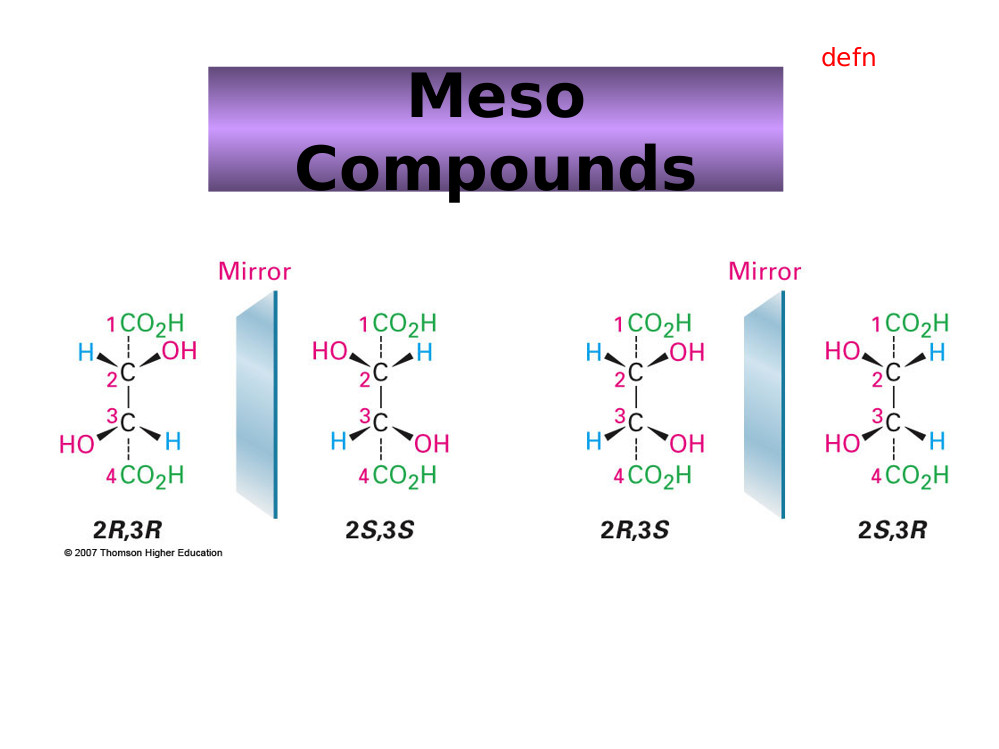

# Scientific practice

## solutions

### electrolytic solutions
Ionic dissociation occurs when the addition of a solvent or energy in the form
of heat causes molecules if crystals of a substance to break down into ions.

### Osmotic effects.
spontaneous net movement of solvent molecules through a semipermeable membrane

### tonicity

#### hypotonic
lower ions concentration, high solvent concentration lower osmotic pressure

#### hypertonic
higher ion concentration, higher solute concentration, lower solvent
concentration, higher osmotic pressure

#### isotonic
equal osmotic pressure. and solute/solvent concentrations.

### Ideal Solutions
an ideal solution is a solution which has a enthalpy of solution equal to zero
NOTE: bonds forming releases heat energy.
FR: the concentration of water in a typical cell is 55molar.

### concentration measurements

#### molar/molarity/molar concentration
concentration of solute in a solution in terms of moles of solute per volume of
solution

#### molality
concentration of solute in a solution in terms of moles of solute per mass of
solvent.

#### Other measures.
%w/w weight of solute per weight of (solvent?)

%w/v weight per volume.

%v/v volume per volume.

#### osmolarity
concentration of solute as total number of solute particles per litre (?)

#### osmolality
Concentration of solute as total number of solute particles per kilogram.

####osmol
number of solute particles which contribute towards the osmolarity of the
substance.

##Life Molecules

### Basic list
* Carbohydrates (2%)
* Lipids (2.5%)
* Proteins (15%)
* Nucleic Acids (RNA 20% E. Coli < 10% mammalian DNA is functional )
* Inorganic ions (3% Salts, 1% small metabolites)
* water (70%)

### Water

#### general properties
covalent bonds.
dipole moment.

##### hydrogen bonds.
many hydrogen bonds are formed which together gain considerable strength.

Hydrogen bonds are typically up to $ angstroms in length, which a strength of 2-10kcal/mol.

NOTE: the advantage of hydrogen bonds is that they do not take too much energy to break down so the body can readily re-purpose/recycle organic compounds.

##### polarity
high polarity means water has a large ability to stabilise other charges

#####
auto ionisation.
water can auto ionise into hydroxide ions and hydronium ions, the concetrations of which in solution can be measured by pOH and pH respectively.  

##### Solvation of ionic and polar solutes

$Coulomb’s\ law: F = k\frac{ q_{1}q_{2}}{ Dr^{2}}$

Where D is a measure of solvent polarity.The higher the polarity, the greater the ability to stabilise charges. water forms solvations shells around each ion.

##### Solvation of apolar groups and molecules (the hydrophobic effect)
free amphipathic molecules will associate in water to form hydrophobic internal environments. molecules (amphipathic molecules contain both polar and a polar groups )

###### Examples

Integral proteins within the cell membrane are amphipathic, and allow for non polar channels through the membrane.

fatty acids form micelles (globules) and bilayers in water.

{width=50%}

###### Septicaemia
Certain bacteria, respond to antibiotics by releasing proteins which punch holes in the cell surface membrane creating freely permeable pore through which cell contense can leak out, and killing the cells.

#### water and protein structure
water proteins can be buried in the interior of protein structures where they may furfill vital functions

##### examples
proteases only work if the have a water molecule imbedded within their internal structure, without this one molecule the entire enzyme becomes inactive.

other examples are reverse transcriptase and HIV protease and GST (detoxifying enzyme) which all rely on water molecules to function.

## Acids and Bases

### Bronsted and lowery
acids are proton donors
bases are proton acceptors.
difference between acid/base and its conjugate is a proton.

### lewis
acids are electron pair acceptors
bases are electron pair donors.

#### lewis bases
* alchohol
* organophosphates.

### buffering
relies on weak acids or bases which do nto fully dissociate.

# Scientific Reasoning

## Basic structures of an argument  

### Premises
A Premise is a statment. This statement may be true or false.

In science the orginial premise is known as the hypothesis.
this hypothesis will be tested, usually impirically.

### Conclusions
A conclusion should be well supported by all premises. The conclusion leads one to decide if the hypothesis is true fo false.

## A good argument
A good argument can be deductively, or nondecuctive but abductively, or inductively strong.

NOTE: Arguments can be invalid even if all of the premises and the conclusion are true. If they do not actually imply eachother then it is simply a collection of facts and not an argument.  

### Deductive arguments
$A \in B \wedge B \in C \rightarrow C \in B$

#### Conditional
$\exists P \rightarrow \exists Q$

#### Contrapositive
$\nexists P \rightarrow \nexists Q$

#### Converse
$\exists Q \rightarrow \, \exists P$

#### deductive validity
1. Are the premices true (this is difficult if not impossible to establish in mathematics. )
2. Do the premices guarentee the truth on the conclusion.
3. does the argument beg the question (Not really one of the criteria)

### Non deductive arguments
most of science is actually non deductive reasoning. science will often venture conclusions beyond the scope of observation (induction).

#### Inductive Reasoning
In Inductive reasoning premises are veiw as strong support of the truth of the conclusion. however they do not garuntee the truth of the conclusion. Induction allows for conclusions to be made about issues outside the scope of ovservation.

##### Inductive strength
two factor influence the inductive strength of an argument, sample size and bias.

### Deductive arguments

### Abduction
abductive arguments seek to explain what is observed, otherwise known as inference to best explination.

#### Abductive arguments
abductive hypothesies should be able to predict easily testable results, such that if the predicted result is achieved during experimentation then the validity of the hypothesis is supported, and if it is not the hypothesis can be rejected.

(Abductive arguments usually rely on a number of assumptions which can be supported by the predictive power of the argument)

NOTE: if testing two alternative theories H1 and H0 then a good test experiment will be set up such that the the observation of event P supports H0 and negates H1 and visa versa.

#### Evaluating Abductive Inferences.

##### Surprise principles
If an observation supports a hypothesis, then it must strongly favour that hypothesis over others with which it competes

In order to satisfy this principle:
1. the hypothesis should make no fasle predictions
2. Within the set of true predictions which the hypothesis makes, there should be predictions which are expected NOT to come true if the hypothesis is false (Is this not mixed up somewhere?)

##### Abductive fallacy
A widely used and accepted expination is not necessary at all plausible, (even if no competing explination exists)

### Making observations

obervations can be made by human senses as well as by sophisticated scientific equipment.

#### examples

##### Medelian genetics.
mendal made conclusions very far beyond his premises, abducting from color change to the existance and role of gentic elements.

## A bad argument

### Circular arguments.
$A \in B \rightarrow A \in B$

# Definitions

### Premise
A Premise is a statment. This statement may be true or false.

### Conclusion

### Bias
factors which may skew the results of a test in some form.

# Steriochemistry

## Rotamers

Isomers which can be interconverted by rotation (of a given part of the molecule)  about a particular bond

Different isomers are known as Isoforms.

NOTE: bonds within molecules can lengthed, shorted,bend and rotate, depending on what stresses are excerted upon them.

### Newman Projections
A visualisation of a moleculeviewed from the front.

  the front atom is reprisented as a dot
  the back atom is reprisented as a circle.

### Conformations

#### Staggered
Surrounding atoms/hydrogens are all equally spaced.

this conformation is more stable for two reasons

##### Steric Hinderance
in the eclipsed conformation outside atoms are forced to close to eachother, raising the energy level of the conformation

##### Hyperconjugation
stabilising interactions of the electrons in a $\sigma$-bond (usually C-H or C-C) with an adjacent empty or partially filled p-orbital or a $pi$-orbital to give an extended molecular orbital that increases the stability of the system)

#### Eclipsed
Outside atoms line up with each other.

#### Dihedral Angle

There is a whole range of conformations depending on the exact angle of rotation.
1. anti (180 orinetation)
2. gauche (60 orientation)

##### Protiens
protiens also exibit a dihedral structure with peptide bods forming planes whith a given angle between them

this angle can be calculated which is very useful as most protein analysing techniques are very low res (for example obsorbance spectra to distinguish protein (max absorbance 280nm) from DNA/RNA (max absorbance 260nm)
)

###### Solving protein structure
1. complex maths in necessary (furner(?) transfer analysis)
2. complex measuring equipment is needed.

## Inantomers.

### Enantiomers
opposite conformation at all chiral centers.

#### Chiral compounds
a chiral compound consists of four separate atoms bonded to one central (tetrahedral,carbon) molecule.

NOTE: this central carbon atom will always be $sp^{3}$ hybridized.

##### Optical activity
certain molecules rotate plane polerised light to the right (dextrorotatory + ) or to the left (levorotatory - )

the exact degree of rotation depends on the length of substance which the light is shon through, the composition of the substance, and the optical properties of the substance.

###### Poleriser
only allows light of certain phases (that is light with a particular electric and magnetic component) through. the light alowed throguh is now plane polerised.

###### Analyser
observes/ analyses how light interacts with certain molecules.

### Diastereomers
opposite conformation at some chiral centers.

#### Allo Diastereomers

#### Messo Diastereomers
2S3R mirror image is 2R3S,
also possilbe to be identical but rotated by 180 degrees.

### Drawing structures

#### simple system
1. wedges indicate bonds coming out of the page
2. straight lines are in the line of the page.
3. dotted line are receding back out of the page.

#### Fisher Convention.
2 dimentional reprisentation of a three dimentional molecule.

The stereocentre furthest from the anomeric centre. The rotation brings about two distinct configurations, $\alpha$ and $\beta$ – anomers)
1. For sugars if the OH group is on the right it is a D sugar.
2. If it is on the left then it is an L sugar.
3. vertical lines reprisent atoms thatpoint away from the viewer.
4. horizontal lines reprisent atoms that point towards the viewer.
5. the point of intersection between thevertical and horizontal lines reprisents the centeral carbo atom.

NOTE: the anomernic carbon is the carbon single bonded to two oxygen molecules.

##### Amino Acids
NOTE: natural Amino Acids occur in the L form only.

NOTE: appart from glycine all amino acids are chiral.

###### D and L convention  
L amino acids have the $H_3N^{+}$ group on the left side, D antomers have it on the right side.

###### CORN.
along the line between th COO and N group, if R is left of the central Carbon atom the antomer is L, if R is right the antomer is D.

Alternative
if the molecule is orinetated with the H group dirrectly behind the centeral carbon. then if CoRN reads clockwise the antomer is a D amino acid, if it reads Anticlockwise it is an L amino acid.

###### R and S (find what R and S stand for)

more generally applicable

each atom around the central carbon is assigned a priority based on its atomic number (lower atomic number $\rightarrow$) lower priority. (if two atoms have equal atomic numbers then the atomic numbers of their side groups are checked and so on outwards until an order can be established)

###### Cahn-Ingold-Prelog Convention
Uses the R, S system but is still based on glyceraldehyde.
1. priorities are assigned
2. the molecule is orientated so that the lowest priority group is dirrectly behinf the central carbon atom.
3. if the remain molecules arrange clockwise in terms of priority (highest to lowers) the molecule is a R antomer, if they arrange counterclockwise the molecule is a S antomer

NOTE: D sugars have the R conformation and L sugars have the S conformation.

#### Racemates
rotate light equally in both dirrections with no net effect, usually made up of equal concnetrations of opposite chiral molecules.

#### chirality in nature
usually only one isomer is present due to enzymatic selection

#### chirality in drug design
It is vitally important that the right isomer is used.

##### examples
1. Prozac (S prevents migraine, R does nothing)
2. thyidol (?), both effective to supress morning sickness but wrong insomer can lead to birth defects.

#### Prochirality
A molecule is said to be prochiral if it can convert from achiral to chiral in a single chemical step. (such as the addition of a group to a planar $sp^2$ hybridized molecule, or by the substitution into a tetrahedral molecule.

##### Face
the dirrection/ orientation in which a molecule binds. )
Face is related to the need to assign prioritory values to differentiate between identical groups in a prochiral molecule. this identification and the idea of face is imprtant because enzymes will favour which one of the identical groups to act upon depending on its orientation with respect to the rest of the molecule (its face)

# Electrophoresis.

## Background.
Electro refers to the flow of electrons/current.
Phoresis refers to moviment (of sample elements)

### Definitions
Electrophoresis is a separation method where by charged molecules in solution, most commonly proteins of nucliec acids, migrate in respose to an electric field.

\newline
NOTE: As Electrophoresis is the moviment (of sample consitituents) under electric current,electrophoresis can only be used as a separation technique for molelecules which will move within an electric field ie charged molecules.

#### Cathode
The cathode is the negatively charged electrode. Cations (positively charged ions) will be attracted to and move towards the cathode during elecrophoresis.

#### Anode.
The anode is the positively charged electrode. Anions (negatively charged ions) will move towards the anode during electrophoresis.

### History
Arne tiselius.
nobel chemistry prize for electrophoresis and adsorbtion analysis, especially complex nature of ther serum proteins.

#### Cell
bend glass tube with electrolyte reservior containing cathode and anode, and a buffer containing sample molecules to be separated.
Horse serum tested gave four different bands. Albumin and 3 globulins ($\alpha, \beta \text{ and } \gamma$).

## Rate of migration

### Affecting fators

#### Field Strength.
Higher field strength will lead to faster moviment but it may also in turn heat up the gel destroying its structure.

#### Net charge (sample molecules)

#### Size
Smaller molecules will move faster as they have an easier path through the gel.

#### Shape
More spherical molecules will move faster and then linear molecules of the same molecular wieght, as they will be able to move through pores regardless fo their orientation. linear molecules will have to line up correctly (with their long side more of less purpendicular to the pore), to be able to pass through the pore.

supercoiled nucleic acids will migrate faster.

#### media/solution porperties.

##### Ionic strength
Higher ionic strength will lead to more shielding and hence slower moviment (?)

##### Viscosity
Higher viscosity will result in slowr moviment through the gel.

##### Temperature.
Higher temperature (provided the structure of sample consitiuets is not disrupted) will lead to faster moviment through the gel.

#### Voltage

#### Intercalculating dyes.

### Equation

$\mu=\frac{qE}{r}$

where:

  $\mu$=Mobility
  q= net charge
  E= field strength ($V.cm^{-1}$)
  r= molecular radius

NOTE: r is also commonly reffered to as frictional coefficient f, and is dependant on size.

#### Relating resistance, voltage, current, and power.

##### Ohms law
$V=IR$

Increased voltage with constant resistance increases current.
Increased current leads to increased heat which must be dissapated or it will be absorbed by the system. Too much heat can cause the sample to migrate irregularly within the sample lane, leading to sample bands which form a "smile", in the extreme case the gel can literally fall apart.

##### Power
$P=IV$ ($P=I^2R$)

## Set up
Slab gel electrophoresis can be performed ither horizontally or vertically. If run vertically samples are introduced into the wells at the top of the gel.

NOTE: In electrophoresis one parameter,  resistance, voltage, current, or power is always held constant.

##### Constant current
Velocity of molecules is constant, but heat is generated.

NOTE: velocty is dirrectly proportional to current.

##### Constant voltage
velocity will slow (over the course of the reaction), but heat is generated.

##### Constant Power.
Velocity slows, but heat generated is kept constant.

## Set up
Slab gel electrophoresis can be performed ither horizontally or vertically. If run vertically samples are introduced into the wells at the top of the gel.

### Electrode
The negative electrode is black. the positive electrode is red.

### Wells
The well are created by inserting a comb into the set up before the gel is set. Once the gel is set the comb can be removed, leaving evenly sized, evenly spaced wells where the teeth of the comb used to be.

#### Regular comb
The wells are separated by an "ear" of gel

#### Houndstooth comb
The wells are immediataely adjacent.

### Gel

#### Function
The solid support matrix inhibits convection and diffusion which would otherwise impede separation of molecules, and allows for a permanent record of the results. It can provide additional separation (by size) through molecular sieving.

NOTE: A perminant record is made through staining after running, and trichloroacetic acid which acts as a fixing agent for proteins.

#### Structure
Both agarose and polyacrilamide gels are porous in structre. A porous gel acs as a sieve by retarding or, in some cases, by completely obstructing the movment of macromolecules while allowing smaller molecules to migrate freely. A gel with a restrictive pore size can differentiate sample molecules based on size. Both gel types are also relatively electrically neutral.

### Polyacrylamide.
Polyacrylamide is a cross-linked polymer of arcylamide. It can be used to separate molecules from 0.2-500kD, eg most proteins and oligonucleotides.

NOTE: Acrylamide is a potent neurotoxin.

### Concentration
Polyacilamide gels\% are made at 3.5-20\% by mass.

### Agarose.

#### Structure
Agarose is a polysaccharide, harvested from rhodophyceae algal cell walls. Alternating sugar units form linear chains. These two subunits are $1,3-\beta-d-\text{galactose}$ and $1,4-\alpha-3,6-\text{anhydrogalactose}$. These chains are cross-linked via hydrogen bonding to form the porous matrix. Cooling a liquid form of the gel forms a matrix with an 'average' pore size.

To make the gel, a solid sample of agarose, in a random structure is heated from menting from $45-100^\circ C$, the inital gel structure begins to form as unifrom cooling takes place, and by the time the gel has cooled back to room structure it has taken on its final porous conformation. Agarose gel will dissolve again if immerced in boiling water only solidifying when the temperature is lowered to about $40^\circ C$

The pore size of the gel can be predetermined but by adjusting the cencentration of agarose in the gel.

Agarose gels are fragile as they are hydrocolliods and they are held together by the formation of weak hydrogen bonds and hydrophobic interactions.

NOTE: heat can break these H bonds breaking the matrix apart.

#### Function
Used for separating large molecules 8-800,000kD. Agarose is effective at separating these larger molecules, such as nucleic acids and protein complexes because of its larger pore size.

#### Concentration
Agarose gels are made to be 0.5-5\% agarose by mass.

### Buffer
In most electrophoresis units the gel is mounted between two buffer chambers containing separate electrodes so that the onyl electrical connnection between the two chambers is through the gel.

#### Function
The function of buffer is to carry current and protect samples.

#### Types
 #. Tris Borate EDTA (TBE).
 #. Acetate EDTA (TAE).
 #. Tris Phosphate EDTA (TPE) used most often for DNA.
 #. 10mM sodium phosphate buffer: used for RNA.

Buffer additives can also modify sample molecules such as (denaturing agents)

### Dye
Tracking dye is loaded to keep track of the moviment of sample consituents on the gel, the tracking dye is visible during the electrophoresis process and moves just ahead of the samples.

### Loading adgent/dye
The loading adjent or density agent is used to to weigh down the sample so that it remains in the wells, and does not move through the buffer above the gel.

## Detection
Bands are ditected on the gel by staining during or after electrophoresis using a number of different stains.

### Stains

#### Ethidium Bromide
Ethidium Bromide is used to mark double stranded DNA. It is flourescent under UV light.  

#### SyBr green or Sybr gold.
Used to stain single or double stranded DNA, or for RNA.

#### Silver stain
Siler stain is a more sensitive tha the SyBr gells but is also used for single or double stranded DNA or for RNA, or even for proteins.

#### Coomassie blue
Commassie blue is used for proteins.

## Interpretation
Molecular weight markers, using fragments of known size are run along side sample for comparison. A semiquantitive measure can also be obtained by comparison of band intensity.

## Proteins
The net charge on proteins is derrived from amino and carboxylic groups on it sode chains and terminals.

### Charge

#### PH
Charge is dependant on pH as R groups of the protein will posses different charges based on the pH of the solution. The exact responce of a given protein to PH change will depend on the particular amino acids which make up that specific protein.

NOTE: Proteins are amphoteric as they possess both basic and acidic amino acids.

## Nucleic acids
 Nucleic acids are loaded at the the cathode and move towards the anode,  
### Charge
Nucleic acids are always negatively charged due do their phosphate backbone.

## RNA

### Process

#### Buffer
RNA is heated in dilute formamide or glyoxal(which form part of the buffer solution) to prevent formation of secondary structures. Therefore RNA electrophoresis is said to use denaturing gels.

#### Quality
RNA qualtiy can be determined by the relative intensity of the 18s rRNA and 28s rRNA bands. In a pure sample the ration is expected to be, 28:18 $\equiv$ 2:1.

NOTE: 28s rRNA comes from the cells main ribosomes. 18s rRNA comes from mitochondirial, or choroplastic(?) ribosomes.

## Temperature

### Polymerization

#### Exothermic reaction

#### Gel irregularities
Pore sizes may differ.

### Electrophoresis

#### Denaturation of proteins
Denatured proteins can also lead to the smile effect.

#### Change in buffer.
Some buffers will change their pH based on the temperature, which leads changes in protein charge and moviment.

## Pulse field gel electrophoresis (PGFE)

### Process
PGFE used two or more alternating electric fields. Larger molecules will take longer to reorrientate than smaller molecules hence separation is on the basis if size.

### Function
PGFE is used to separate large DNA fragemtns up to 12Mb.

## Function

### Nucleic acid Separation

### Analysis of protein purity

### Separation of DNA and RNA.

### Determination of the isolelectric point. (Proteins)

### Estimation of native size (Proteins)

NOTE: $\text{Dalton}=g.mol^{-1}$

# Immunology

## Background
Microscopic organism have been observable since the 1670s whith the production of the first microscopes. These organsisms can be unicelluat or multicellular, proaryotic or eukaryotic. The most common micro-organims are bacteria, archae, and fungi, with viruses forming a separate brannch of non living micro molecules.

### Robert Koch
Koch came up with a method for confirming the relationship between a particular micro-organism and a particular disease known as kochs postulate for which he won a nobel prize.

#### Kochs postulate
Kochs postulate can be spilt into a number of steps/ requirments. If and only if all of there requirments are met then the microorganism in question can be considered to be the causative agent of the disease.

##### Requirments
(The microbe must be obervable present in every  case of the disease. )  #. The microbe must be obervalbe/ isolated from a sick individual
 #. The microbe after isolation and identification is cultured in the lab and then injected into another healthy individual.
    #. The healthy individual must become sick (ie injected microbe causes the disease in a healthy individual)
    #. The same microbe must be present/ isolated from the newly infected individual.

NOTE: Positive identification of the microbe will rely on microscope work.

### Non Pathogenic microbes.  
Not all micro-organisms are pathogenic. In fact humans have many mutualistic or commensal microbes living in and on them. These microbes are collectively reffered to as the microbiome and account for 1-2 kg of an average individuals weight.  

### Defintitions.

#### Prokaryotes

Prokaryotes are classified as they are lving organsism which consist of cells, but lack a nucleus. They do have a cell wall, but lack a cytoskeleton, internal membranes, organelles. In general they are also quite small <$5\mu m$ in diameter, and are always unicellular.

#### Eukaryotes.
Eukaryotes are living organisms comprised of cells which possess a nucleus. Eukaryotes are generally large cells .$10 \mu m$ and can be uni or multicellular. Eukarryotic cells contain a cytoskeleton, internal membranes, organelles and in some cases a cell wall (such as in plants and fungi)

#### Pathogen
A pathogen is an infectious micro-organsim that causes disease.

##### Examples

###### Potato blight
Plant fungal infection resonsilbe for irish famine in the 1800s

###### Bacteriophage
Phages are viruses which infect bacteria, they may provide an alternative treatment to some antibiotics.

###### Rinderpest
A Cattle Virus which killed 90\% of cows in SA in the 1890s. (the virus is now eradicated)

###### Bacillus thuringiensis (Bt)
Bacterial which kills a particular insect which ingests it, it has been used in commercial pesticides.

#### Host.
A host is the species/individual which becomes infected, and gets sick from a pathogen. This host will mount an immune response against the pathogen. Any form of living organism can be a host.

NOTE: many pathogens are sepcies specific infection only one particular host for example HIV infects humans where as SIV infects monkeys(?)

#### Immunology
Immunology is the study of the immune system, that is ther study of the bodies natural protection from foriegn macromolecules (worm, parasite, viral protein etc) or invading organism and respoces to them.

#### Immune system
A collection of specialsied tissues and cells which can, recognise pathogens, distinguish self from non self molecules/cells, and react to eliminate pathogens.

NOTE: Unicelluar prokaryotes like bacteria have a versy simple enzyme based defence system called CRISPR.

Eukaryotes: invertibrates, plants, and vertibrates all have innate immunity.

Jawed vertibrates have a particularly advanced immune system which includes adaptive immunity.

### Domains of life.
As well as being separated in prokaryotes and eukaryotes life is also separated into three domains, an idea first concieved by Woese.

#### Bacteria
Prokaryotes

##### Common human pathogens
Bacteria in general are common human pathogens, although by no means will all bacterial species be pathogenic.

#### Archaea
Prokaryotes

##### Common human pathogens
Archaea live in extreme environments and therefore are not pathogen to humans as the human body does not provide a suitable environment for their growth.

#### Eucaryota
Eukaryotes.

##### Common human pathogens
Animals, Funig, Flagellates, Trichomonads, Microsporia, and Diplomonads are all common human pathogens.

### Common human Pathogens.

#### Bacteria
eg escherichia coli.

##### Description
Single celled organisms without a nucleus.

##### Human diseases
Strep throat, Staph infeftions, tuberculosis, food posioning, tetanus, pneumonia, syphilis.

#### Viruses
eg Herpes virus

##### Description
Thread-like particles that reproduce using host cell machinary.

##### Human diseases
Common cold, flu, genital herpes, cold sores, measles, AIDS, genital warts, chicken pox, small pox.

#### Fungi
eg Death cap mushroom

##### Description
Simple organisms including mushrooms and yeasts, which can grow as single cells or threadling fillaments of coencytic cells.

##### Human diseases
Ring worm, Athlete's foot, tinea candidiasis, histoplasmosis, mushroom posioning.  

#### Protozoa
eg Giardia lamblia

##### Description

Single celled organism with a nucleus.

##### Human diseases
Malaria, "travelers diarrhea", giardiasis, trypanosomiasis ("sleeping sickness")

## Innate Immunity
The inate immune system has components which naturally exist in the body and which can respond very fast (to patterns of amino acids of saccharides). The system does not have to learn or develop over time, but is not very sepcific and has no memory (ie the respoce will be indetical if the infectino reoccurs. )

### Why innate immunity is necessary
Pathogen can multiply very fast. Ecoli for examples doubles every 30 minutes leading to $2 \cdot 10^{143}$ bacteria in # days. whereas the adaptive immune system requires at least 3 days, and potentially closer to 14 days to respond.

### Barriers
Barriers inclue many tissues and organs within the body. The barriers can also take non many different forms such as anatomical,mechanical, chemical, and microbial.

#### Skin
The skin predominately a physical barrier, but can also be considered a chemical barrier due to its lower PH

#### Mucous membranes
Mucous membranes are present in the respiritory and reproductive tract and also pose a predominately physical barrier to pathgens trapping them in the mocus layer.

#### Microbiome
A microbial barrier the mcrobiome acts to full up all of the availbe ecological niches for microprganisms in the human body provind competition for any pathogen seeking to invade.

#### Stomach
The stomach poses a cheimcal barrier due to its very low pH and high enzyme content.

### Pathogen recognition
Non specific, recognises pathgen patterns.

### Receptors
Small set/ limited variety.

### Memory
No memory mechansims, subsequent exposures illicit an identical responce.

### Speed
Immediate responce, within hours.

### Species
All vertibrates.

### Cells and tissues

#### Barriers
Anatomic and physiological, such as inflamation.

#### Cells general
phagocytes, NK cells,

#### Humoral
Complement antimicrobial peptides.

### Cell types

#### Granulocytes

##### Functions
 #. Phagocytosis
 #. Cytolysis (Cytotoxic)
 #. Cytokine production/release

##### Neutrophils

##### Basophils

##### Eosinophils
 #. Allergic reactions

#### Lymphocytes

##### NK cells.
 #. Cytolysis
 #. Cytokine release/production

#### Monocytes
##### Functions
 #. Phagocytosis
 #. Antigen presentation
 #. Cytokine production/release

##### Monocyes

##### Macrophages.

##### Dendritic cells.

## Adaptive immunity
Components respond specifically to the invading pathogen. A memory is developed for that pathoen,and the responce to subsiquent infections with of that pathogen are much faster and more vigorous.

### Pathogen recognition
Very specific recognises particular pieces of particular pathogens.

### Receptors
Very large variety.

### Memory
Memory from one exposure leads to increased responce on subsequent exposures.

### Speed
Several days are required for responce to develop, unless it is a memory responce in which case the responce is very fast.

### Species
Only jawed vertibrates

### Cells and tissues.

#### Cells General
B and T cells.

#### Humoral
Antibodies.

## Physical barriers
Physical barriers such as the skin provide the first line of defence to any prosepctive antigen.

NOTE: a disease which inavdes physical barriers, the innate and the adaptive immune system will become a chronic infection.

### Cells.

#### T lymphocytes

##### CD4 T Cells
 #. Cytokine production

##### CD8 T Cells
#. Cytolysis (Cytotoxic)

#### B lymphocytes.

 #. Antibody production/release
 #. Antigen presentation.

## Location of the immune system

### Blood.
Cells (ie white blood cells)
Consitiuets of the blood plasma.

NOTE: some immune disorders can de diagnosed purely by lookign at blood samples.

#### Cell types
Cetrifugation of blood gives three layers.

##### bottom layer
Contains red blood cells (Erythrocyes), and makes up about 45\% of the blood. Red blood cells are specialised to carry oxygen.

##### Middle Layer (Buffy coat)
Contains white blood cells (leukocytes),and platlets  makes up about 1 \% of the blood. Platelets thrombocytes are important for blood clotting.

##### Top layer
Plasma makes up about 55\% of the blood. The plasma contains immune system non-cellular components such as antibodies, and complememnts.

### Tissues fluid

### Lymph
The lymph is very similar to blood plasma, and contains lynphocytes and other white bloof cells in addition to tissue fluid. It also contains waste products alogn with bacteria and proteins.

The lymph circulatory system is not closed, like blood vessels are, Rather lymph enters the lymph in cappilary beds and is returned to the blood vial the subclavina veins.

Lymphocytes within the lymph are concentrated at the lymph nodes.

### Tissues and organs.

#### Lymph nodes and vessles.

#### Physical barriers such as skin

#### Specialised organs such as appendix and tonsils.

#### Gut and lungs.

#### Mocosal surfaces.

#### Bone marrow and thymus.

## Leukocytes.

### Granulocytes
Cells contain lots of small granules visible under a micropscope. The nucleus is subdivided into sections. Theses cells are also known as polymorphonuclear PMN cells.

#### Neutrophils

#### Basophils

#### Eosinophils

### Lymphocytes
no granules, one smooth nucleus

#### T cells

#### B cells

#### NK cells

### Monocytes.
monocytes remain mononcytes when in the blood once they move out into the tissue they differentiate into macropahges and dendtritic cells.

#### Macrophages

#### Dendritic cells
no granules, one smooth nucleus. Monocytes are slightly larger and have rougher edges than lymphocytes.

## Immune system development.

### Haematopoiesis
Haematopoiesis  is the development of blood cellular components. It occurs in hramatopoietic stem cells (HSC) found in the bone marrow. Thses HSCs give rise to all blood cell types incuding platelets, red blood cells, and white blood cells.

NOTE: in a healthy person about $10^{12}$ new blood cells are produced every day.

## Identifying Immune cells
The size and complexity of an immune cell, along with surfae markers are used to indentify a particular immmune cell type. Each cell displays partilucar types of proteins on its cell surface known as cluster of differentiation (CD) markers. There are approximately 350 differe tCD atigents for human white blood cells.

### Florencent tagging
Fourecently tagged antibodies specific to particular cell surface recpetors could be used to indetify a particular cell type known to have those recepors as the florecently tagged antibodies would bind to those receptors and cells in question would glow a particular color when viewed under a (florescent) microscope.

### Flow cytometry
Flow cytometry also uses specific florecent tagging but includes considerations of the size and compelxity/granularity of the cell to give a unique identification.

NOTE: Stem cells are undifferentiated biolgical cells which could give rise to a variety of different specialised cells.

### Markers for common cells.

#### HSC (stem cells)
CD34

#### Leukocytes (All WBS)
CD45

#### Monocytes
CD14

#### Dendritic cells
CD11

#### Granulocytes.
CD66

#### Lymphocytes

##### NK cells.
CD56
CD16

##### B Cells
CD19
CD20

##### T Cells
CD3

##### Cytotoxic T cells
CD8

##### Helper T cells
CD4

## Immune cell functions

### Phagocytosis

Phyagocytic cells include macropahges dendritic cells and neutrophils.

#### Step #1 Chemotaxis
The macrophaphage sences the pathogenic cells/moelcules, and is attracted towards it by chemical signal transduction, leading to an active chase.  

#### Step #2 Binding
The macrophage extends it pseudopodia to "catch" the pathogen, sticking strongly to it.

#### Step #3 Ingestion
The pathogen is engulf into the macrophage by means of endocytoses, such that the pathogen is now contained within a vacuole (phagosome) within the cell.

#### Step #4 Digestion
Lysosomes within the macrophage fuse with the phagosome introducing lysosomal enzymes to destroy/digest the pathogen.(Lysosomes contain reactive oxygen species in addition to their proteases). The phagocyte is digested/degraded into smaller pieces.

#### Step #5 Exocytosis .
The waste material remaining after diggestion is released by exocytosis  
#### Step #6 Antigen presentation.
some of the digested pathogen constituents are retained and used for  antigen presentation.

#### End result
Destruction of micro-organisms, antigen presentation, and cytokine release.

### Antigen presentation
After phagocytosis the phagocytes retains small pieces of the pathogen, known as antiges. Theses antigens are displayed on the surfacae of the phagocyte, in effect signallying that the pathofen has been detected. This Form of antigen presentation occurs only in phagocytic cell types, (also known as anitgen presenting cells).

#### HLA (MHC)

## Defence mechanisms of the immune system

### Phagocytosis .
Chopping up, degrading the phagocyte

### Cytokines.
Cytokines act to comminicate the presence of an atigen to other immune cells stimulating these cells to take part on the immune responce. antibodies, antigen presentation and inflammation can also act in this regard.

### Cytolysis
Cytolysis involves the injection of cytotoxis into the pathogen of an infected host cell, to distrupt its cell membrane or cell wall, causing its content to leak out and the cell itself to die.

The effectors of cytolysis are complement, cytotoxic granoules and antimicrobial peptides.

### Neutralisation
Antibodies can bind to the pathogen blocking it from binding or entering host cells.

### Cell secretions

#### Neutrophils
Secrete antimicrobial peptides, cytokines and perforin/ cytotoxic granules which lyse target cells.

#### Cytotoxic T cells
Secrete cytokines,(chemical messengers), Perforin of cytotoix granules.

#### NK Cells
excrete perforin/ cytotoxic granules.

#### B cells
Excrete antibodies.

# Course Background.

The course is a high level background, very little detail.
Textbook: Tortora.

## Background.
Not full notes are provided, no notifications for new content uploads to sakai, A lot of work outside the scope of the lectures is not included/focussed on.
Everything in the prac manual is included.

### Types
There are six(?) main types of microorganisms namely: fungi, bacteria, viruses, protozoa, Archaea and algae.

# Microorganisms.
Bacteria and viruses are considered to be microorganisms, the 'cut off' is that a microscope is required.

Such microorganisms can be mulualists, some are pathogens. The are also vital in mantaining the geochemistry planet cycle.

Microorganims are both producers and decomposers, (they produce organic sugars both by photoynthesis and by chemolithotrophic.

## Appilications.
The two major applications of microorganisms are in production of fermented foods and beverages (for example beer/ethanol in any alcohol and yogurt) and industrial chemicals for example insulin.
Another example is a pair of jeans. The bleach used derrives from peroxidase in mushrooms, the indigo die is derrived from *Escherichia coli*. Even the (plastic) buttons can also be made by bacteria which can be manipulated to produce poly--toante, by manipulation (?) (or is in maniputed to produce plastic )

### Human impact.
Microorganisms can lead to food spoilage. When humans eat food contaminted with microorganisms they are t risk of severse sickness of even death, either because the microorganism themselves are toxic or because some product of their metabolism, eg a waste product is. Closely related is the risk of infection from ingesting a pathogenic micro-organism.

#### Aseptic techniques.
Aseptic technique are used to avoid contamination of microorganism samples under study in the laboritory. One major source of contamination is the air itself. Millions of bacteria fall on each $m^2$ of the earths surface per day.

##### Agar plates
An agar plate consists of the agar medium, a gelly like substance extracted from seaweed which is used to form a regular support matrix to which food sources, such as sugars and proteins are added.

## Lab safety
If agar plates are cultivated with sucessive imprints of a persons fingers, normally by the sixth plate there are still enough microorganism transferred that significant growth is observed.

## Nomenclature.

The linnaeus system of classification is used. Any given organism is described by its genus, in combination with a specific epithet, i.e. it's species name, For example *Staphylocuccus Aureus*

NOTE: Genus and species names should always be italisized, (or underlined when hand written). Furthermore the first time a microorgansim is reffered to in a text its full name should be given, after which the genus name can be abbreviated to an initial.

## Bacteria

### Cellular consituents.
Bacteria are prokaryotes, so lack a nucleus and associated nuclear membrane.

#### Cell wall  
All bacteria have a cell wall, and these cell walls contain peptidoglycans.

### Replication
Bacteria replicate most commonly by binary fission.

#### Binary fission
Binary fission results in two approximately equally sized daughter cells, which are genetically identical. This form of reproduction is assexual.

### Energy Source.
Bacteria can oxidise organic or inorganic chemicals, to produce energy. Some are also capable of photosynthesis.

NOTE: The ability to produce energy by oxidation of inorganic chemicals is relatilvely unique to bacteria.

## Archaea
NOTE: Archae are often covered in less detail not because they are far less widespread or numberous than other microorganisms but becuase they are relatively unstudied. The lack of study is explained by their extreme habitats making them harder to sample/collect and grow in labs, and the related fact that they seldom interact with humans and do not act as human pathogens.

### Cellular Components.
Archaea are prokaryotes.

### Cell walls
Not all archae possess cell walls and those that do, do not contain peptidoglycans.

### Habitat
Archaea live in a diversity of 'extreme' envirments.

#### Methalogens
Methalogens live in environments which contain lots of methane producing bacteria (methane is a waste product of their metabolism).

#### (Extreme) Halophiles
Live in very high salt concentrations.

#### (Extreme) Thermophiles.
Live in very high temperature environments. ($>115^\circ C$  easily)

NOTE: The combined biomass of all bacteria under the surface of the earth is greater than the combined biomass of all plants and animals on the earth.

## Fungi

### Cellular consituents.
Fungi are eukaryotic.

#### Cell wall
All Fungi posses cell walls made of chitin.

#### Energy source.
Fungi metabolised organic molecules for an enery source.

### Higher organisation
Fungi can be unicellular in the case of yeasts, or multicellular in the case of molds and mushrooms. Multicelluar fungi consist of a mass of filamentous hyphae which together form a tangled mess known as the mycelium.  

### Reproduction
Fungi can reporduce both sexually and assexually.

### Life cycle
Fungi can be parasitic or free living.

## Protozoa
Absorb/ ingest organic materila.

### Motility
May be motile, due to the presence of flagella.

### Reproduction
Protozoa can reproduce both sexually and assexually.

### Life cycle
Protozoa can be parasitic or free living.

## Algae

### Cellular components.
Algae are eukaryotes,

#### Cell wall
Algae posses a cellulose cell wall.

### Energy Source
Photosynthesis is used to produce (more more accurately store energy) in the form of carbon sugars.

NOTE: photosyntheisis is not necessarily oxygenic, i.e. it does not necessarily involve the formation of oxygen.

### Reproduction
Algae reproduce sexually and assexually

### Energy source.
Algae can use the oxygen they generate in photosynthesis for their respiration, and in general to produce oxygenic compounds.

### Morphology
Strikingly algae can become unusually large for single cellular organisms, eg giant kelp.

## Viruses.
Viruses are acelluar.

### Genetic material
Viruses can contain either DNA or RNA as their genetic material.

NOTE: All other microorgansims rely predominately on DNA but also contain an RNA component (eg rRNA) so extracting pure DNA or pure RNA is difficult. In the case of viruses however either exclusively DNA or exclusively RNA will be present.

### Numerosity and distribution
Viruses may in fact be the most numerous microorganisms. The evidence for this claim lies in the fact that for all studied bacteria at least one bacteriophage specific to that bacterial species has been discovered, and in fact it is currently thought that there are at least two bacteriophages per bacterial species one with a lytic and one with a lysogenic life cycle. Furthermore for each infected bacteria there will be on the order of $10^8$ phage, hence as bacteria were suspected to be the most numerous, viruses (in terms of the phage component alone) can be considered to be the most numerous.

## Multicelluar animal parasites.
These species are considered to be microorganims in the sense that they have a stage fo their life cycle which is microscopic, this is far from the general classification system however.

### Cell constituents.
Multicellular animal parasites are exclusively eukaryotic.

### Higher organisation
they are by definintion multicellular.

## Bacterial structure and function

### Learnign Outcomes.

 #. what are bacteria
 #. what is the strucure of a bacterium
 #. what are the sizes and morpholgies of bacteria.

### Defining characteristics.

### Cell constituets.
Bacteria are prokaryotes so the have no tru membrane enclosed nucleus (TMEN) ie no nucleus or nuclear membrane.

#### Genetic material
The genetic material of bacteria in compacted and contained within a region of the cytoplasm known as the nuceloid, however this region is not set or inclosed, it is merely the region in which the genetic material is found.

#### Mitochondria
bacteria do not contain mitochondria becuase they are essentailly mitochondria (or more accurately they have a common ancestor with the mitochodria of eukarytic cells and can perform a similar respiratory process with their own cell membrane as mitochondria perform with their outer membrane. )   
